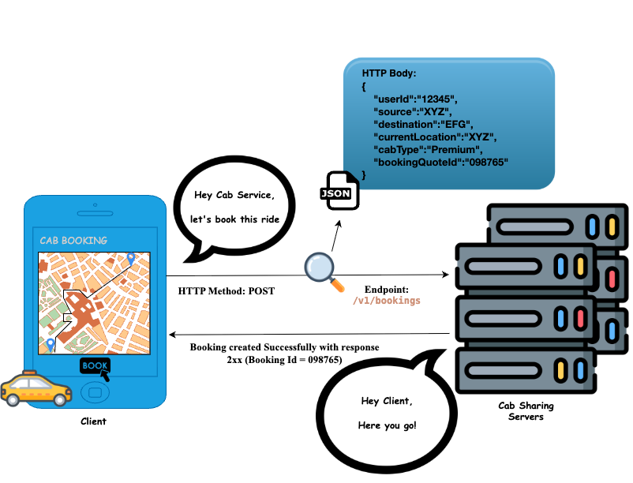
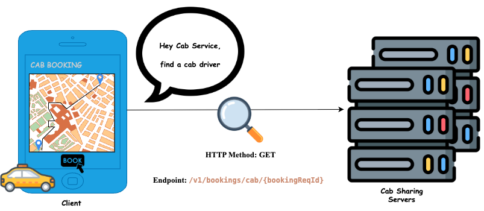

# CAB SHARING SYSTEM DESIGN

- [DECIDING REQUIREMENTS](#deciding-requirements)
    - [1. Functional Requirements](#functional-requirements)
    - [2. Non Functional Requirements](#non-functional-requirements)
- [CAPACITY ESTIMATION](#capacity-estimation)
    - [3. DAU-MAU](#dau-mau-estimation)
    - [4. Throughput](#throughput-estimation)
    - [5. Storage](#storage-estimation)
    - [6. Memory](#memory-estimation)
    - [7. Network and Bandwidth Estimation](#network-and-bandwidth-estimation)
- [API DESIGN](#api-design)
    - [8. API Design:Book a cab](#api-design-book-a-cab)
    - [9. API Design:Find a cab driver](#api-design-find-a-cab-driver)
    - [10. API Design:Track the journey](#api-design-track-the-journey)
    - [11. API Design:Pay for the service](#api-design-pay-for-the-service)
- [HIGH LEVEL DESIGN](#high-level-design)
    - [12. High Level Design:Book a cab](#high-level-design-book-a-cab)
    - [13. High Level Design:Find a cab driver](#high-level-design-find-a-cab-driver)
    - [14. High Level Design:Track the journey](#high-level-design-track-the-journey)
    - [15. High Level Design:Pay for the service](#high-level-design-pay-for-the-service)
- [DEEP DIVE INSIGHTS](#deep-dive-insights)

<hr style="border:2px solid gray">

# DECIDING REQUIREMENTS

## Functional Requirements

Below is a structured table displaying various requirements and their descriptions.

### User Functional Requirements

<table>
    <tr>
        <th>Requirement</th>
        <th>Description</th>
    </tr>
    <tr>
        <td>Book a cab</td>
        <td>User should be able to book a cab from any pickup location to any drop-off location</td>
    </tr>
    <tr>
        <td>Matching user with a cab driver</td>
        <td>User should be able to map with a closest cab driver by finding the one who is nearby</td>
    </tr>
    <tr>
        <td>Track the trip</td>
        <td>User should be able to track his journey from source to destination using a map service</td>
    </tr>
    <tr>
        <td>Pay for the trip</td>
        <td>User should be able to pay for his journey before the ride using payment gateway</td>
    </tr>
    <tr>
        <td>See for the trip history</td>
        <td>User should be able to view his ride history</td>
    </tr>
</table>

### Cab Driver Functional Requirements

<table>
    <tr>
        <th>Requirement</th>
        <th>Description</th>
    </tr>
    <tr>
        <td>Accept/decline the booking request</td>
        <td>Cab driver should be able to accept/decline a user booking request</td>
    </tr>
    <tr>
        <td>Track the trip</td>
        <td>Cab driver should be able to track his accepted booking journey from source to destination using a map service</td>
    </tr>
    <tr>
        <td>Payment for the trip</td>
        <td>Cab driver should be able to see the user payment status after completing the trip</td>
    </tr>
    <tr>
        <td>See for the trip history</td>
        <td>Cab driver should be able to view his ride history</td>
    </tr>
</table>

## Non Functional Requirements

<table>
    <tr>
        <th>Requirement</th>
        <th>Description</th>
    </tr>
    <tr>
        <td><strong>Availability</strong></td>
        <td>The system should be highly available - <strong>99.99%</strong> uptime</td>
    </tr>
    <tr>
        <td><strong>Eventual Consistency</strong></td>
        <td>If a user requests for a ride, it's okay if it doesn't show up immediately but acknowledges with-in considerable amount of time</td>
    </tr>
    <tr>
        <td><strong>Low latency</strong></td>
        <td>The map should load within 2 or 3 seconds through out the booking.</td>
    </tr>
    <tr>
        <td rowspan="3"><strong>Scalability</strong></td>
        <td>The system should support global users and traffic that will be from multiple geographic regions</td>
    </tr>
    <tr>
        <td>The system should support <strong>36 million Daily Active Users (DAU)</strong></td>
    </tr>
    <tr>
        <td>The system should support <strong>180 million Monthly Active Users (MAU)</strong></td>
    </tr>
    <tr>
        <td><strong>Extensibility</strong></td>
        <td>The design of our system should be such that it is easier to extend it in the future.<br>
        <em>Example:</em> If we need to add features like auto-pilot cab bookings, or drive-in cabs.</td>
    </tr>
    <tr>
        <td><strong>User Experience</strong></td>
        <td>The system should give smooth and seamless experience, if user's internet is working perfectly</td>
    </tr>
    <tr>
        <td><strong>Security</strong></td>
        <td>The system should provide security with out any data breach</td>
    </tr>
    <tr>
        <td><strong>Storage Reliability</strong></td>
        <td>The system should ensure storage reliability for user's content by maintaining his/her records and booking history.</td>
    </tr>
</table>

<hr style="border:2px solid gray">

# CAPACITY ESTIMATION

## DAU MAU ESTIMATION

<strong>How many users are using your software?</strong>
- <strong>Daily Active Users</strong> (DAU) : ```36 million```
- <strong>Monthly Active Users</strong> (MAU) : ```180 million```

## Throughput Estimation

Calculation of write requests and read requests to the system

### Write requests

Some of the possible ways of write requests to the system:
1. Customer/Cab driver's booking acceptance/rejection information
2. Customer payment preference (optional)

Most of the cases write requests are one time activities other than booking and payment requests.

<strong>Assumptions</strong>:
- ```90 out of 100``` customers book rides daily.
- ```95 out of 100``` cab drivers accept rides daily.
- ```20 out of 100``` customers set their payment preferences daily.

<strong>Calculation</strong>:
- Total DAU: ```36 million```
- Write requests per day:
    - Booking : ```(90/100) times 36,000,000 = 32,400,000 ~ 32.4 million```
    - Ride acceptance : ```(95/100) times 36,000,000 = 34,200,000 ~ 34.2 million```
    - Payment preference : ```(20/100) times 36,000,000 = 7,800,000 ~ 7.8 million```

### Read requests

The possible ways of read requests to the system:
- Trip
    - Preferences
    - Acceptance
    - Scheduling
    - Tracking
    - Fares
    - History
    - Payment

<strong>Assumptions</strong>:
- ```90 out of 100``` customers read their ride preference(cab type preference e.t.c.) daily.
- ```95 out of 100``` cab drivers read the acceptance request daily.
- ```90 out of 100``` customers read their source and destination while scheduling their ride daily.
- ```55 out of 100``` customers track their journey daily.
- ```85 out of 100``` customers read their trip fare details daily.
- ```10 out of 100``` customers read their trip history daily
- ```90 out of 100``` customers/cab drivers read the trip payment details after their ride daily.

<strong>Calculation</strong>:
- Total DAU: ```36 million```
- Read requests per day:
    - Trip
        - Preferences: ```(90/100) times 36,000,000 = 32,400,000 ~ 32.4 million```
        - Acceptance: ```(95/100) times 36,000,000 = 34,200,000 ~ 34.2 million```
        - Scheduling: ```(90/100) times 36,000,000 = 32,400,000 ~ 32.4 million```
        - Tracking: ```(55/100) times 36,000,000 = 19,800,000 ~ 19.8 million```
        - Fares: ```(85/100) times 36,000,000 = 30,600,000 ~ 30.6 million```
        - History: ```(10/100) times 36,000,000 = 3,600,000 ~ 3.6 million```
        - Payment: ```(90/100) times 36,000,000 = 32,400,000 ~ 32.4 million```

<strong>Summary</strong>

<table>
    <tr>
        <th>Operation</th>
        <th>Calculation</th>
        <th>Result</th>
    </tr>
    <tr>
        <td rowspan="3">Write</td>
        <td>(90/100) x 36 million</td>
        <td>32.4 million</td>
    </tr>
    <tr>
        <td>(95/100) x 36 million</td>
        <td>34.2 million</td>
    </tr>
    <tr>
        <td>(20/100) x 36 million</td>
        <td>7.8 million</td>
    </tr>
    <tr>
        <td colspan="2">Total write request(s) per day</td>
        <td><strong>74.4 million</strong></td>
    </tr>
    <tr>
        <td rowspan="7">Read</td>
        <td>(90/100) x 36 million</td>
        <td>32.4 million</td>
    </tr>
    <tr>
        <td>(95/100) x 36 million</td>
        <td>34.2 million</td>
    </tr>
    <tr>
        <td>(90/100) x 36 million</td>
        <td>32.4 million</td>
    </tr>
    <tr>
        <td>(55/100) x 36 million</td>
        <td>19.8 million</td>
    </tr>
    <tr>
        <td>(85/100) x 36 million</td>
        <td>30.6 million</td>
    </tr>
    <tr>
        <td>(10/100) x 36 million</td>
        <td>3.6 million</td>
    </tr>
    <tr>
        <td>(90/100) x 36 million</td>
        <td>32.4 million</td>
    </tr>
    <tr>
        <td colspan="2">Total read request(s) per day</td>
        <td><strong>185.4 million</strong></td>
    </tr>
</table>

## Storage Estimation

<strong>Assumptions</strong>

- Average size of a customer record: ```100 MB```
- Daily write operations to the system: ```74.4 million```

<strong>Storage Calculations</strong>

1. <strong>Daily storage requirement</strong>:
    ```100 MB x 74.4 million requests per day = 7.44 PB per day```
2. <strong>Storage requirement for 10-Years</strong>:
    ```7.44 PB per day x 365 days x 10 years = 271.56 PB```

<strong>Summary</strong>
|   Metric          |   Calculation                      |   Result        |
|-------------------|------------------------------------|-----------------|
| Daily Storage     | 100 MB x 102.12 M req/day          |    7.44 PB      |
| 10-Year Storage   | 7.44 PB/day x 365 days x 10 years. |   27.156 EB     |

## Memory Estimation

<strong>Overview</strong>
By memory, we refer to the <strong>cache memory size</strong> required for faster data access.

<strong>Why Cache Memory</strong>
Accessing data directly from the database takes time. To speed up data retrieval, cache memory is used.

<strong>Cache Memory Requirement Calculation</strong>

- <storage>Daily Storage Requirement</storage>: ```7.44 PB```
- <storage>Cache Requirement(1% of Daily Storage)</storage>: ```(1/100) x 7.44 PB = 74.4 TB```

<strong>Scalability</strong>
The memory size should scale as the system grows to accommodate increasing storage and data access demands.

## Network and Bandwidth Estimation

<strong>Overview</strong>
Network/Bandwidth estimation helps us determine the amount of data flowing in and out of the system per second.

<strong>Data Flow Estimations</strong>

<strong>Ingress</strong> (Data flow into the system)

- <strong>Data stored per day</strong>: ```7.44 PB```
- <strong>Calculation</strong>: ```7.44 PB / (24 x 60 x 60) = 86.11 GB/sec```
- <strong>Result:</strong> Incoming Data Flow = ```86.11 GB/sec```

<strong>Egress</strong> (Data flow out of the system)

- <strong>Total read requests per day</strong>: ```185.4 million```
- <strong>Average customer record size</strong>: ```100 MB```
- <strong>Daily Outgoing Data</strong>: ```185.4 million x 100 MB = 18.54 PB/day```
- <strong>Calculation</strong>: ```18.54 PB / (24 x 60 x 60) = 214.58 GB/sec```
- <strong>Result</strong>: ```214.58 GB/sec```

<strong>Summary</strong>

|       Type           |        Calculation        |   Result       |
|----------------------|---------------------------|----------------|
|Ingress (Data flow in)|  7.44 PB / (24 x 60 x 60) | 86.11 GB/sec   |
|Egress (Data flow out)| 18.54 PB / (24 x 60 x 60) |214.58 GB/sec   |

<hr style="border:2px solid gray">

# API DESIGN

## API Design :Book a cab

Lets understand how user book a cab.

When we ask the server to book a cab for user's ride, we use an API call. This is how computers talk to each other.

We follow a standard way to book a ride for a user and will use a REST API for this communication. Here are the technical details.



### HTTP Method
This tells to the server what action to perform. Since we want to book a cab for a user on the server, we use the `POST` action.

### Endpoint
This tells the server where to perform that action. Since we are booking a ride for a user, we will use the `/v1/bookings/cab/users` endpoint of the server.

**Note:**
```
'v1' means version 1. It is good practice to version your APIs.
```

### HTTP Body
We have told the server to book a ride for a user, but we haven't provided the details of the booking itself. This information is sent in the request body:

```json
{
    "userId":"Identification number of the user",
    "source":"pick-up location of the ride",
    "destination":"drop-off location of the ride",
    "currentLocation":"current location of the user",
    "cabType":"Type of the cab for a ride. E.g: Economy/Premium e.t.c",
    "Fare":"Estimated fare for the ride"
}
```

## API Design :Find a cab driver

Lets zoom into the 'communication' for finding a cab driver for our booking.

When we ask the server to find a cab driver for a booking request, we use an API call.

As we follow a standard way to find for a user and will use a REST API for this communication. Here are the technical details.



### HTTP Method
This tells to the server what action to perform. Since we want to find a cab driver for a booking request on the server, we use the `GET` action.

### Endpoint
This tells the server where to perform that action. Since we are finding a cab driver for a ride, we will use the `/v1/bookings/cab/{bookingReqId}` endpoint of the server.

### Note:
`GET` requests do not include a body because they are used to fetch information, not to send data.

## API Design :Track the journey

What might be the 'communication' for journey tracking?

Again, we will use an API call for tracking our journey.

[TBD]

## API Design :Pay for the service

<hr style="border:2px solid gray">

# HIGH LEVEL DESIGN

## High Level Design :Book a cab

## High Level Design :Find a cab driver

## High Level Design :Track the journey

## High Level Design :Pay for the service

<hr style="border:2px solid gray">

# DEEP DIVE INSIGHTS

<hr style="border:2px solid gray">