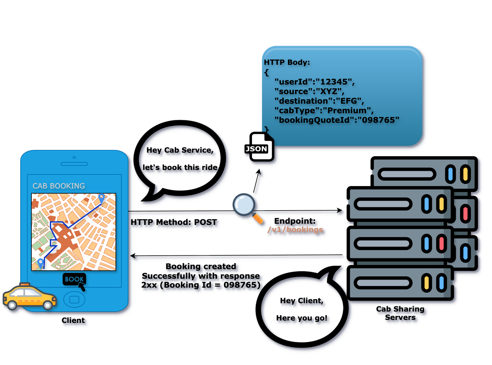
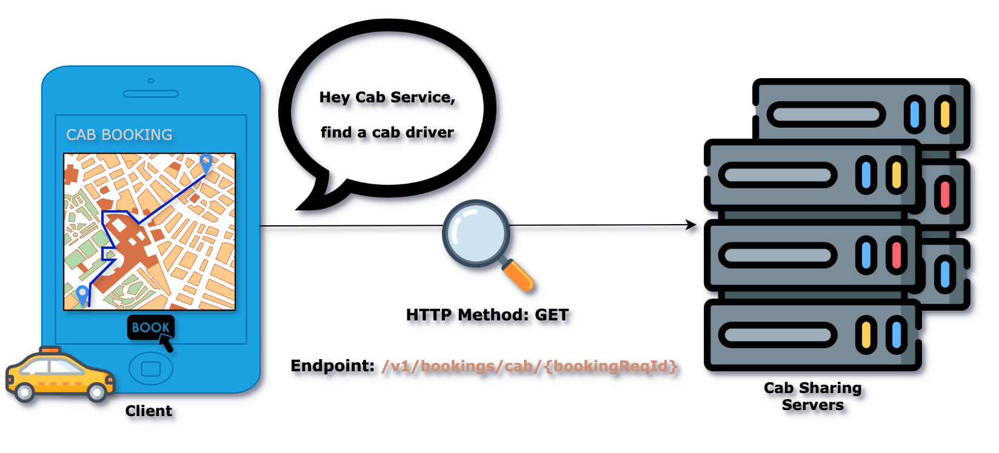

# CAB SHARING SYSTEM DESIGN

- [DECIDING REQUIREMENTS](#deciding-requirements)
    - [1. Functional Requirements](#functional-requirements)
    - [2. Non Functional Requirements](#non-functional-requirements)
- [CAPACITY ESTIMATION](#capacity-estimation)
    - [3. DAU-MAU](#dau-mau-estimation)
    - [4. Throughput](#throughput-estimation)
    - [5. Storage](#storage-estimation)
    - [6. Memory](#memory-estimation)
    - [7. Network and Bandwidth Estimation](#network-and-bandwidth-estimation)
- [API DESIGN](#api-design)
    - [8. API Design:Book a cab](#api-design-book-a-cab)
    - [9. API Design:Track the journey](#api-design-track-the-journey)
    - [10. API Design:check for the trip history](#api-design-check-for-the-trip-history)
    - [11. API Design:See for the payment history](#api-design-see-for-the-payment-history)
- [HIGH LEVEL DESIGN](#high-level-design)
    - [12. High Level Design:Book a cab](#high-level-design-book-a-cab)
    - [13. High Level Design:Track the journey](#high-level-design-track-the-journey)
    - [14. High Level Design:check for the trip history](#high-level-design-check-for-the-trip-history)
    - [15. High Level Design:see for the payment history](#high-level-design-see-for-the-payment-history)
- [DEEP DIVE INSIGHTS](#deep-dive-insights)

<hr style="border:2px solid gray">

# DECIDING REQUIREMENTS

## Functional Requirements

Below is a structured table displaying various requirements and their descriptions.

### User Functional Requirements

<table>
    <tr>
        <th>Requirement</th>
        <th>Description</th>
    </tr>
    <tr>
        <td rowspan="2">Book a cab</td>
        <td>User should be able to book a cab from any pickup location to any drop-off location</td>
    </tr>
    <tr>
        <td>User should be able to map with a closest cab driver by finding the one who is nearby</td>
    </tr>
    <tr>
        <td>Track the trip</td>
        <td>User should be able to track his journey from source to destination using a map service</td>
    </tr>
    <tr>
        <td>Check for the trip history</td>
        <td>User should be able to view his ride history</td>
    </tr>
</table>

***Note:*** Payment process is a part of the booking request.

### Cab Driver Functional Requirements

<table>
    <tr>
        <th>Requirement</th>
        <th>Description</th>
    </tr>
    <tr>
        <td>Accept/decline the booking request</td>
        <td>Cab driver should be able to accept/decline a user booking request</td>
    </tr>
    <tr>
        <td>See for the payment history</td>
        <td>Cab driver should be able to view his payment history</td>
    </tr>
</table>

## Non Functional Requirements

<table>
    <tr>
        <th>Requirement</th>
        <th>Description</th>
    </tr>
    <tr>
        <td><strong>Availability</strong></td>
        <td>The system should be highly available - <strong>99.999999%</strong> uptime</td>
    </tr>
    <tr>
        <td><strong>Latency</strong></td>
        <td>User should receive booking acknowledgement within considerable amount of time.</td>
    </tr>
    <tr>
        <td rowspan="3"><strong>Scalability</strong></td>
        <td>The system should support global users and traffic that will be from multiple geographic regions</td>
    </tr>
    <tr>
        <td>The system should support <strong>36 million Daily Active Users (DAU)</strong></td>
    </tr>
    <tr>
        <td>The system should support <strong>180 million Monthly Active Users (MAU)</strong></td>
    </tr>
    <tr>
        <td><strong>Extensibility</strong></td>
        <td>The design of our system should be such that it is easier to extend it in the future.<br>
        <em>Example:</em> If we need to add features like auto-pilot cab bookings, or drive-in cabs.</td>
    </tr>
</table>

***Note:*** For now, we are not concentrating on the non-functional requirements such as User experience, Security and Storage reliability.

<hr style="border:2px solid gray">

# CAPACITY ESTIMATION

## DAU MAU ESTIMATION

<strong>How many users are using your software?</strong>
- <strong>Daily Active Users</strong> (DAU) : ```36 million```
- <strong>Monthly Active Users</strong> (MAU) : ```180 million```

***Note:*** DAU and MAU estimations are considered from [Uber cab sharing Wiki](https://en.wikipedia.org/wiki/Uber#:~:text=It%20is%20the%20largest%20ridesharing%20company%20worldwide%20with%20over%20180%20million%20monthly%20active%20users%20and%206%20million%20active%20drivers%20and%20couriers.%20It%20coordinates%20an%20average%20of%2036%20million%20trips%20and%20delivery%20orders%20per%20day). If you want, then you can update these estimates as per your convenience.

## Throughput Estimation

Calculation of write requests and read requests to the system

### Write requests

Some of the possible ways of write requests to the system:
- Customer/Cab driver's booking acceptance/rejection information

Most of the cases write requests are one time activities other than booking and payment requests.

<strong>Assumptions</strong>:
- ```50 out of 100``` customers book rides daily.
- ```95 out of 100``` cab drivers accept rides daily.

<strong>Calculation</strong>:
- Total DAU: ```36 million```
- Write requests per day:
    - Booking : ```(50/100) times 36,000,000 = 18,000,000 ~ 18 million```
    - Ride acceptance : ```(95/100) times 36,000,000 = 34,200,000 ~ 34.2 million```

### Read requests

Some of the possible ways of read requests to the system:
- Cab drivers read their booking request.
- Users track their ride.
- Users check their ride's fare.
- Users refer their ride history.

<strong>Assumptions</strong>:
- ```95 out of 100``` cab drivers read their booking request.
- ```55 out of 100``` users track their ride.
- ```55 out of 100``` users check their ride's fare.
- ```10 out of 100``` users refer their ride history daily.

<strong>Calculation</strong>:
- Total DAU: ```36 million```
- Read requests per day:
    - Cab drivers read their booking request: ```(95/100) times 36,000,000 = 34,200,000 ~ 34.2 million```
    - Users track their ride: ```(55/100) times 36,000,000 = 19,800,000 ~ 19.8 million```
    - Users check their ride's fare: ```(55/100) times 36,000,000 = 19,800,000 ~ 19.8 million```
    - Users refer their ride history daily: ```(10/100) times 36,000,000 = 3,600,000 ~ 3.6 million```

<strong>Summary</strong>
<table>
    <tr>
        <th>Operation</th>
        <th>Calculation</th>
        <th>Result</th>
    </tr>
    <tr>
        <td rowspan="2">Write</td>
        <td>(50/100) x 36 million</td>
        <td>18 million</td>
    </tr>
    <tr>
        <td>(95/100) x 36 million</td>
        <td>34.2 million</td>
    </tr>
    <tr>
        <td colspan="2">Total write request(s) per day</td>
        <td><strong>52.2 million</strong></td>
    </tr>
    <tr>
        <td rowspan="4">Read</td>
        <td>(95/100) x 36 million</td>
        <td>34.2 million</td>
    </tr>
    <tr>
        <td>(55/100) x 36 million</td>
        <td>19.8 million</td>
    </tr>
    <tr>
        <td>(55/100) x 36 million</td>
        <td>19.8 million</td>
    </tr>
    <tr>
        <td>(10/100) x 36 million</td>
        <td>3.6 million</td>
    </tr>
    <tr>
        <td colspan="2">Total read request(s) per day</td>
        <td><strong>77.4 million</strong></td>
    </tr>
</table>

## Storage Estimation

<strong>Assumptions</strong>

- Average size of a cab sharing record: ```100 KB```
- Daily write operations to the system: ```52.2 million```

<strong>Storage Calculations</strong>

1. <strong>Daily storage requirement</strong>:
    ```100 KB x 52.2 million requests per day = 5.22 TB per day```
2. <strong>Storage requirement for 10-Years</strong>:
    ```5.22 TB per day x 365 days x 10 years = 19.053 PB```

<strong>Summary</strong>
|   Metric          |   Calculation                      |   Result        |
|-------------------|------------------------------------|-----------------|
| Daily Storage     | 100 KB x 52.2 M req/day            |    5.22 TB      |
| 10-Year Storage   | 5.22 TB/day x 365 days x 10 years. |   19.053 PB     |

## Memory Estimation

<strong>Overview</strong>
By memory, we refer to the <strong>cache memory size</strong> required for faster data access.

<strong>Why Cache Memory</strong>
Accessing data directly from the database takes time. To speed up data retrieval, cache memory is used.

<strong>Cache Memory Requirement Calculation</strong>

- <storage>Daily Storage Requirement</storage>: ```5.22 TB```
- <storage>Cache Requirement(1% of Daily Storage)</storage>: ```(1/100) x 5.22 TB = 52.2 GB```

***Note:*** You may wonder, why we considered 1% of daily storage as cache requirement! It's for storing geo spacial information primarily.

<strong>Scalability</strong>
The memory size should scale as the system grows to accommodate increasing storage and data access demands.

## Network and Bandwidth Estimation

<strong>Overview</strong>
Network/Bandwidth estimation helps us determine the amount of data flowing in and out of the system per second.

<strong>Data Flow Estimations</strong>

<strong>Ingress</strong> (Data flow into the system)

- <strong>Data stored per day</strong>: ```5.22 TB```
- <strong>Calculation</strong>: ```5.22 TB / (24 x 60 x 60) = 60.42 MB/sec```
- <strong>Result:</strong> Incoming Data Flow = ```60.42 MB/sec```

<strong>Egress</strong> (Data flow out of the system)

- <strong>Total read requests per day</strong>: ```77.4 million```
- <strong>Average customer record size</strong>: ```100 KB```
- <strong>Daily Outgoing Data</strong>: ```77.4 million x 100 KB = 7.74 TB/day```
- <strong>Calculation</strong>: ```7.74 TB / (24 x 60 x 60) = 89.58 MB/sec```
- <strong>Result</strong>: ```89.58 MB/sec```

<strong>Summary</strong>

|       Type           |        Calculation        |   Result       |
|----------------------|---------------------------|----------------|
|Ingress (Data flow in)|  5.22 TB / (24 x 60 x 60) | 60.42 MB/sec   |
|Egress (Data flow out)|  7.74 TB / (24 x 60 x 60) | 89.58 MB/sec   |

<hr style="border:2px solid gray">

# API DESIGN

[TODO] Update the API design content with gRPC call flow.

We follow a standard way to communicate between the cab sharing systems and also this communication should be quick enough to accommodate the user's booking request. That's why we go with gRPC for this communication.

***Note:*** We can also use REST API for this communication if turn around time between services is negligible 

## API Design :Book a cab

### The process of 'Booking a cab' for a user:
1. **User** sends a booking request with his choice of pick-up and drop-off location(s) to **Cab Sharing Server**.
2. **Cab Sharing Server** maps booking request with a **Cab Driver** who is near to the **user's pick-up location**.
3. **Cab Driver** acknowledges the booking request with his acceptance or rejection.

#### First Part: Sending a booking request to the server.

When we ask the server to book a cab for user's ride, we use an API call. This is how computers talk to each other.

Here are the technical details.



### HTTP Method
This tells to the server what action to perform. Since we want to book a cab for a user on the server, we use the `POST` action.

### Endpoint
This tells the server where to perform that action. Since we are booking a ride for a user, we will use the `/v1/bookings` endpoint of the server.

***Note:*** 'v1' means version 1. It is good practice to version your APIs. You can customize the endpoint based on your convenience.

### HTTP Body
We have told the server to book a ride for a user, but we haven't provided the details of the booking itself. This information is sent in the request body:

```json
{
    "userId":"Identification number of the user",
    "source":"pick-up location of the ride",
    "destination":"drop-off location of the ride",
    "currentLocation":"current location of the user",
    "cabType":"Type of the cab for a ride. E.g: Economy/Premium e.t.c",
    "BookingQuoteId":"Temporary booking Id for the ride"
}
```

#### Second Part: Sending a booking request to the Cab Driver.

Lets zoom into the 'communication' for finding a cab driver for our booking.

When we ask the server to find a cab driver for a booking request, we use an API call.

As we follow a standard way to find for a user and will use a REST API for this communication. Here are the technical details.


[TODO] Update pic with response

### HTTP Method
This tells to the server what action to perform. Since we want to find a cab driver for a booking request on the server, we use the `GET` action.

### Endpoint
This tells the server where to perform that action. Since we are finding a cab driver for a ride, we will use the `/v1/bookings/{bookingReqId}` endpoint of the server.

***Note:*** `GET` requests do not include a body because they are used to fetch information, not to send data.

#### Third Part: Cab Driver acknowledges the booking request.

## API Design :Track the journey

What might be the 'communication' for journey tracking?

Again, we will use an API call for tracking our journey.

[TBD]

## API Design :Check for the trip history

## API Design :See for the payment history

<hr style="border:2px solid gray">

# HIGH LEVEL DESIGN

## High Level Design :Book a cab

## High Level Design :Track the journey

## High Level Design :Check for the trip history

## High Level Design :See for the payment history

<hr style="border:2px solid gray">

# DEEP DIVE INSIGHTS

<hr style="border:2px solid gray">