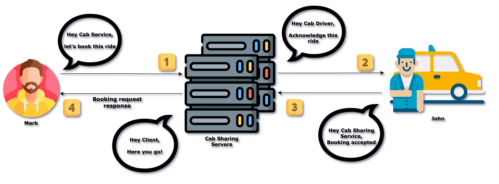
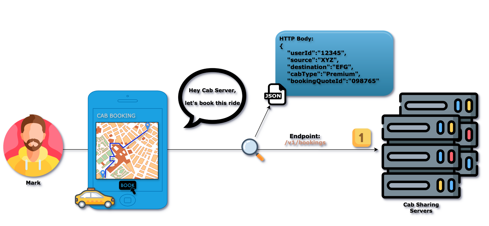
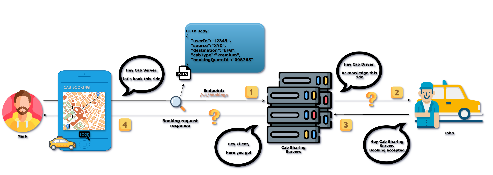
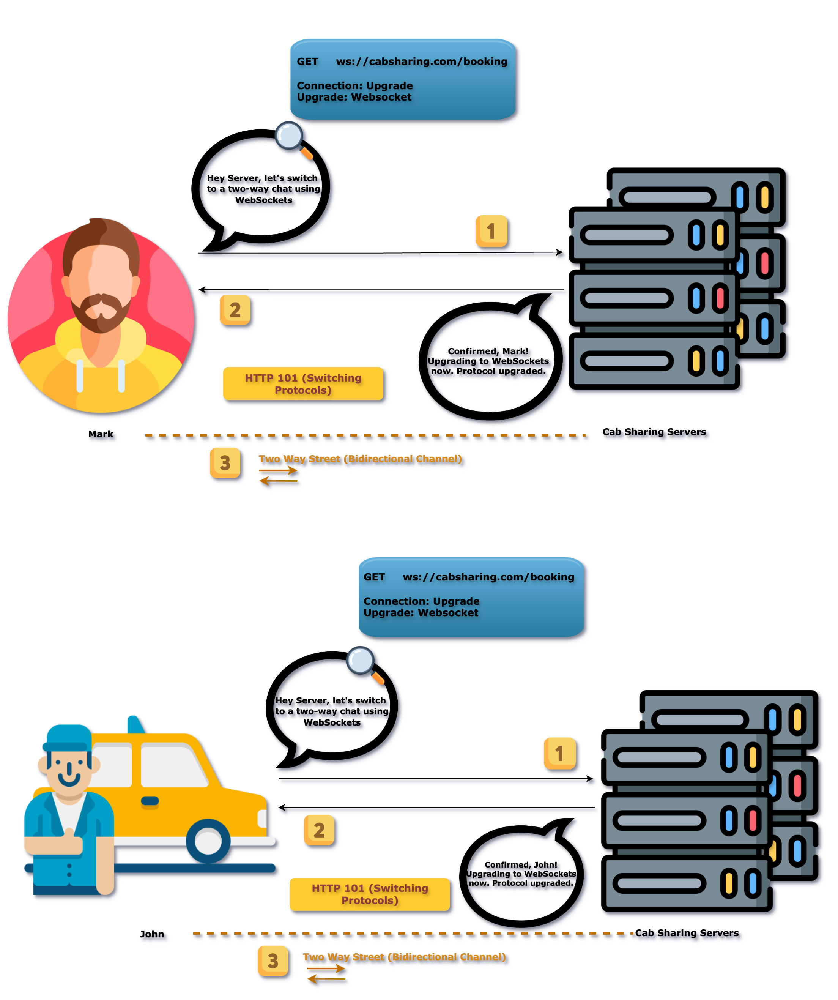
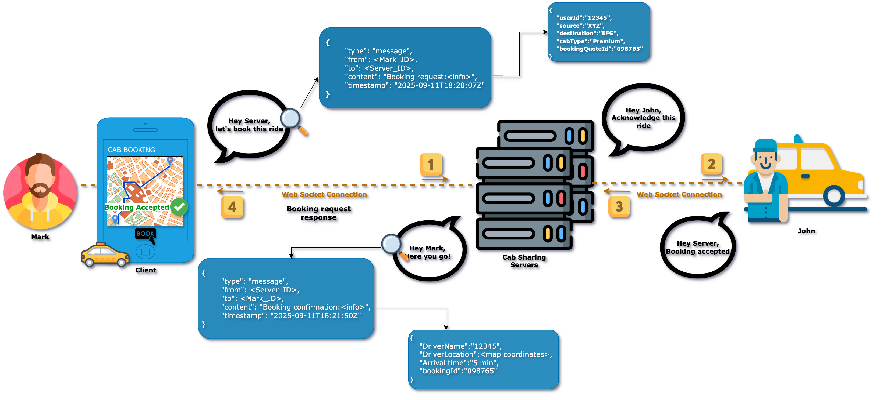
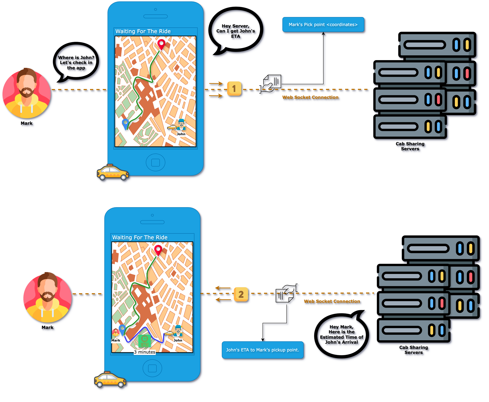
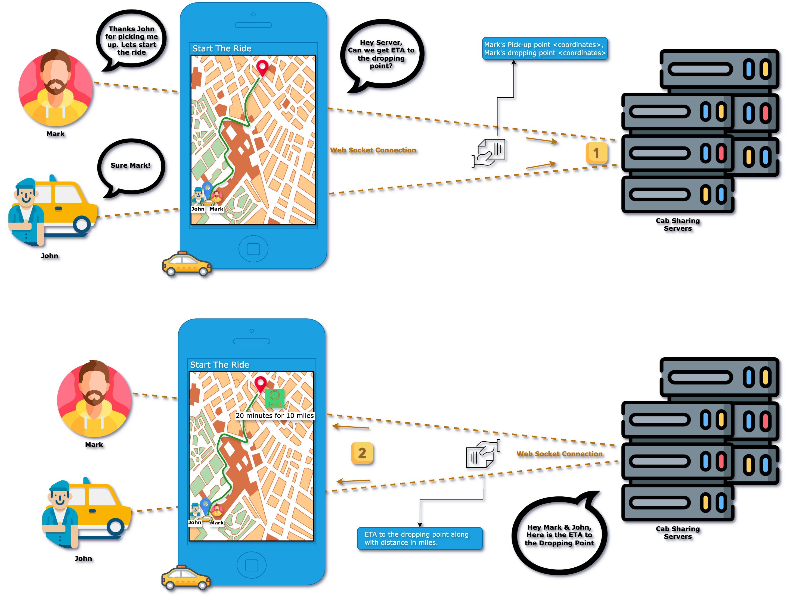
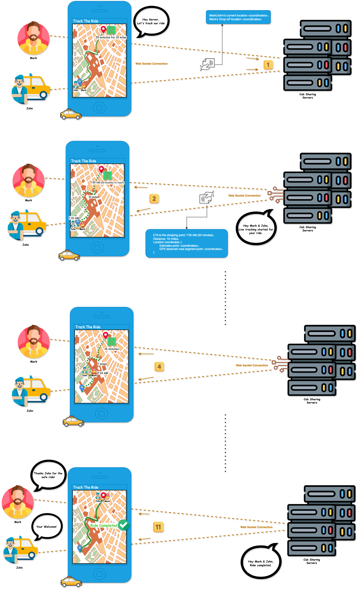
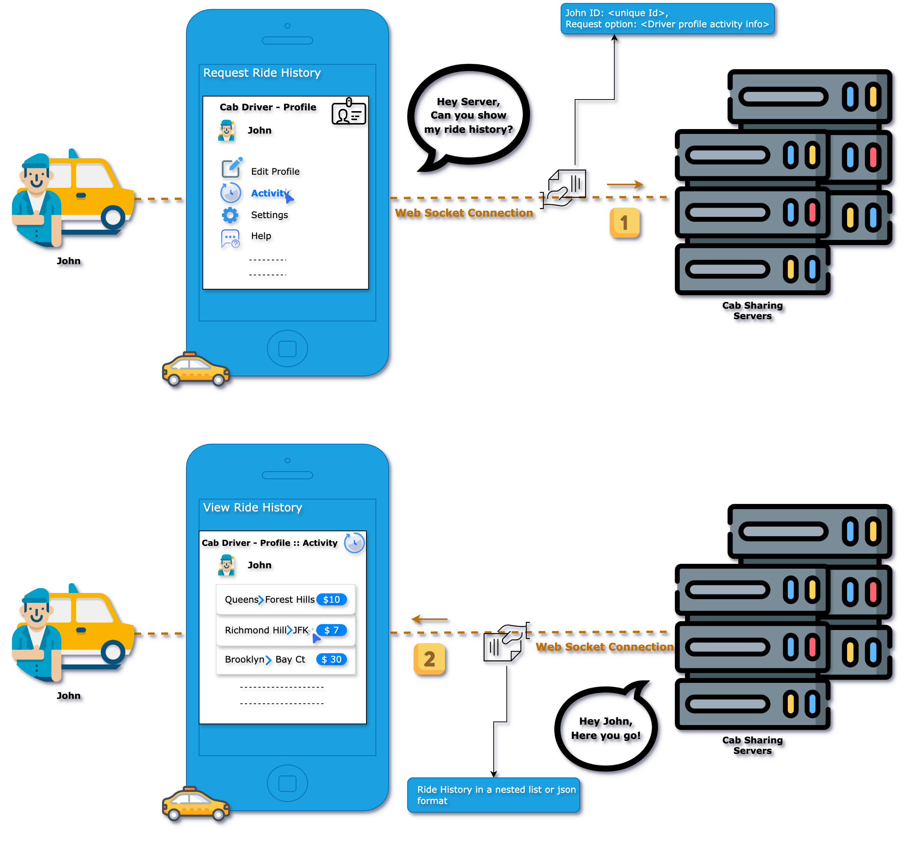

# CAB SHARING SYSTEM DESIGN

- [DECIDING REQUIREMENTS](#deciding-requirements)

    - [1. Functional Requirements](#functional-requirements)

    - [2. Non Functional Requirements](#non-functional-requirements)

- [CAPACITY ESTIMATION](#capacity-estimation)

    - [3. DAU-MAU](#dau-mau-estimation)

    - [4. Throughput](#throughput-estimation)

    - [5. Storage](#storage-estimation)

    - [6. Memory](#memory-estimation)

    - [7. Network And Bandwidth Estimation](#network-and-bandwidth-estimation)

- [API DESIGN](#api-design)

    - [8. API Design:Book A Cab](#api-design-book-a-cab)

    - [9. API Design:Track The Ride](#api-design-track-the-ride)

    - [10. API Design:View Ride History](#api-design-view-ride-history)

- [HIGH LEVEL DESIGN](#high-level-design)

    - [11. High Level Design:Book A Cab](#high-level-design-book-a-cab)

    - [12. High Level Design:Track The Ride](#high-level-design-track-the-ride)

    - [13. High Level Design:View Ride History](#high-level-design-view-ride-history)

- [DEEP DIVE INSIGHTS](#deep-dive-insights)

<hr style="border:2px solid gray">

# DECIDING REQUIREMENTS

## Functional Requirements

Below is a structured table displaying various requirements and their descriptions.

### User Functional Requirements

<table>
    <tr>
        <th>Requirement</th>
        <th>Description</th>
    </tr>
    <tr>
        <td>Book a cab</td>
        <td>User should be able to book a cab from any pickup location to any drop-off location. When they do so, our system should try to match them with one of the closest driver.</td>
    </tr>
    <tr>
        <td>Track the ride</td>
        <td>User should be able to track their journey from source to destination on a map</td>
    </tr>
</table>

***Note:*** We won't be covering payment in this design as this design focuses on Cab sharing.

### Cab Driver Functional Requirements

<table>
    <tr>
        <th>Requirement</th>
        <th>Description</th>
    </tr>
    <tr>
        <td>Accept/decline the booking request</td>
        <td>The cab driver who accepts the rider first will be given the ride</td>
    </tr>
    <tr>
        <td>View ride history</td>
        <td>Cab driver should be able to view his ride history mentioning payments for each ride.</td>
    </tr>
</table>

## Non Functional Requirements

<table>
    <tr>
        <th>Requirement</th>
        <th>Description</th>
    </tr>
    <tr>
        <td><strong>Availability</strong></td>
        <td>The system should be highly available - <strong>99.999999%</strong> uptime</td>
    </tr>
    <tr>
        <td><strong>Latency</strong></td>
        <td>User should receive booking acknowledgement within 15 seconds.</td>
    </tr>
    <tr>
        <td rowspan="3"><strong>Scalability</strong></td>
        <td>The system should support global users and traffic that will be from multiple geographic regions</td>
    </tr>
    <tr>
        <td>The system should support <strong>36 million Daily Active Users (DAU)</strong></td>
    </tr>
    <tr>
        <td>The system should support <strong>180 million Monthly Active Users (MAU)</strong></td>
    </tr>
    <tr>
        <td><strong>Extensibility</strong></td>
        <td>The design of our system should be such that it is easier to extend it in the future.<br>
        <em>Example:</em> If we need to add features like auto-pilot cab bookings, or luxury cab bookings.</td>
    </tr>
</table>

***Note:*** For now, we are not concentrating on the non-functional requirements such as User experience, Security and Storage reliability.

<hr style="border:2px solid gray">

# CAPACITY ESTIMATION

For Capacity Estimation, we will consider both **customers** and **cab drivers**. Here customers are the users who use cab sharing services for their rides.

## DAU MAU ESTIMATION

### For Customers

<strong>How many users are using your software?</strong>
- <strong>Daily Active Users</strong> (DAU) : ```36 million```
- <strong>Monthly Active Users</strong> (MAU) : ```180 million```

***Note:*** DAU and MAU estimations for customers are considered from [Uber cab sharing Wiki](https://en.wikipedia.org/wiki/Uber#:~:text=It%20is%20the%20largest%20ridesharing%20company%20worldwide%20with%20over%20180%20million%20monthly%20active%20users%20and%206%20million%20active%20drivers%20and%20couriers.%20It%20coordinates%20an%20average%20of%2036%20million%20trips%20and%20delivery%20orders%20per%20day). If you want, then you can update these estimates as per your convenience.

### For Cab Drivers

<strong>How many cab drivers are using your software?</strong>
- <strong>Daily Active Users</strong> (DAU) : ```3 million```
- <strong>Monthly Active Users</strong> (MAU) : ```93 million```

***Note:*** DAU and MAU estimations for cab drivers are considered as a rough estimate based on the Google search results. If you want, then you can update these estimates as per your convenience.

## Throughput Estimation

Calculation of write requests and read requests to the system

### For Customers

#### Write Requests

One of the possible ways of write requests to the system:
- Customer booking request information

Most of the cases, write requests are one time activities other than booking requests.

<strong>Assumptions</strong>:
- ```50 out of 100``` customers book rides daily.

<strong>Calculation</strong>:
- Total DAU: ```36 million```
- Write requests per day:
    - Booking : ```(50/100) times 36,000,000 = 18,000,000 ~ 18 million```

#### Read Requests

One of the possible ways of read requests to the system:
- Users track their ride.

<strong>Assumptions</strong>:
- ```55 out of 100``` users track their ride.

<strong>Calculation</strong>:
- Total DAU: ```36 million```
- Read requests per day:
    - Users track their ride: ```(55/100) times 36,000,000 = 19,800,000 ~ 19.8 million```

### For Cab Drivers

#### Write Requests

One of the possible ways of write requests to the system:
- Cab driver's booking acceptance/rejection information

Most of the cases write requests are one time activities other than booking and payment requests.

<strong>Assumptions</strong>:
- ```95 out of 100``` cab drivers accept rides daily.

<strong>Calculation</strong>:
- Total DAU: ```36 million```
- Write requests per day:
    - Ride acceptance : ```(95/100) times 36,000,000 = 34,200,000 ~ 34.2 million```

#### Read Requests

Some of the possible ways of read requests to the system:
- Cab drivers read their booking request.
- Cab drivers refer their ride history along with fare details.

<strong>Assumptions</strong>:
- ```95 out of 100``` cab drivers read their booking request.
- ```90 out of 100``` cab drivers check their ride history along with fare details.

<strong>Calculation</strong>:
- Total DAU: ```36 million```
- Read requests per day:
    - Cab drivers read their booking request: ```(95/100) times 36,000,000 = 34,200,000 ~ 34.2 million```
    - Users refer their ride history along with fare details daily: ```(90/100) times 36,000,000 = 32400000 ~ 32.4 million```

<strong>Summary</strong>
<table>
    <tr>
        <th>End User</th>
        <th>Operation</th>
        <th>Calculation</th>
        <th>Result</th>
    </tr>
    <tr>
        <td rowspan="2">Customer</td>
        <td>Write</td>
        <td>(50/100) x 36 million</td>
        <td><strong>18 million</strong></td>
    </tr>
    <tr>
        <td>Read</td>
        <td>(55/100) x 36 million</td>
        <td><strong>19.8 million</strong></td>
    </tr>
    <tr>
        <td rowspan="4">Cab Driver</td>
        <td>Write</td>
        <td>(95/100) x 36 million</td>
        <td><strong>34.2 million</strong></td>
    </tr>
    <tr>
        <td rowspan="2">Read</td>
        <td>(95/100) x 36 million</td>
        <td>34.2 million</td>
    </tr>
    <tr>
        <td>(90/100) x 36 million</td>
        <td>32.4 million</td>
    </tr>
    <tr>
        <td colspan="2">Total read request(s) per day</td>
        <td><strong>66.6 million</strong></td>
    </tr>
</table>

## Storage Estimation

### For Customers

<strong>Assumptions</strong>

- Average size of a cab sharing record: ```100 KB```
- Daily write operations to the system: ```18 million```

<strong>Storage Calculations</strong>

1. <strong>Daily storage requirement</strong>:
    ```100 KB x 18 million requests per day = 1.8 TB per day```
2. <strong>Storage requirement for 10-Years</strong>:
    ```1.8 TB per day x 365 days x 10 years = 6.57 PB```

### For Cab Drivers

<strong>Assumptions</strong>

- Average size of a cab sharing record: ```100 KB```
- Daily write operations to the system: ```34.2 million```

<strong>Storage Calculations</strong>

1. <strong>Daily storage requirement</strong>:
    ```100 KB x 34.2 million requests per day = 3.42 TB per day```
2. <strong>Storage requirement for 10-Years</strong>:
    ```3.42 TB per day x 365 days x 10 years = 12.483 PB```

<strong>Summary</strong>
<table>
    <tr>
        <th>End User</th>
        <th>Metric</th>
        <th>Calculation</th>
        <th>Result</th>
    </tr>
    <tr>
        <td rowspan="2">Customer</td>
        <td>Daily Storage</td>
        <td>100 KB x 18 M requests/day</td>
        <td><strong>1.8 TB</strong></td>
    </tr>
    <tr>
        <td>10-Year Storage</td>
        <td>1.8 TB/day x 365 days x 10 years</td>
        <td><strong>6.57 PB</strong></td>
    </tr>
    <tr>
        <td rowspan="2">Cab Driver</td>
        <td>Daily Storage</td>
        <td>100 KB x 34.2 M requests/day</td>
        <td><strong>3.42 TB</strong></td>
    </tr>
    <tr>
        <td>10-Year Storage</td>
        <td>3.42 TB/day x 365 days x 10 years</td>
        <td><strong>12.483 PB</strong></td>
    </tr>
</table>

***Note:*** Average size of a Cab Sharing user record - 100 KB is considered as a rough estimate. If you want, then you can update it as per your convenience.

## Memory Estimation

<strong>Overview</strong>
By memory, we refer to the <strong>cache memory size</strong> required for faster data access.

<strong>Why Cache Memory</strong>
Accessing data directly from the database takes time. To speed up data retrieval, cache memory is used.

<strong>Cache Memory Requirement Calculation</strong>

### For Customers

- <strong>Daily Storage Requirement</strong>: ```1.8 TB```
- <strong>Cache Requirement(1% of Daily Storage)</strong>: ```(1/100) x 1.8 TB = 18 GB```

### For Cab Drivers

- <strong>Daily Storage Requirement</strong>: ```3.42 TB```
- <strong>Cache Requirement(1% of Daily Storage)</strong>: ```(1/100) x 3.42 TB = 34.2 GB```

***Note:*** You may wonder, why we considered 1% of daily storage as cache requirement! This is because we need to store geo-spatial data only relevant to the user i.e. area closer to their location.

<strong>Scalability</strong>
The memory size should scale as the system grows to accommodate increasing storage and data access demands.

<strong>Summary</strong>
<table>
    <tr>
        <th>End-user</th>
        <th>Metric</th>
        <th>Result</th>
    </tr>
    <tr>
        <td rowspan="2">Customer</td>
        <td>Daily Storage</td>
        <td>1.8 TB</td>
    </tr>
    <tr>
        <td>Cache Requirement(1% of Daily Storage)</td>
        <td><strong>18 GB</strong></td>
    </tr>
    <tr>
        <td rowspan="2">Cab Driver</td>
        <td>Daily Storage</td>
        <td>3.42 TB</td>
    </tr>
    <tr>
        <td>Cache Requirement(1% of Daily Storage)</td>
        <td><strong>34.2 GB</strong></td>
    </tr>
</table>

## Network and Bandwidth Estimation

<strong>Overview</strong>
Network/Bandwidth estimation helps us determine the amount of data flowing in and out of the system per second.

<strong>Data Flow Estimations</strong>

### For Customers

<strong>Ingress</strong> (Data flow into the system)

- <strong>Data stored per day</strong>: ```1.8 TB```
- <strong>Calculation</strong>: ```1.8 TB / (24 x 60 x 60) = 20.833 MB/sec```
- <strong>Result:</strong> Incoming Data Flow = ```20.833 MB/sec```

<strong>Egress</strong> (Data flow out of the system)

- <strong>Total read requests per day</strong>: ```19.8 million```
- <strong>Average customer record size</strong>: ```100 KB```
- <strong>Daily Outgoing Data</strong>: ```19.8 million x 100 KB = 1.98 TB/day```
- <strong>Calculation</strong>: ```1.98 TB / (24 x 60 x 60) = 22.92 MB/sec```
- <strong>Result</strong>: ```22.92 MB/sec```

### For Cab Drivers

<strong>Ingress</strong> (Data flow into the system)

- <strong>Data stored per day</strong>: ```3.42 TB```
- <strong>Calculation</strong>: ```3.42 TB / (24 x 60 x 60) = 39.58 MB/sec```
- <strong>Result:</strong> Incoming Data Flow = ```39.58 MB/sec```

<strong>Egress</strong> (Data flow out of the system)

- <strong>Total read requests per day</strong>: ```66.6 million```
- <strong>Average customer record size</strong>: ```100 KB```
- <strong>Daily Outgoing Data</strong>: ```66.6 million x 100 KB = 6.66 TB/day```
- <strong>Calculation</strong>: ```6.66 TB / (24 x 60 x 60) = 77.08 MB/sec```
- <strong>Result</strong>: ```77.08 MB/sec```

<strong>Summary</strong>
<table>
    <tr>
        <th>End User</th>
        <th>Type</th>
        <th>Calculation</th>
        <th>Result</th>
    </tr>
    <tr>
        <td rowspan="2">Customer</td>
        <td>Ingress (Data flow in)</td>
        <td>1.8 TB / (24 x 60 x 60)</td>
        <td><strong>20.833 MB/sec</strong></td>
    </tr>
    <tr>
        <td>Egress (Data flow out)</td>
        <td>1.98 TB / (24 x 60 x 60)</td>
        <td><strong>22.92 MB/sec</strong></td>
    </tr>
    <tr>
        <td rowspan="2">Cab Driver</td>
        <td>Ingress (Data flow in)</td>
        <td>3.42 TB / (24 x 60 x 60)</td>
        <td><strong>39.58 MB/sec</strong></td>
    </tr>
    <tr>
        <td>Egress (Data flow out)</td>
        <td>6.66 TB / (24 x 60 x 60)</td>
        <td><strong>77.08 MB/sec</strong></td>
    </tr>
</table>

<hr style="border:2px solid gray">

# API DESIGN

We follow a standard & efficient way to communicate between the cab sharing systems. Computers talk to each other through API call. So let's first try with REST API for this communication.

## API Design :Book A Cab

Let's say our user(Mark) wants to book a ride using a cab sharing company. Mark can send request to the cab sharing server, the cab sharing server can relay that request to cab driver(John). John can accept the ride, the cab sharing server can get the response from John, and then cab sharing server can pass the booking confirmation response to Mark.



***Note:*** Here, John can also reject the Mark's booking request. If so, Mark will have to repeat the process by re-initiating booking request.

### Let's put this analogy of 'Booking a cab' on paper:
1. **User(Mark)** sends a booking request with his choice of pick-up and drop-off location(s) to the **Cab Sharing Server**.
2. The **Cab Sharing Server** maps booking request with a **Cab Driver(John)** who is near to the **Mark's pick-up location**.
3. **John** acknowledges the booking request with his acceptance or rejection and notifies to the **Cab Sharing Server**
4. The **Cab Sharing Server** relays that acknowledgement to **Mark**.

***Note:*** The process of mapping cab driver involves micro-service gRPC communication and we will talk about that in High-level design.

#### First Part: Sending a booking request to the server

We can handle this with a simple REST API call (HTTP POST request).

Here are the technical details.



### HTTP Method
This tells to the server what action to perform. Since we want to book a cab for a user on the server, we use the `POST` action.

### Endpoint
This tells the server where to perform that action. Since we are booking a ride for a user, we will use the `/v1/bookings` endpoint of the server.

***Note:*** 'v1' means version 1. It is good practice to version your APIs. You can customize the endpoint based on your convenience.

### HTTP Body
We have told the server to book a ride for a user, but we haven't provided the details of the booking itself. This information is sent in the request body:

```json
{
    "userId":"Identification number of the user",
    "source":"pick-up location of the ride",
    "destination":"drop-off location of the ride",
    "cabType":"Type of the cab for a ride. E.g: Economy/Premium e.t.c",
    "BookingQuoteId":"Temporary booking Id for the ride"
}
```

#### Second Part: Relaying the message to the Cab Driver

This is more challenging. The Cab Sharing Server needs to send the message to John.


#### Third Part: Relaying the message to the Cab Driver

If second step isn't through, then we can forget about the third part even though from client to server communication is possible through HTTP request.

#### Fourth Part: Relaying the message to the Cab Driver

So is the fourth part!



__Problem__

In HTTP, the server cannot initiate requests to the user. Requests can only be sent **from the client to the server** - it's a one-way street (user -> cab sharing server).

__Solution: WebSockets__

WebSockets (an upgraded version of a HTTP request) are a mechanism that allows bidirectional communication. Client can send __HTTP GET request__ to switch from __HTTP__ to __WebSocket__ as shown in the reference image below.



***Note:*** For more details on WebSockets, you can refer to this [wiki link](https://en.wikipedia.org/wiki/WebSocket).

Once the connection is upgraded, it remains **open**, allowing both the cab sharing server and user/client to send messages directly to each other in **real-time** without needing the traditional HTTP request/response model.

- Mark sends messages to the cab sharing server through his connection.
- John receives messages from the cab sharing server through his connection.
- John sends messages to the cab sharing server through his connection.
- Mark receives messages from the cab sharing server through his connection.



## API Design :Track The Ride

In the above API, we saw how Mark booked a ride. Now, let's see how Mark will track his ride.

We will continue with the WebSocket connection as __Track The Ride__ requires bi-directional communication.

<strong>Ride tracking involves the steps below.</strong>
1. Mark will wait for John's cab to arrive at the pick-up location.
2. John will start the ride after picking Mark from the pick-up location.
3. Mark and John will start tracking their ride along the way.

### First Part: How does the structure of data sent and received look like?

Imagine Mark is waiting at his pick-up point for John. He has no clue when John will arrive at his location. So, Mark opened the cab sharing application to get John's Estimated Time of Arrival(ETA).

Server will read the Mark's pick-up point and John's current location coordinates to calculate the ETA. After ETA calculation, server will share John's ETA to Mark's pick-up location with Mark.



### Second Part: Data flow while starting an operation

Imagine John is at Mark's pick-up point. Mark got into John's cab now. They wanted to start the ride and John clicked start ride button in the cab sharing application.

Server will read the Mark/John's current and drop-off location coordinates to calculate the ETA to the drop-off location along with distance in miles. After calculation, server will share ETA to the drop-off location and distance between pick-up and drop-off locations to both Mark and John via cab sharing application.



### Third Part: Live data flow after starting the operation

Let's assume Mark is curious to track his cab ride along with John. So, they both opened cab sharing application to track their ride.

Server will consider both Mark/John's current location and drop-off location coordinates continuously to calculate dynamic ETA, distance(in miles). It will asynchronously sending these updates to both Mark and John to track their ride along the way.



***Note:***
1. ETA calculation involves several steps which will get covered in the __Track The Ride__ high level design.
2. __The map, ETA and distance(in miles)__ in the above images are considered as an example. You can re-consider these factors as per your convenience.
3. There can be more cases during this tracking process. Some of them are-
    - Mark may change his pick-up location during __Wait For The Cab__ period. In this case-
        - Server can notify both Mark and John about the dynamic change of John's ETA to Mark's location along with distance to reach.
        - Server can give heads-up to John about Mark's new pick up location.
    - Server can suggest __alternate ways__ to reach drop-off location by considering various factors, such as ETA, distance, traffic e.t.c.
    - __During the trip__, Mark may change his __drop-off location__. In this case-
        - Server can re-calculate ETA to the drop-off location along with relevant changes, such as price, alternate routes e.t.c.
        - Server can notify these changes to both Mark and John.

## API Design :View Ride History


[TBD]

<hr style="border:2px solid gray">

# HIGH LEVEL DESIGN

## High Level Design :Book A Cab

## High Level Design :Track The Ride

## High Level Design :View Ride History

<hr style="border:2px solid gray">

# DEEP DIVE INSIGHTS

<hr style="border:2px solid gray">