# CAB SHARING SYSTEM DESIGN

- [DECIDING REQUIREMENTS](#deciding-requirements)

    - [1. Functional Requirements](#functional-requirements)

    - [2. Non Functional Requirements](#non-functional-requirements)

- [CAPACITY ESTIMATION](#capacity-estimation)

    - [3. DAU-MAU](#dau-mau-estimation)

    - [4. Throughput](#throughput-estimation)

    - [5. Storage](#storage-estimation)

    - [6. Memory](#memory-estimation)

    - [7. Network And Bandwidth Estimation](#network-and-bandwidth-estimation)

- [API DESIGN](#api-design)

    - [8. API Design:Book A Cab](#api-design-book-a-cab)

    - [9. API Design:Track The Ride](#api-design-track-the-ride)

    - [10. API Design:View Ride History](#api-design-view-ride-history)

- [HIGH LEVEL DESIGN](#high-level-design)

    - [11. High Level Design:Book A Cab](#high-level-design-book-a-cab)

    - [12. High Level Design:Track The Ride](#high-level-design-track-the-ride)

    - [13. High Level Design:View Ride History](#high-level-design-view-ride-history)

- [DEEP DIVE INSIGHTS](#deep-dive-insights)

<hr style="border:2px solid gray">

# DECIDING REQUIREMENTS

## Functional Requirements

Below is a structured table displaying various requirements and their descriptions.

### User Functional Requirements

<table>
    <tr>
        <th>Requirement</th>
        <th>Description</th>
    </tr>
    <tr>
        <td>Book a cab</td>
        <td>User should be able to book a cab from any pickup location to any drop-off location. When they do so, our system should try to match them with one of the closest driver.</td>
    </tr>
    <tr>
        <td>Track the ride</td>
        <td>User should be able to track their journey from source to destination on a map</td>
    </tr>
</table>

__*Note:*__ We won't be covering payment in this design as this design focuses on Cab sharing.

### Cab Driver Functional Requirements

<table>
    <tr>
        <th>Requirement</th>
        <th>Description</th>
    </tr>
    <tr>
        <td>Accept/decline the booking request</td>
        <td>The cab driver who accepts the rider first will be given the ride</td>
    </tr>
    <tr>
        <td>View ride history</td>
        <td>Cab driver should be able to view his ride history mentioning payments for each ride.</td>
    </tr>
</table>

## Non Functional Requirements

<table>
    <tr>
        <th>Requirement</th>
        <th>End User</th>
        <th>Description</th>
    </tr>
    <tr>
        <td><strong>Availability</strong></td>
        <td>Customer & Cab Driver</td>
        <td>The system should be highly available - <strong>99.999999%</strong> uptime</td>
    </tr>
    <tr>
        <td><strong>Latency</strong></td>
        <td>Customer & Cab Driver</td>
        <td colspan="2">User should receive booking acknowledgement within 15 seconds.</td>
    </tr>
    <tr>
        <td rowspan="5"><strong>Scalability</strong></td>
        <td>Customer & Cab Driver</td>
        <td>The system should support global users and traffic that will be from multiple geographic regions</td>
    </tr>
    <tr>
        <td rowspan="2">Customer</td>
        <td >The system should support <strong>36 million Daily Active Users (DAU)</strong></td>
    </tr>
    <tr>
        <td>The system should support <strong>180 million Monthly Active Users (MAU)</strong></td>
    </tr>
    <tr>
        <td rowspan="2">Cab Driver</td>
        <td>The system should support <strong>3 million Daily Active Users (DAU)</strong></td>
    </tr>
    <tr>
        <td>The system should support <strong>93 million Monthly Active Users (MAU)</strong></td>
    </tr>
    <tr>
        <td><strong>Extensibility</strong></td>
        <td>Customer & Cab Driver</td>
        <td>The design of our system should be such that it is easier to extend it in the future.<br>
        <em>Example:</em> If we need to add features like auto-pilot cab bookings, or luxury cab bookings.</td>
    </tr>
</table>

__*Note:*__ For now, we are not concentrating on the non-functional requirements such as User experience, Security and Storage reliability.

<hr style="border:2px solid gray">

# CAPACITY ESTIMATION

For Capacity Estimation, we will consider both **customers** and **cab drivers**. Here customers are the users who use cab sharing services for their rides.

## DAU MAU ESTIMATION

### For Customers

#### How many users are using your software?
- <strong>Daily Active Users</strong> (DAU) : ```36 million```
- <strong>Monthly Active Users</strong> (MAU) : ```180 million```

__*Note:*__ DAU and MAU estimations for customers are considered from [Uber cab sharing Wiki](https://en.wikipedia.org/wiki/Uber#:~:text=It%20is%20the%20largest%20ridesharing%20company%20worldwide%20with%20over%20180%20million%20monthly%20active%20users%20and%206%20million%20active%20drivers%20and%20couriers.%20It%20coordinates%20an%20average%20of%2036%20million%20trips%20and%20delivery%20orders%20per%20day). If you want, then you can update these estimates as per your convenience.

### For Cab Drivers

#### How many cab drivers are using your software?
- <strong>Daily Active Users</strong> (DAU) : ```3 million```
- <strong>Monthly Active Users</strong> (MAU) : ```93 million```

__*Note:*__ DAU and MAU estimations for cab drivers are considered as a rough estimate based on the Google search results. If you want, then you can update these estimates as per your convenience.

## Throughput Estimation

Calculation of write requests and read requests to the system

### For Customers

#### Write Requests

One of the possible ways of write requests to the system:
- Customer booking request information

Most of the cases, write requests are one time activities other than booking requests.

<strong>Assumptions</strong>:
- ```50 out of 100``` customers book rides daily.

<strong>Calculation</strong>:
- Total DAU: ```36 million```
- Write requests per day:
    - Booking : ```(50/100) times 36,000,000 = 18,000,000 ~ 18 million```

#### Read Requests

One of the possible ways of read requests to the system:
- Users track their ride.

<strong>Assumptions</strong>:
- ```55 out of 100``` users track their ride.

<strong>Calculation</strong>:
- Total DAU: ```36 million```
- Read requests per day:
    - Users track their ride: ```(55/100) times 36,000,000 = 19,800,000 ~ 19.8 million```

### For Cab Drivers

#### Write Requests

One of the possible ways of write requests to the system:
- Cab driver's booking acceptance/rejection information

Most of the cases write requests are one time activities other than booking and payment requests.

<strong>Assumptions</strong>:
- ```95 out of 100``` cab drivers accept rides daily.

<strong>Calculation</strong>:
- Total DAU: ```36 million```
- Write requests per day:
    - Ride acceptance : ```(95/100) times 36,000,000 = 34,200,000 ~ 34.2 million```

#### Read Requests

Some of the possible ways of read requests to the system:
- Cab drivers read their booking request.
- Cab drivers refer their ride history along with fare details.

<strong>Assumptions</strong>:
- ```95 out of 100``` cab drivers read their booking request.
- ```90 out of 100``` cab drivers check their ride history along with fare details.

<strong>Calculation</strong>:
- Total DAU: ```36 million```
- Read requests per day:
    - Cab drivers read their booking request: ```(95/100) times 36,000,000 = 34,200,000 ~ 34.2 million```
    - Users refer their ride history along with fare details daily: ```(90/100) times 36,000,000 = 32400000 ~ 32.4 million```

### Summary
<table>
    <tr>
        <th>End User</th>
        <th>Operation</th>
        <th>Calculation</th>
        <th>Result</th>
    </tr>
    <tr>
        <td rowspan="2">Customer</td>
        <td>Write</td>
        <td>(50/100) x 36 million</td>
        <td><strong>18 million</strong></td>
    </tr>
    <tr>
        <td>Read</td>
        <td>(55/100) x 36 million</td>
        <td><strong>19.8 million</strong></td>
    </tr>
    <tr>
        <td rowspan="4">Cab Driver</td>
        <td>Write</td>
        <td>(95/100) x 36 million</td>
        <td><strong>34.2 million</strong></td>
    </tr>
    <tr>
        <td rowspan="2">Read</td>
        <td>(95/100) x 36 million</td>
        <td>34.2 million</td>
    </tr>
    <tr>
        <td>(90/100) x 36 million</td>
        <td>32.4 million</td>
    </tr>
    <tr>
        <td colspan="2">Total read request(s) per day</td>
        <td><strong>66.6 million</strong></td>
    </tr>
</table>

## Storage Estimation

### For Customers

<strong>Assumptions</strong>

- Average size of a cab sharing record: ```100 KB```
- Daily write operations to the system: ```18 million```

<strong>Storage Calculations</strong>

1. <strong>Daily storage requirement</strong>:
    ```100 KB x 18 million requests per day = 1.8 TB per day```
2. <strong>Storage requirement for 10-Years</strong>:
    ```1.8 TB per day x 365 days x 10 years = 6.57 PB```

### For Cab Drivers

<strong>Assumptions</strong>

- Average size of a cab sharing record: ```100 KB```
- Daily write operations to the system: ```34.2 million```

<strong>Storage Calculations</strong>

1. <strong>Daily storage requirement</strong>:
    ```100 KB x 34.2 million requests per day = 3.42 TB per day```
2. <strong>Storage requirement for 10-Years</strong>:
    ```3.42 TB per day x 365 days x 10 years = 12.483 PB```

<strong>Summary</strong>
<table>
    <tr>
        <th>End User</th>
        <th>Metric</th>
        <th>Calculation</th>
        <th>Result</th>
    </tr>
    <tr>
        <td rowspan="2">Customer</td>
        <td>Daily Storage</td>
        <td>100 KB x 18 M requests/day</td>
        <td><strong>1.8 TB</strong></td>
    </tr>
    <tr>
        <td>10-Year Storage</td>
        <td>1.8 TB/day x 365 days x 10 years</td>
        <td><strong>6.57 PB</strong></td>
    </tr>
    <tr>
        <td rowspan="2">Cab Driver</td>
        <td>Daily Storage</td>
        <td>100 KB x 34.2 M requests/day</td>
        <td><strong>3.42 TB</strong></td>
    </tr>
    <tr>
        <td>10-Year Storage</td>
        <td>3.42 TB/day x 365 days x 10 years</td>
        <td><strong>12.483 PB</strong></td>
    </tr>
</table>

__*Note:*__ Average size of a Cab Sharing user record - 100 KB is considered as a rough estimate. If you want, then you can update it as per your convenience.

## Memory Estimation

### Overview
By memory, we refer to the <strong>cache memory size</strong> required for faster data access.

### Why Cache Memory
Accessing data directly from the database takes time. To speed up data retrieval, cache memory is used.

### Cache Memory Requirement Calculation

#### For Customers

- <strong>Daily Storage Requirement</strong>: ```1.8 TB```
- <strong>Cache Requirement(1% of Daily Storage)</strong>: ```(1/100) x 1.8 TB = 18 GB```

#### For Cab Drivers

- <strong>Daily Storage Requirement</strong>: ```3.42 TB```
- <strong>Cache Requirement(1% of Daily Storage)</strong>: ```(1/100) x 3.42 TB = 34.2 GB```

__*Note:*__ You may wonder, why we considered 1% of daily storage as cache requirement! This is because we need to store geo-spatial data only relevant to the user i.e. area closer to their location.

### Scalability
The memory size should scale as the system grows to accommodate increasing storage and data access demands.

### Summary
<table>
    <tr>
        <th>End-user</th>
        <th>Metric</th>
        <th>Result</th>
    </tr>
    <tr>
        <td rowspan="2">Customer</td>
        <td>Daily Storage</td>
        <td>1.8 TB</td>
    </tr>
    <tr>
        <td>Cache Requirement(1% of Daily Storage)</td>
        <td><strong>18 GB</strong></td>
    </tr>
    <tr>
        <td rowspan="2">Cab Driver</td>
        <td>Daily Storage</td>
        <td>3.42 TB</td>
    </tr>
    <tr>
        <td>Cache Requirement(1% of Daily Storage)</td>
        <td><strong>34.2 GB</strong></td>
    </tr>
</table>

## Network and Bandwidth Estimation

### Overview
Network/Bandwidth estimation helps us determine the amount of data flowing in and out of the system per second.

### Data Flow Estimations

#### For Customers

##### Ingress (Data flow into the system)

- <strong>Data stored per day</strong>: ```1.8 TB```
- <strong>Calculation</strong>: ```1.8 TB / (24 x 60 x 60) = 20.833 MB/sec```
- <strong>Result:</strong> Incoming Data Flow = ```20.833 MB/sec```

##### Egress (Data flow out of the system)

- <strong>Total read requests per day</strong>: ```19.8 million```
- <strong>Average customer record size</strong>: ```100 KB```
- <strong>Daily Outgoing Data</strong>: ```19.8 million x 100 KB = 1.98 TB/day```
- <strong>Calculation</strong>: ```1.98 TB / (24 x 60 x 60) = 22.92 MB/sec```
- <strong>Result</strong>: ```22.92 MB/sec```

#### For Cab Drivers

##### Ingress (Data flow into the system)

- <strong>Data stored per day</strong>: ```3.42 TB```
- <strong>Calculation</strong>: ```3.42 TB / (24 x 60 x 60) = 39.58 MB/sec```
- <strong>Result:</strong> Incoming Data Flow = ```39.58 MB/sec```

##### Egress (Data flow out of the system)

- <strong>Total read requests per day</strong>: ```66.6 million```
- <strong>Average customer record size</strong>: ```100 KB```
- <strong>Daily Outgoing Data</strong>: ```66.6 million x 100 KB = 6.66 TB/day```
- <strong>Calculation</strong>: ```6.66 TB / (24 x 60 x 60) = 77.08 MB/sec```
- <strong>Result</strong>: ```77.08 MB/sec```

#### Summary
<table>
    <tr>
        <th>End User</th>
        <th>Type</th>
        <th>Calculation</th>
        <th>Result</th>
    </tr>
    <tr>
        <td rowspan="2">Customer</td>
        <td>Ingress (Data flow in)</td>
        <td>1.8 TB / (24 x 60 x 60)</td>
        <td><strong>20.833 MB/sec</strong></td>
    </tr>
    <tr>
        <td>Egress (Data flow out)</td>
        <td>1.98 TB / (24 x 60 x 60)</td>
        <td><strong>22.92 MB/sec</strong></td>
    </tr>
    <tr>
        <td rowspan="2">Cab Driver</td>
        <td>Ingress (Data flow in)</td>
        <td>3.42 TB / (24 x 60 x 60)</td>
        <td><strong>39.58 MB/sec</strong></td>
    </tr>
    <tr>
        <td>Egress (Data flow out)</td>
        <td>6.66 TB / (24 x 60 x 60)</td>
        <td><strong>77.08 MB/sec</strong></td>
    </tr>
</table>

<hr style="border:2px solid gray">

# API DESIGN

We follow a standard & efficient way to communicate between the cab sharing systems. Computers talk to each other through API call. So let's first try with REST API for this communication.

## API Design :Book A Cab

Let's say our user(Mark) wants to book a ride using a cab sharing company. Mark can send request to the cab sharing server, the cab sharing server can relay that request to cab driver(John). John can accept the ride, the cab sharing server can get the response from John, and then cab sharing server can pass the booking confirmation response to Mark.

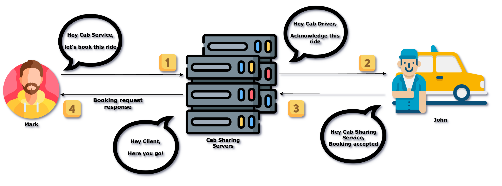

__*Note:*__ Here, John can also reject the Mark's booking request. If so, Mark will have to repeat the process by re-initiating booking request.

### Let's put this analogy of 'Booking a cab' on paper:
1. **User(Mark)** sends a booking request with his choice of pick-up and drop-off location(s) to the **Cab Sharing Server**.
2. The **Cab Sharing Server** maps booking request with a **Cab Driver(John)** who is near to the **Mark's pick-up location**.
3. **John** acknowledges the booking request with his acceptance or rejection and notifies to the **Cab Sharing Server**
4. The **Cab Sharing Server** relays that acknowledgement to **Mark**.

__*Note:*__ The process of mapping cab driver involves micro-service gRPC communication and we will talk about that in High-level design.

#### First Part: Sending a booking request to the server

We can handle this with a simple REST API call (HTTP POST request).

Here are the technical details.

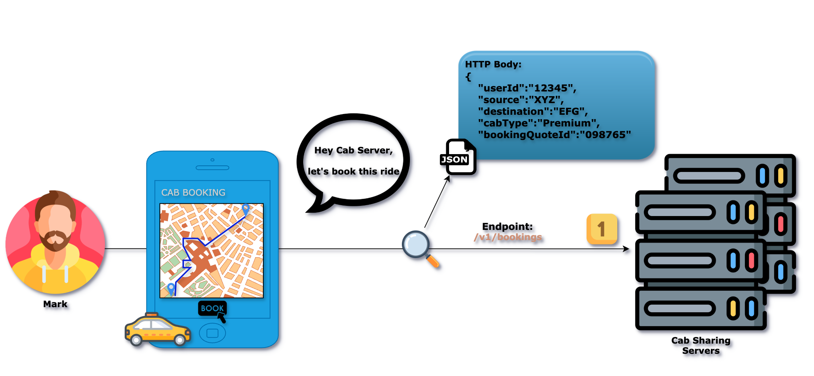

### HTTP Method
This tells to the server what action to perform. Since we want to book a cab for a user on the server, we use the `POST` action.

### Endpoint
This tells the server where to perform that action. Since we are booking a ride for a user, we will use the `/v1/bookings` endpoint of the server.

__*Note:*__ 'v1' means version 1. It is good practice to version your APIs. You can customize the endpoint based on your convenience.

### HTTP Body
We have told the server to book a ride for a user, but we haven't provided the details of the booking itself. This information is sent in the request body:

```json
{
    "userId":"Identification number of the user",
    "source":"pick-up location of the ride",
    "destination":"drop-off location of the ride",
    "cabType":"Type of the cab for a ride. E.g: Economy/Premium e.t.c",
    "BookingQuoteId":"Temporary booking Id for the ride"
}
```

#### Second Part: Relaying the message to the Cab Driver

This is more challenging. The Cab Sharing Server needs to send the message to John.

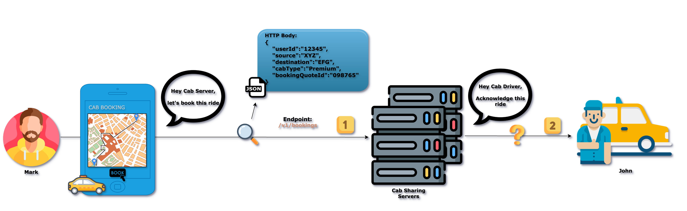

#### Third Part: Relaying the message to the Cab Driver

If second step isn't through, then we can forget about the third part even though from client to server communication is possible through HTTP request.

#### Fourth Part: Relaying the message to the Cab Driver

So is the fourth part!

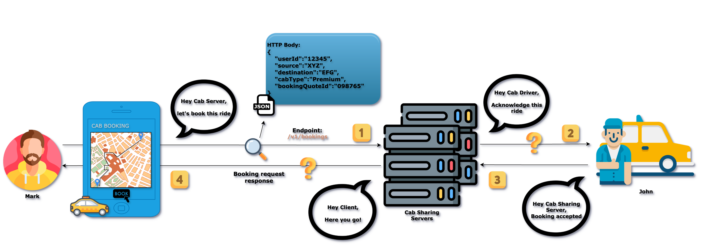

__Problem__

In HTTP, the server cannot initiate requests to the user. Requests can only be sent **from the client to the server** - it's a one-way street (user -> cab sharing server).

__Solution:__ WebSockets

WebSockets enable __bidirectional__ communication.

__*Note:*__ For more details, you can refer to our WebSocket section of [Communication Protocols](../Course%20Notes/03%20-%20Appendix/03%20-%20Networking%20Buzzwords/03%20-%20Communication%20Protocols_%20Rules%20for%20Computer%20Communication.md).

The below image represents the creation of bi-directional communication using a HTTP request.

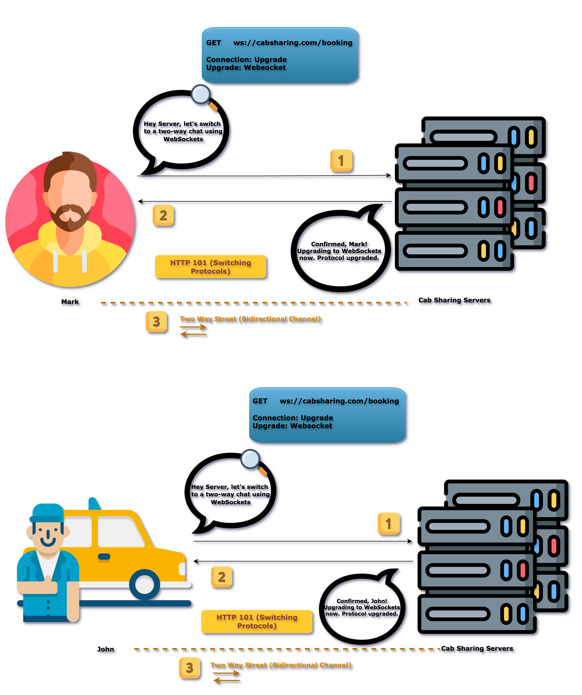

Once the connection is upgraded, it remains **open**, allowing both the cab sharing server and user/client to send messages directly to each other in **real-time** without needing the traditional HTTP request/response model.

- Mark sends messages to the cab sharing server through his connection.
- John receives messages from the cab sharing server through his connection.
- John sends messages to the cab sharing server through his connection.
- Mark receives messages from the cab sharing server through his connection.

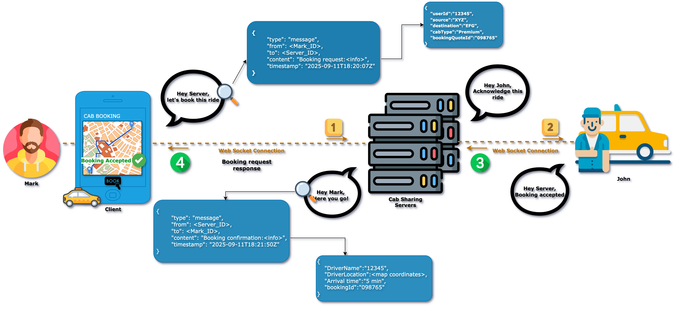

## API Design :Track The Ride

In the above API, we saw how Mark booked a ride. Now, let's see how Mark will track his ride.

We will continue with the WebSocket connection as __Track The Ride__ requires bi-directional communication and also a stream of messages from server to client.

<strong>Ride tracking involves the steps below.</strong>
1. Mark will wait for John's cab to arrive at the pick-up location.
2. John will start the ride after picking Mark from the pick-up location.
3. Mark and John will start tracking their ride along the way.

### First Part: How does the structure of data sent and received look like?

Imagine Mark is waiting at his pick-up point for John. He has no clue when John will arrive at his location. So, Mark opened the cab sharing application to get John's Estimated Time of Arrival(ETA).

Server will read the Mark's pick-up point and John's current location coordinates to calculate the ETA. After ETA calculation, server will share John's ETA to Mark's pick-up location with Mark.

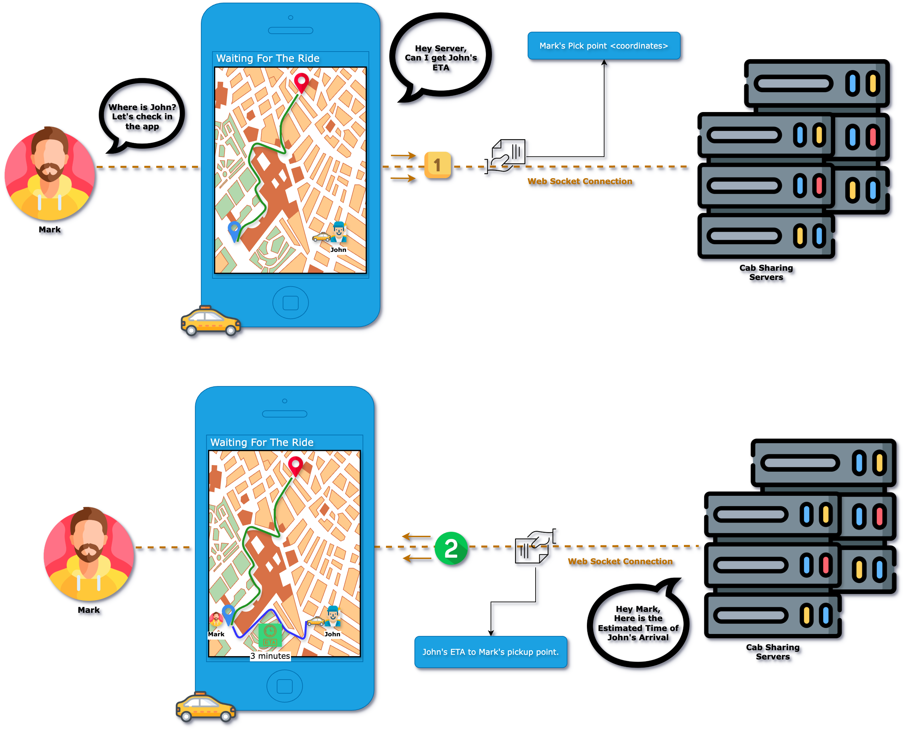

### Second Part: Data flow while starting an operation

Imagine John is at Mark's pick-up point. Mark got into John's cab now. They wanted to start the ride and John clicked start ride button in the cab sharing application.

Server will read the Mark/John's current and drop-off location coordinates to calculate the ETA to the drop-off location along with distance in miles. After calculation, server will share ETA to the drop-off location and distance between pick-up and drop-off locations to both Mark and John via cab sharing application.

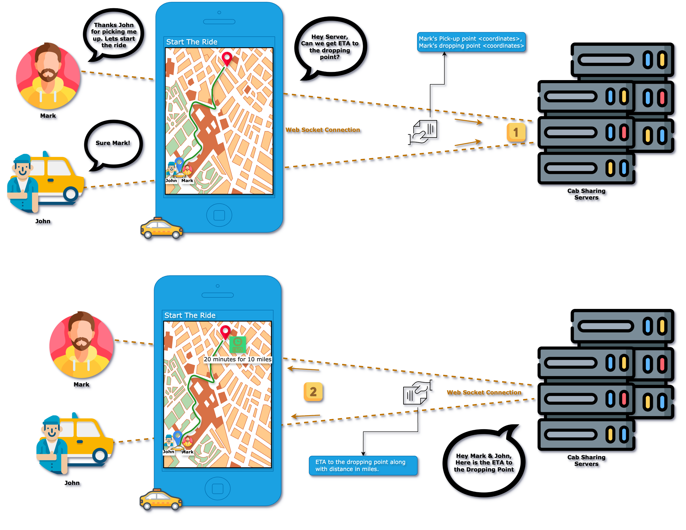

### Third Part: Live data flow after starting the operation

Let's assume Mark is curious to track his cab ride along with John. So, they both opened cab sharing application to track their ride.

Server will consider both Mark/John's current location and drop-off location coordinates continuously to calculate dynamic ETA, distance(in miles). It will asynchronously sending these updates to both Mark and John to track their ride along the way.


__*Note:*__
1. ETA calculation involves several steps which will get covered in the __Book A Cab__ high level design.
2. __The map, ETA__ and __distance(in miles)__ in the above images are considered as an example. You can re-consider these factors as per your convenience.
3. There can be more cases during this tracking process. Some of them are-
    - Mark may change his pick-up location during __Wait For The Cab__ period. In this case-
        - Server can notify both Mark and John about the dynamic change of John's ETA to Mark's location along with distance to reach.
        - Server can give heads-up to John about Mark's new pick up location.
    - Server can suggest __alternate ways__ to reach drop-off location by considering various factors, such as ETA, distance, traffic e.t.c.
    - __During the trip__, Mark may change his __drop-off location__. In this case-
        - Server can re-calculate ETA to the drop-off location along with relevant changes, such as price, alternate routes e.t.c.
        - Server can notify these changes to both Mark and John.

## API Design :View Ride History

After dropping Mark at drop-off point, John thought of checking his ride history along with the payment information. So, John opened his Cab Sharing application and clicked __Activity__ option in his profile page.

Unlike previous API, we can use REST API (HTTP GET request) for viewing ride history. But, we will stick to the __WebSocket connection__ for API communication to avoid extra HTTP headers and also to maintain consistency.

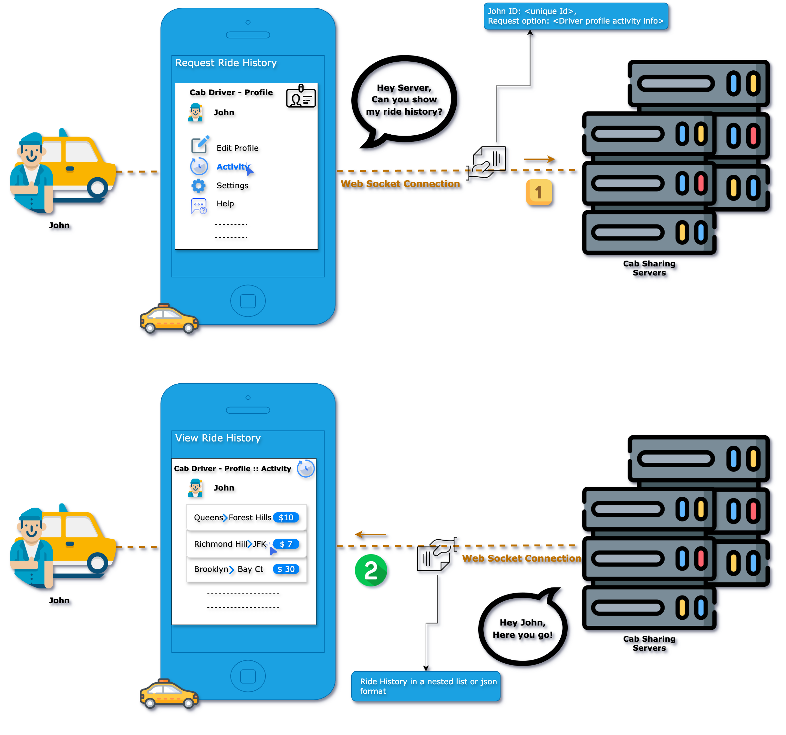

Now, John is able to view his ride history including payment information. He can also view more details of a particular ride if needed.

<hr style="border:2px solid gray">

# HIGH LEVEL DESIGN

Let's see what was happened in the __background__ when-
- Mark booked a cab,
- Mark and John tracked their ride,
- John viewed his ride history along with payment information.

In the API design, we saw how WebSocket connection can be used to communicate with cab sharing servers. If we go __a little deeper__, then we can see how __services communicate__ with each other.

For service communication, we can use __gRPC__.

google __Remote Procedure call__(gRPC) enables efficient communication between services using __proto buffers__ and __gRPC server__.
- Protocol buffers(an interface definition language) used to represent the __service interface__ and the __payload message structure__.
- gRPC server is used to __handle client calls__.

__*Note:*__ We can relate gRPC to a general example [here](../Course%20Notes/03%20-%20Appendix/04%20-%20Communication%20Buzzwords/03%20-%20gRPC_%20A%20Restaurant%20Analogy.md)

## High Level Design :Book A Cab

Mark performed a couple of steps to book his cab. Let's dive into them one by one on a __high-level__.

### HLD :View Map

How Mark was able to view the map which allowed him to choose pick-up and drop-off points graphically? Below steps walk us through.

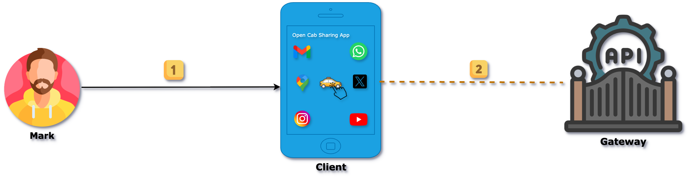

1. Mark can tap the __Cab Sharing App__ icon on his mobile device(client) to open Cab Sharing Application.

2. The __Client__ can send view request to the __API gateway__ via WebSocket connection.
    - An API gateway acts as a single entry point for all incoming requests.
    *Note:* For more details, you can refer to our [API gateway template](../Course%20Notes/03%20-%20Appendix/01%20-%20The%20Ultimate%20System%20Design%20Template/10%20-%20API%20Gateway.md)

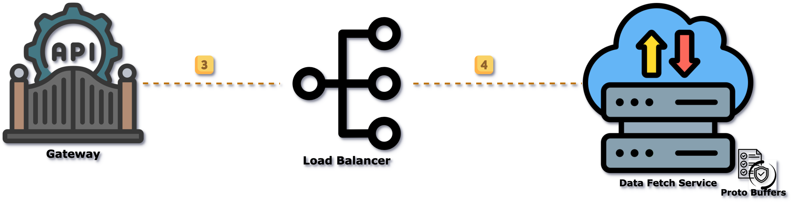

3. The __API gateway__ can relay the request to the __load balancer__.
    - A load balancer acts like a traffic manager, directing incoming user requests to different servers.
    *Note:* For more details, you can refer to our [ultimate system design template](../Course%20Notes/03%20-%20Appendix/01%20-%20The%20Ultimate%20System%20Design%20Template/04%20-%20Load%20Balancer.md)

4. The __Load balancer__ can relay the request to the __Data Fetch__ service.
    - The Data Fetch service can take request and pass it to appropriate service within cluster for a response.

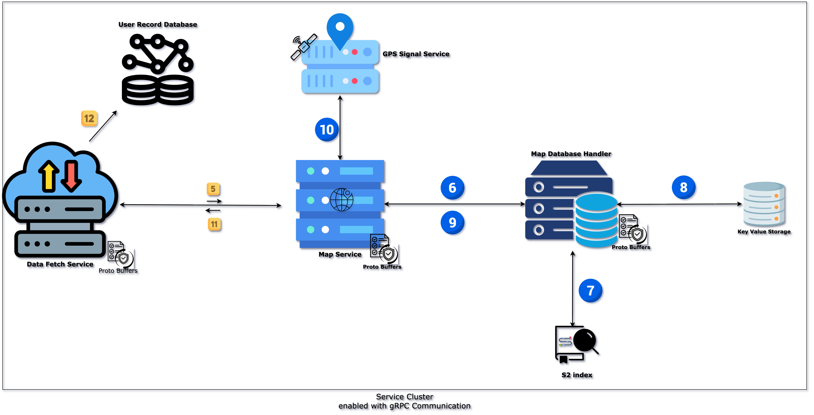

5. The __Data Fetch__ service can relay the request to the __map service__.
    - The __map service__ is responsible to manage map data

6. The __Map Service__ can take help from __Map Database__ service to get the map details.
    - The __Map Database__ service is responsible for getting relevant map details and also for maintaining user's map information until the ride completes.

7. The __Map Database__ service can use S2 index to get user's region and also to find relevant database partition.

8. The __Map Database__ service can use this partition to download the map data from __key value storage__.
    - The __Key value storage__ is an example of __NoSQL__ database. For more details, refer to our [Database and Storage Basics](../1.%20System%20Design%20Basics/Database%20and%20Storage%20Basics.md)

9. The __Map Database__ service can relay the response to the __Map Service__.

10. The __Map Service__ can take help from the __GPS signal__ service to avoid the risk of missing road data.

11. The __Map Service__ can provide final map data output to the __Data Fetch__ service.

12. The __Data Fetch__ can save user's map information to the __user record__ database.
    - The __user record__ database is responsible for maintaining user's information.
        - Internally, you can implement __Cache Aside Strategy__ for read operations and __Write Aside Strategy__ for write operations as user's data storage has more importance in cab sharing system.
        *Note:* For more details on caching, refer to our [Caching Basics](../1.%20System%20Design%20Basics/Caching%20Basics.md).

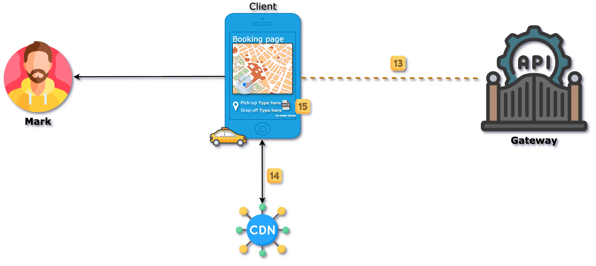

13. The __API gateway__ can send the response back to the __Client__. Now, Mark can view the booking page with a __Map view__.

14. The __Client__ can save map information to the __CDN__.
    - The __Content Delivery Network(CDN)__ stores copies of your website’s data that doesn’t change too often.
    *Note:* For more details on CDN, you can refer to the CDN section of [Database Storages](../1.%20System%20Design%20Basics/Database%20and%20Storage%20Basics.md).

15. We can use in-memory cache to __avoid__ additional __network data usage__ on duplicate download of map data by drivers.
    - __In-memory cache__ can help us to update data only if the server map data changes.

__Overall Flow Of View Map__:

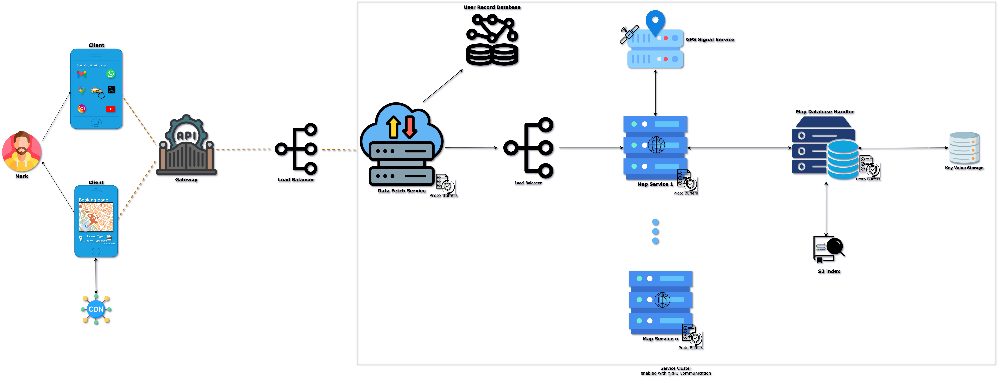

### HLD :View ETA

How Mark was able to view ETA to the drop-off point? Let's find out.

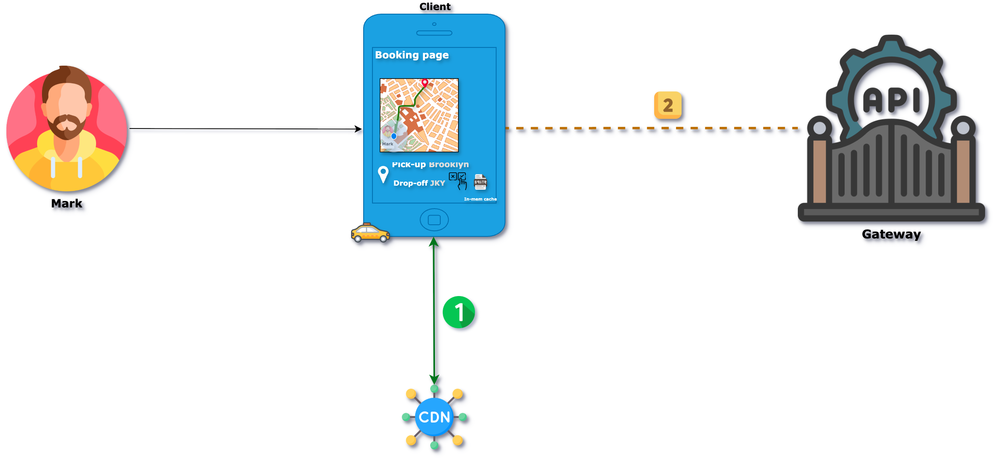

1. Mark can click __ok__ button after entering pick-up and drop-off points.
2. The __Client__ can send __view ETA__ request to the __API gateway__.

__*Note:*__ When Mark clicks __ok button__, other options such as cab type e.t.c can also be considered, but we are not covering them in this design.

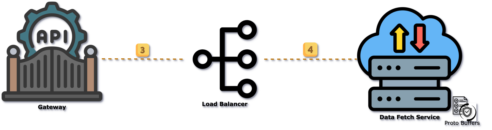

3. The __API gateway__ can relay the request to __load balancer__.
4. The __Load balancer__ can direct the same request to __Data Fetch__ service.

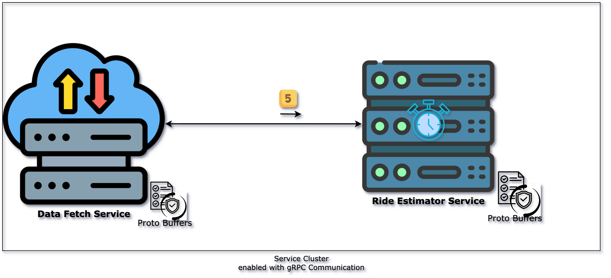

5. The __Data Fetch__ service can relay the request to the __Ride Estimator__ service.
    - Here, Data Fetch service can __validate the input__ data __before sending__ it to the Ride Estimator service.


6. The __Ride Estimator__ service can get the map data from the __Map__ service based on Mark's pick-up and drop-off points.

7. The __Ride Estimator__ service can use __deep learning algorithms__ to predict __traffic control elements__ such as stop signals and traffic lights.

8. The __Ride Estimator__ service can get average speeds (based on the locations) from __hash table__ through __Estimator Database__ handler.

9. The __Ride Estimator__ service can consider the map data as a __graph__ to compute accurate ETA.
    - In Map graph, the road intersection is considered as a node and a road segment is considered as an edge.
    - Let's say road intersections are more in Mark's ride path. In this case, we can partition the Map graph to calculate ETA efficiently.
    *Note:* You can refer to this [link](https://en.wikipedia.org/wiki/Graph_(discrete_mathematics)) for more details on Graph.

10. The __Ride Estimator__ service can make use of __GPS signal__ service to get active & recent GPS observed points between Mark's pick-up and drop-off points.
    *Note:* For more information on GPS signals, you can refer to this [link](https://en.wikipedia.org/wiki/GPS_signals)

11. Now, to get the __accurate ETA__, we can do __map matching__ between estimated and GPS observed points as shown in the image above.
    - In __Map matching__, if the estimated and GPS observed points are different, then step 9 will be repeated with the ride path paired with GPS observed points and can skip step 10 and step 11.
    - The final calculated ETA data can be relayed back to the __Data Fetch__ service.

12. The computed __ETA__ along with user's details (such as user's current location, pick-up and drop-off points) can be registered in database through __Estimator Database__ handler for re-usability purposes.

__*Note:*__
- We can store average speeds in a hash table for fast look-up.
    - A hash table generalizes the simpler notion of an array.
    *Note:* You can refer to our __hashing__ section of [Extras file](../1.%20System%20Design%20Basics/Extras.md) for more information.

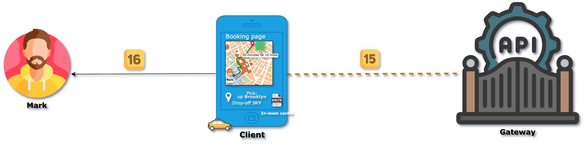

13. The __API gateway__ can relay the response message to the __Client__.
14. Mark can view the __ETA__ on his booking page.

__Overall Flow Of View ETA__:


__*Note:*__
1. The average speed and ETA in the reference image are considered as an example. You can update them as per your convenience.
2. While calculating ETA, __Haversine distance__ can be considered. Think of it like a formula to compute the shortest distance between two points on a sphere. More details are [here](https://en.wikipedia.org/wiki/Haversine_formula)
3. As ETA can keep on changing between two locations based on various factors and also storage can be huge in case of ETA. So, we are not considering ETA storage for entire ride path. Instant communication can be preferred.

### HLD :Find A Driver

How Mark was able to find a driver for his booking? Let's look into it.

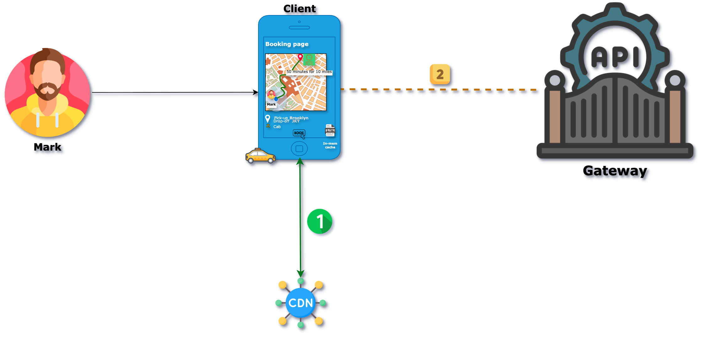

1. Mark can click __Book__ button after knowing ETA to his drop-off point.
2. The __Client__ can send __booking__ request to the __API gateway__.
    - __Find A Driver__ request is a part of booking request.

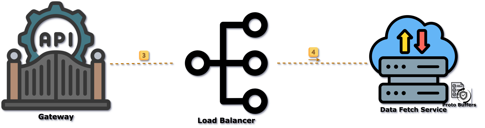

3. The __API gateway__ can relay the request to the __load balancer__.
4. The __Load balancer__ can direct the same request to the __Data Fetch__ service.

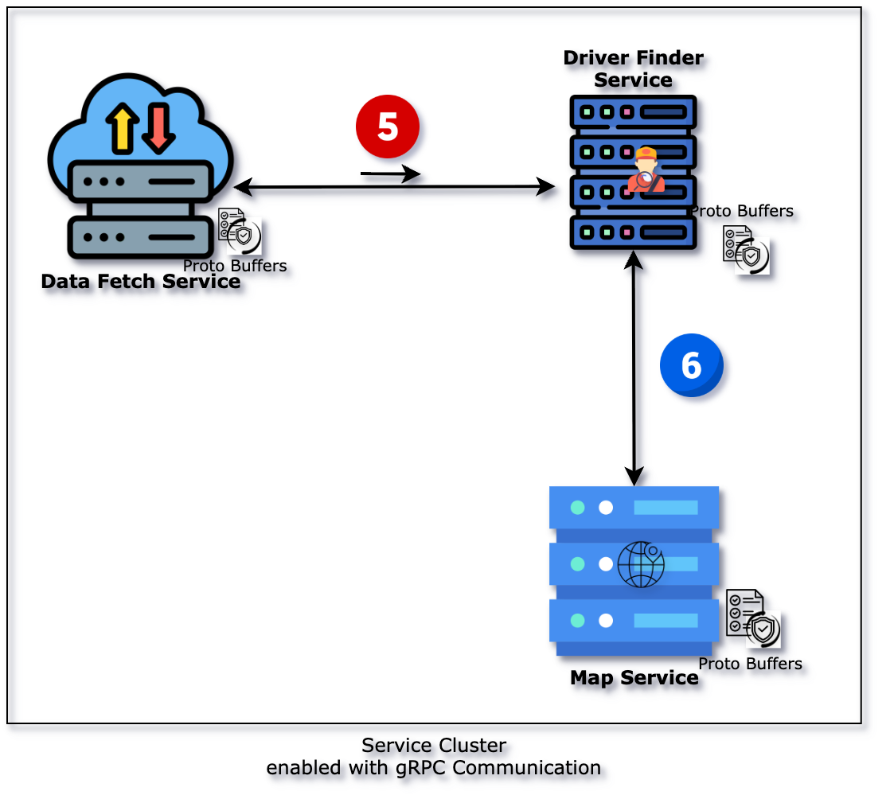

5. The __Data Fetch__ service can relay the same request to the __Driver Finder__ service.
    - The __Driver Finder__ service is responsible to find active drivers near Mark's location.

6. The __Driver Finder__ service can take help from the __Map service__ to get map data of available drivers locations.

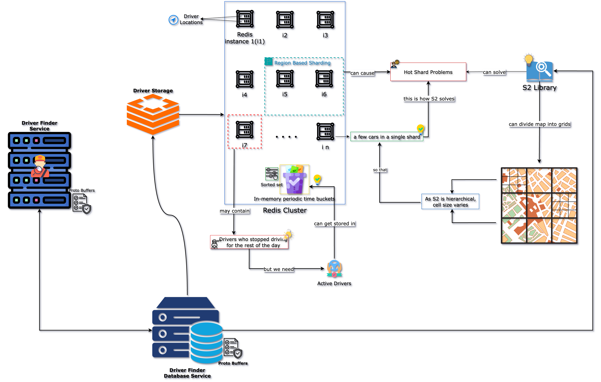

- The __Driver Finder__ service can use Key-Value(Redis cluster) storage to store driver locations.
    - Redis key-value store is an example of NoSQL database. For more details, you can refer to [Database Concept](../Course%20Notes/03%20-%20Appendix/01%20-%20The%20Ultimate%20System%20Design%20Template/02%20-%20Database.md).
- The __Key Value Storage__ can have many __instances__, meaning driver locations are __distributed__ among all instances.
- We may encounter two issues with this storage:
    1. __Hot Shard Problems__
        - Hot Shard Problems can occur due to more drivers in big cities.
        - Solution:
            - We can use S2 library to divide a map into regions that can vary in size.
            - So that only few cars will fit inside a single shard.
        *Note:* For more details on sharding, you can refer to our __Database Sharding__ under [System Design Basics](../1.%20System%20Design%20Basics/Database%20and%20Storage%20Basics.md)

    2. __In-active Drivers__
        - The drivers who __stopped driving__ for the rest of the day.
        - Solution:
            - We can __create buckets__ to store __active drivers__ and can __remove__ old buckets with in-active drivers.
            - To avoid frequent memory access for allocation and de-allocation, we can use a __sorted set__ with latest timestamp to find nearby drivers.

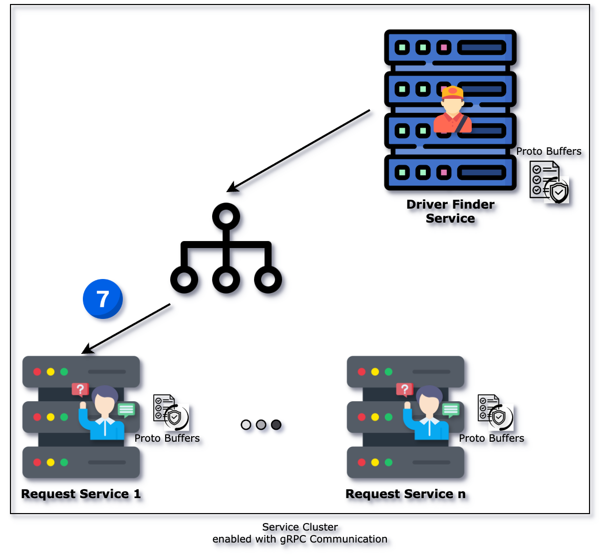

7. The __Driver Finder__ service can relay a list of active drivers near to Mark's location to the __Request__ service.
    - The __Request__ service is responsible for sending requests to users and record their responses.

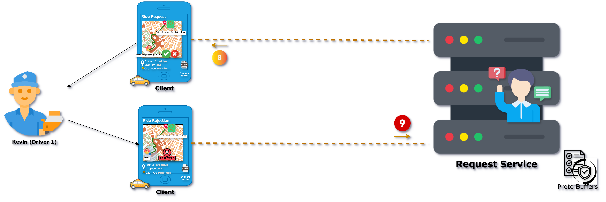

8. The __Request__ service can send Mark's booking request to first driver(Kevin) in the active drivers list.
9. The __Client__ can relay Kevin's rejection message to the __Request__ service.

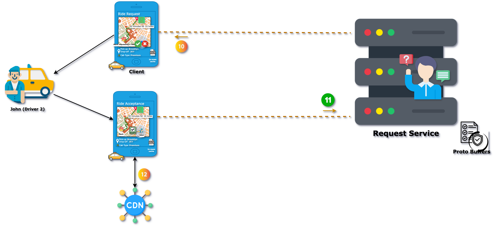

10. As Kevin rejected the booking request, the __Request__ service can send Mark's booking request to John.
11. The __Client__ can relay John's approval message to the __Request__ service.
12. The __Client__ can save driver details to the __CDN__.

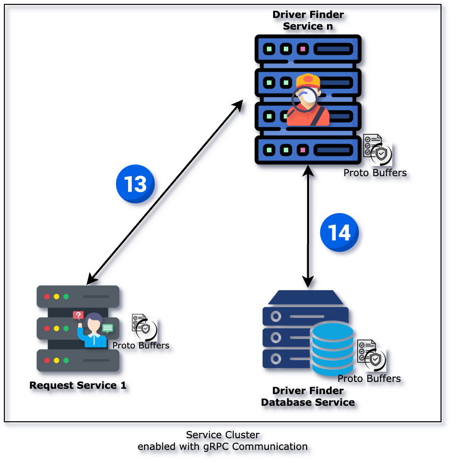

13. The __Request service__ can stop sending requests to drivers and can send confirmed Driver details to the __Driver Finder__ service.
14. The __Driver Finder__ service can update the ride status of John in database.
    - These details are useful in filtering out active drivers.

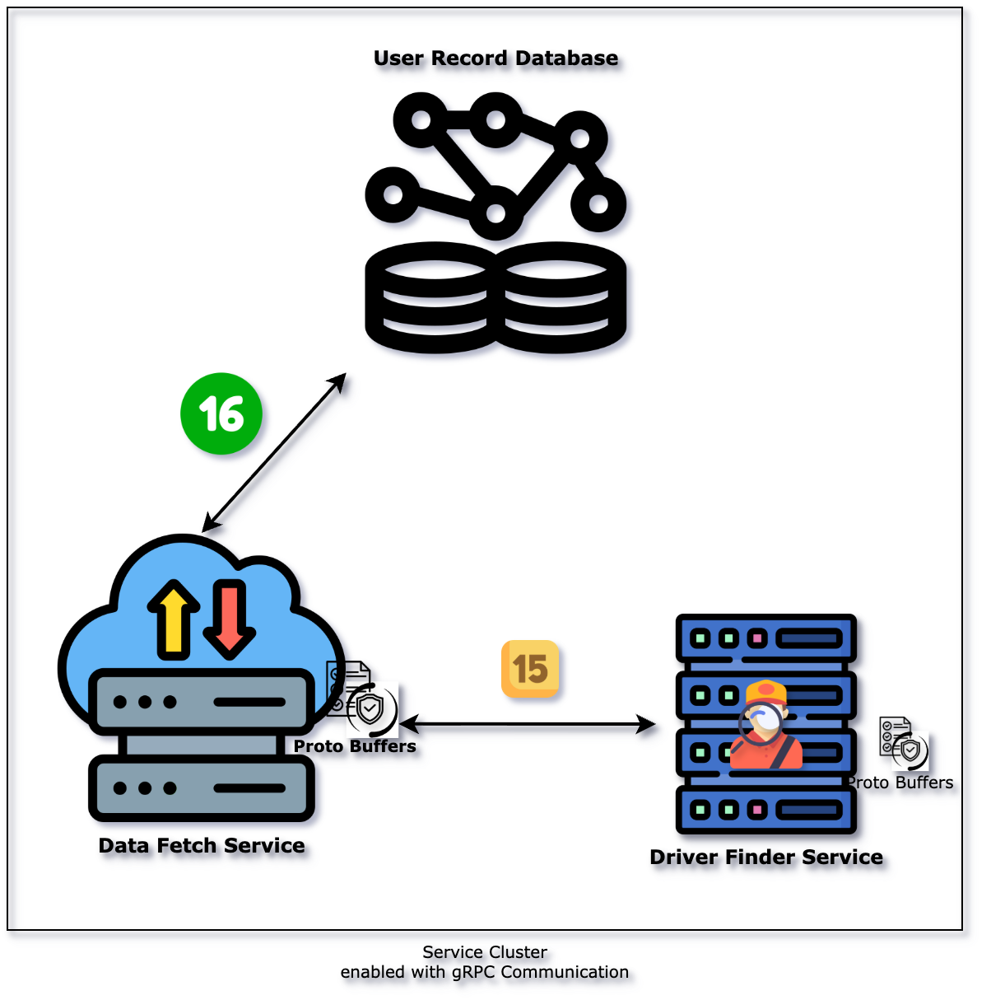

15. The __Driver Finder__ service can give response back to the __Data Fetch__ service.
16. The __Data Fetch__ service can store John's details associated to Mark's ride in __user record__ database.
    - These details are useful to maintain ride history.

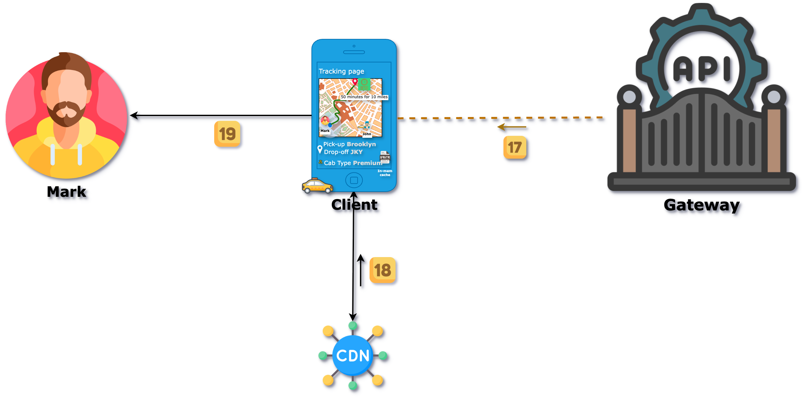

17. The __API gateway__ can send the response back to the __Client__ with booking acceptance message.
18. The __Client__ can retrieve John details from the __CDN__.
    *Note:* The Client can get the driver details from API gateway, but for faster load time, it can make use of CDN.
19. Now, Mark is __able to view__ driver details via Client.

__Overall Flow Of Find A Driver__:


## High Level Design :Track The Ride

How Mark and John were able to track their ride? Let's take a look.

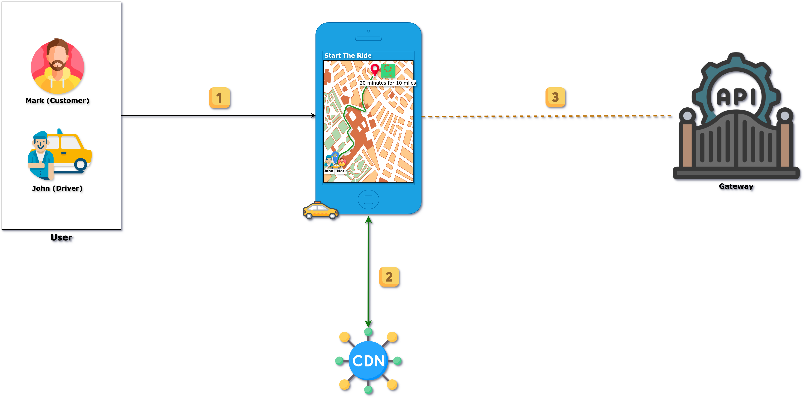

1. __User can start their ride__ through __Client__ device to initiate the __tracking request__.
2. The Client can __fetch static data__ from __CDN__ to populate on Client device.
3. The __Client__ can make use of web-socket connection to forward the request to the __API Gateway__.

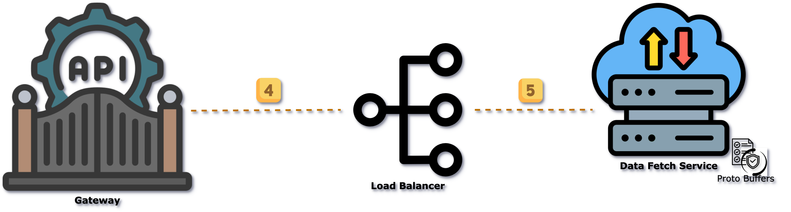

4. The __API gateway__ can relay the request to the __load balancer__.
5. The __Load balancer__ can direct the same request to the __Data Fetch__ service.

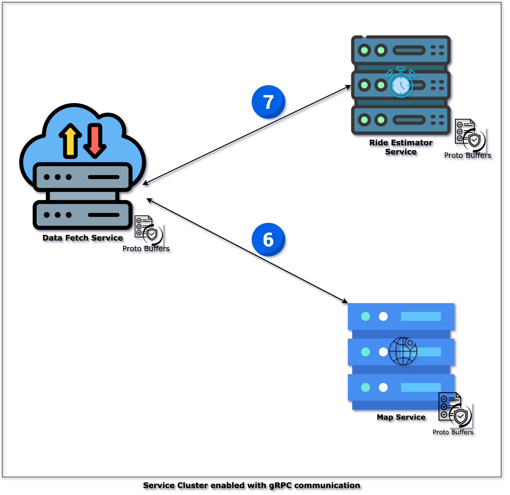

6. The __Data Fetch__ service can send a Map data request to the __Map Service__.
7. The __Data Fetch__ service can send a ETA request to the __Ride Estimator Service__.


8. The __Map Service__ can take help from __Map Database__ handler to get the map details.
    - The __Map Database__ handler can use S2 index to get user's region and also to find relevant database partition.
    - The __Map Database__ handler can use this partition to download the map data from __key value storage__.
    - The __Map Database__ handler can relay the response to the __Map Service__.

9. The __Map Service__ can take help from the __GPS signal__ service to avoid the risk of missing road data.

10. The __Map Service__ can provide a copy of final map data output to the __Estimator__ service for computing ETA.

11. The __Estimator__ service can use __deep learning algorithms__ to predict traffic control elements, such as __stop signals__ and __traffic lights__.
    *Note:*
    1. The traffic control elements will be considered only once between pick-up and drop-off points.
    2. If Mark changes either pick-up point (at the start) or drop-off point (at the end), then you can repeat this step to get updated data.

12. The __Estimator__ service can get location based average speeds from the hash table through __Estimator Database__ handler.

13. The __Estimator__ service can extract __GPS signal__ details for missing road information.
    - This information is useful, if the estimated path encounters any run time changes like John takes different route to reach drop-off location or Mark updates the ride with stopping points in between.

14. The __Estimator__ service will make use of __Map__ data to compute the ETA as per user's current location.
    - The partition of Map graph is still useful to compute ETA by considering road intersections and road segments efficiently.

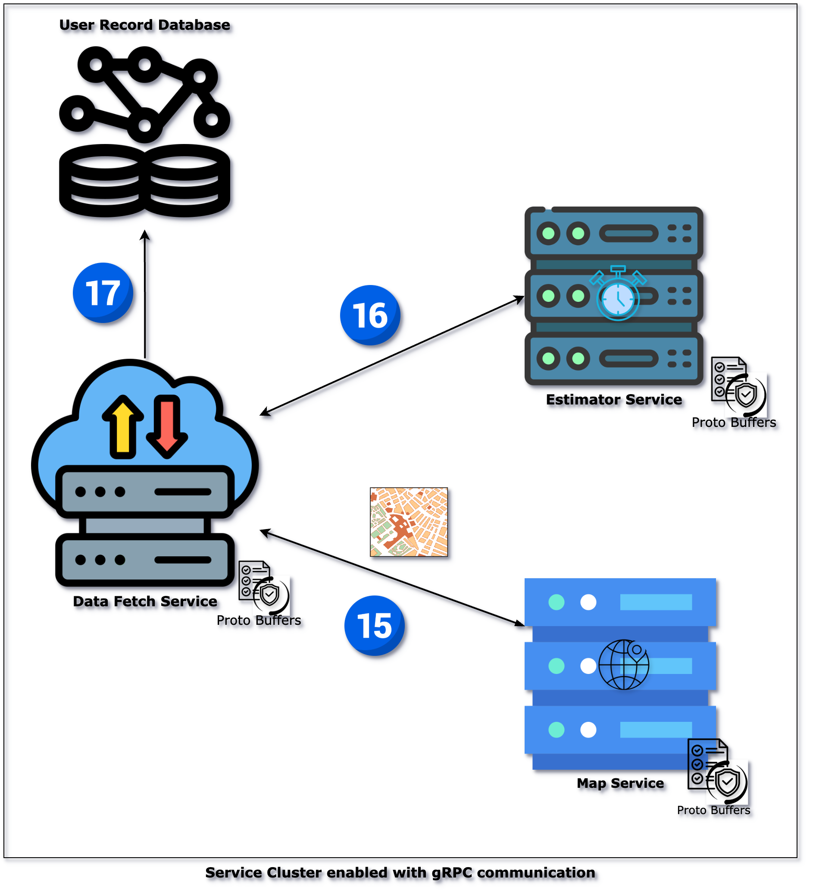

15. The __Map__ service can relay the response back to the __Data Fetch__ service.
16. The __Ride Estimator__ service can provide the computed ETA to the __Data Fetch__ service.
17. The __Data Fetch__ service can save user's current, drop-off location coordinates and respective ETA to the __user record__ database.
    - This step can be an optional one, because it will be a storage overhead to maintain location coordinates through out the ride path.
    - You can consider the location coordinates at the start of the ride and at the end of the ride along with their ETA. Also, you can consider this storage if Mark changes his drop-off location.

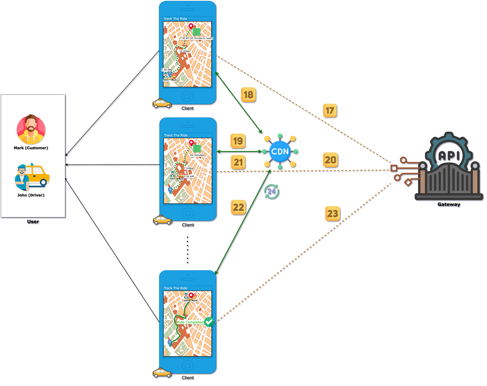

18. The __API Gateway__ can give a response to the __Client__.
    - As we are tracking the ride, responses can be asynchronous i.e: cab sharing servers can keep-on sending responses to client as Mark's or John's current location progresses.
19. The __Client__ can store the information to the __CDN__.
20. The static information from __CDN__ can be used to render the client's User Interface(UI) until, it receives the response from backend system.
21. As Mark progressed with his ride, our __backend-system__ responded back with __updated ETA__ along with his __latest location__ details to __Client__ through __API Gateway__.
22. The __Client__ can store the information to the __CDN__.
23. The __Client retrieves__ static information that was saved in __CDN__.
    - And this process of retrieving data from backend system for data population continuous until ride completes
24. The __API Gateway__ can relay the ride completion response to the __client__.
25. The __Client__ can save the ride completion status to the __CDN__.
    - This can help Mark to view his ride status later on.

__Overall Flow Of Track The Ride__:


## High Level Design :View Ride History
[TBD]
<!-- We have used WebSocket connection to communicate with cab sharing servers and provided seamless operations to Mark & John by using gRPC to communicate between services. -->

<hr style="border:2px solid gray">

# DEEP DIVE INSIGHTS
[TBD]
<hr style="border:2px solid gray">

__*Note:*__
1. The Map and other reference icons are considered just as an example. We can always change them as per our convenience.