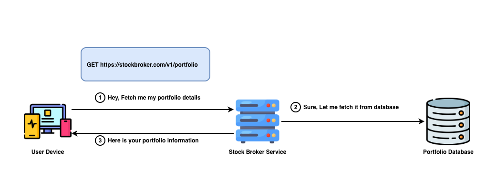
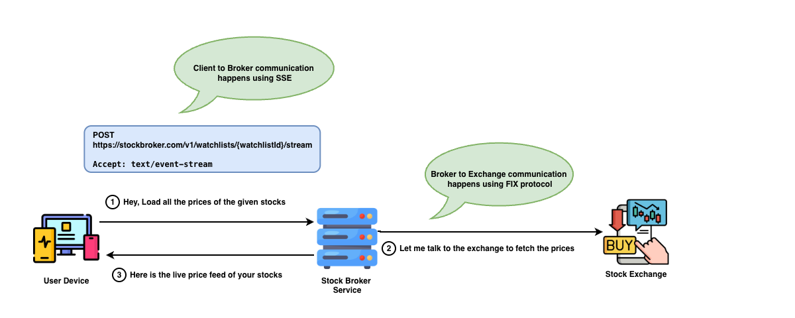
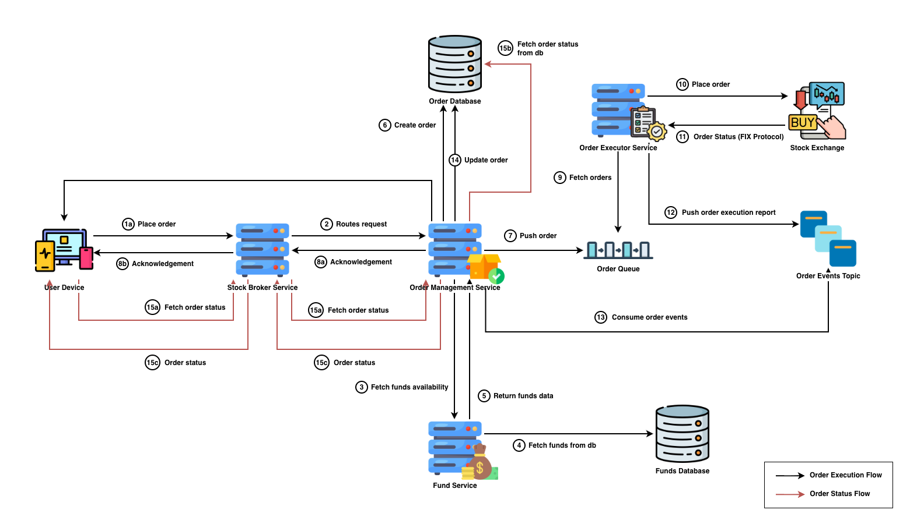
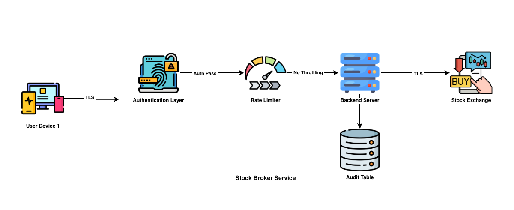

# Stock Broker Service

- [Introduction](#introduction)
  * [What is a Stock Market](#what-is-a-stock-market)
  * [What a Stock Broker Actually Does](#what-a-stock-broker-actually-does)
- [Requirements](#requirements)
  * [Functional Requirements](#functional-requirements)
- [Non-Functional Requirements](#non-functional-requirements)
- [Terminology](#terminology)
- [API Design](#api-design)
  * [Stock Watchlist](#stock-watchlist)
  * [Order Management](#order-management)
  * [Place Order](#place-order)
  * [Fetch Order Status](#fetch-order-status)
  * [View Portfolio](#view-portfolio)
  * [Price Tracker](#price-tracker)
- [High Level Design](#high-level-design)
  * [Note](#note)
  * [Watchlist](#watchlist)
  * [Order Management (Buy/Sell Shares)](#order-management-buysell-shares)
  * [Portfolio](#portfolio)
- [Deep Dive Insights](#deep-dive-insights)
  * [Connection Choices](#connection-choices)
  * [Fan-out Scaling](#fan-out-scaling)
  * [Security](#security)
  * [Order State Machine](#order-state-machine)

<!-- tocstop -->

## Introduction

### What is a Stock Market

Think of the stock market as a regular marketplace. Assume there are multiple sellers selling apples and multiple buyers with money. Each seller might sell apples at different prices, and each buyer is willing to pay different prices for apples. A trade happens when a buyer finds a seller whose price matches what the buyer is willing to pay.


The stock market works the same way. Instead of apples, sellers offer shares of companies, and buyers are willing to pay money to buy those shares. There are many buyers and many sellers quoting different prices at the same time. A trade happens when a buyer’s price matches a seller’s price.

### What a Stock Broker Actually Does

In a real marketplace, buyers and sellers meet directly. A buyer can walk up to a seller, negotiate a price, and buy apples for money. But in the stock market, buyers and sellers are spread across cities and never meet each other.

This is where a stock broker comes in. Think of a stock broker as a middleman for both buyers and sellers. Buyers tell the broker what to buy and at what price. Similarly, sellers tell the broker what to sell and at what price. The broker takes these requests and places them into a common marketplace called the **stock exchange**. The stock exchange (for example, NSE or BSE) is like an organized bazaar that keeps all buy and sell offers in one place and decides when a buyer and seller match.

In simple terms, the broker’s role is to sit between buyers, sellers, and the stock exchange, and make sure the outcome of the trade is accurately reflected for both sides.

---

## Requirements

### Functional Requirements

| Create/view watchlist          | User should be able to create and view the watchlist                               |
| ---------------------------------- | ---------------------------------------------------------------------------------- |
| **Add/remove stocks on watchlist** | User should be able to add or remove stocks on their watchlist                     |
| **Place orders (Buy/Sell)**        | Users should be able to place BUY/SELL orders with the broker                      |
| **Track order status**             | Users should be able to fetch order status until completion                        |
| **View Portfolio**                 | Users should be able to fetch their holdings and positions as a portfolio snapshot |
| **Stream live price updates**      | Users should receive real-time price ticks for watchlist and portfolio stocks      |

## Non-Functional Requirements

| Real-time updates | Price ticks should be delivered with minimal delay to provide a responsive watchlist/portfolio experience        |
| --------------------- | ---------------------------------------------------------------------------------------------------------------- |
| **Security**          | APIs must enforce authentication/authorization, encrypt traffic (TLS), and protect against abuse (rate limiting) |
| **Availability**      | Broker APIs and streaming endpoints should remain available during market hours and peak traffic periods         |
| **Consistency**       | Order state must be strongly consistent from the broker’s perspective                                            |

---

## Terminology

1. **Holding**: Shares you currently own in your account, typically as a long-term investment.
2. **Position**: Your active trading details in a stock, such as intraday buy/sell quantities.
3. **Portfolio**: A consolidated view of your holdings and positions along with their current value and Profit & Loss.
4. **Symbol**: The short identifier of a stock on the exchange (e.g., `INFY`, `HCLTECH`).
5. **Side**: Indicates whether the order is a **BUY** or **SELL**.
6. **Tick**: A single real-time market update for a symbol, such as a change in price.

---

## API Design

### Stock Watchlist

A stock watchlist allows users to save stocks they are interested in. This helps them quickly track prices in one place. It is like a bookmark list for stocks. In the watchlist screen, the user can: 1) create a watchlist, 2) add stocks to the watchlist, 3) remove stocks from the watchlist, and 4) view live prices.


#### Create Watchlist

This API allows the user to create a watchlist with the given watchlist name and stock symbols. We chose REST APIs because they are simple, widely supported, and work with any web or mobile app over HTTP.


**HTTP Method & Endpoint**

This tells the server what action to perform. In our case, we want to create a watchlist, so we use the `POST` method. The `POST` method is generally used when the request creates something new in the system. We will use the endpoint `/v1/watchlists`. Here, `v1` means version 1 and is called API versioning. API versioning allows you to make changes to your APIs without breaking existing clients by using version numbers like `/v1/` or `/v2/` in the URL path.

**HTTP Body**

This section provides the necessary information to the server to create a watchlist. This information is sent as the request body.

```json
{
  "name": "MyWatchlist",
  "stocks": ["INFY", "HCLTECH"]
}
```

> Note that we pass `stocks` while creating the watchlist so that the watchlist is created and the given stocks are added.

**HTTP Response**

The server creates the watchlist, adds the given stocks, and returns a unique id for the created watchlist.

```json
{
  "watchlistId": "MyWatchlist123"
}
```

#### Add Stocks to Watchlist

This API allows the user to add stocks to an existing watchlist.


**HTTP Method & Endpoint**

This tells the server what action to perform. In our case, we want to add stocks to an existing watchlist, so we use the `POST` method. We will use the endpoint `/v1/watchlists/{watchlistId}/add`.

**HTTP Body**

This section provides the necessary information to the server to add stocks to an existing watchlist. This information is sent as the request body.

```json
{
  "stocks": ["INFY", "HCLTECH"]
}
```

**HTTP Response**

For this API, the response can be minimal and simply state whether the operation succeeded.

```json
{
  "status": "success"
}
```

#### Remove Stocks from Watchlist

This API allows the user to remove stocks from an existing watchlist.


**HTTP Method & Endpoint**

This tells the server what action to perform. In our case, we want to remove stocks from an existing watchlist, so we use the `POST` method. We will use the endpoint `/v1/watchlists/{watchlistId}/remove`.

> Why not use DELETE instead of POST?
>
> Some proxies strip `DELETE` request bodies because early implementations assumed `DELETE` should work like `GET` and only require a URL. As a result, sending the list of symbols in the request body is not always reliable across different network layers.

**HTTP Body**

This section provides the necessary information to the server to remove stocks from an existing watchlist. This information is sent as the request body.

```json
{
  "stocks": ["INFY", "HCLTECH"]
}
```

**HTTP Response**

For this API, the response can be minimal and simply state whether the operation succeeded.

```json
{
  "status": "success"
}
```

#### Fetch Stocks from Watchlist

This endpoint fetches the user’s stocks from their watchlist.


**HTTP Method & Endpoint**

This tells the server what action to perform. In our case, we want to fetch stocks from an existing watchlist, so we use the `GET` method. We will use the endpoint `/v1/watchlists/{watchlistId}`.

**HTTP Body**

`GET` requests do not need a body because they are used only to fetch information.

**HTTP Response**

The response contains the symbols of all stocks from the user’s watchlist.

```json
{
  "stocks": ["INFY", "HCLTECH"]
}
```

### Order Management

This API allows the user to place a BUY/SELL order with the broker service. The broker service talks to the exchange to place the order.


We need two APIs for order placement:

1. Place Order
2. Fetch Order Status


### Place Order

**HTTP Method & Endpoint**

This tells the server what action to perform. Since we want to place an order, we use the `POST` method. The endpoint for this API would be `/v1/orders`.

**HTTP Body**

```json
{
  "clientId": "c_12345",
  "symbol": "INFY",
  "side": "BUY",
  "type": "MARKET",
  "quantity": 10
}
```

**HTTP Response**

```json
{
  "orderId": "ord_789",
  "status": "PENDING_EXCHANGE"
}
```

### Fetch Order Status

**HTTP Method & Endpoint**

This tells the server what action to perform. Since we want to fetch the order status, we use the `GET` method. We use `GET` because this action doesn’t alter any state in the system and is read-only. The endpoint for this API would be `/v1/orders/{orderId}`.

**HTTP Body**

`GET` requests do not need a body because they are used only to fetch information.

**HTTP Response**

```json
{
  "orderId": "ord_789",
  "clientId": "c_12345",
  "symbol": "INFY",
  "side": "BUY",
  "type": "MARKET",
  "quantity": 10,
  "status": "SUCCESS",
  "avgPrice": 1542.30
}
```

### View Portfolio


This API provides portfolio details (holdings and positions) with data such as price, quantity, etc.



#### HTTP Method & Endpoint

We use the `GET` method since we only want to retrieve details from the system. The endpoint would be `/v1/portfolio`.

#### HTTP Body

`GET` requests do not need a body because they are used only to fetch information.

#### HTTP Response

```json
{
  "holdings": [
    {
      "symbol": "INFY",
      "quantity": 20,
      "avgBuyPrice": 1480.25,
      "investedValue": 29605.00
    }
  ],
  "positions": [
    {
      "symbol": "HCLTECH",
      "netQuantity": -5,
      "avgPrice": 1320.10,
      "product": "INTRADAY"
    }
  ]
}
```

### Price Tracker

In both **watchlist** and **portfolio**, along with the stocks, we display the current stock price being traded in the market. We need a mechanism that delivers live price updates to the client. We want the best user experience, where the user doesn’t have to refresh the page to view the latest trading price of their watchlist/portfolio stocks.

To stream live price updates to the client, we use a special protocol called **Server-Sent Events (SSE)**. SSE is a one-way streaming connection where:

1. The client opens an HTTP connection with the server.
2. The server keeps the connection open for the client-specified duration.
3. The server continuously pushes events through the same connection.

We used SSE because it is well-suited for **live feed** style updates and is built on HTTP, which works on most modern browsers. We use `text/event-stream` as the content type for SSE requests. There are other ways to achieve the same result using **WebSockets** and long polling. Refer dive deep section [Connection Choices](#connection-choices) for more details. 



**HTTP Method & Endpoint**

This tells the server to start a live stream of price updates for the client. We use the `GET` method and the endpoint `/v1/marketdata/stream`. We use SSE to invoke this endpoint.

**HTTP Body**

`GET` requests do not need a body because they are used only to fetch information.

**HTTP Response**

```json
event: price_tick
data: {"symbol":"INFY","ltp":1542.35,"change":12.10,"changePct":0.79,"ts":"2026-01-17T10:45:01Z"}

event: price_tick
data: {"symbol":"HCLTECH","ltp":1320.10,"change":-5.20,"changePct":-0.39,"ts":"2026-01-17T10:45:02Z"}
```

**Did you notice the FIX Protocol?**

You must have noticed that the Broker Service and the Stock Exchange don’t communicate through HTTP or SSE. Instead, they use a special protocol called FIX (Financial Information eXchange). FIX is a standard messaging protocol used in trading systems to exchange information such as placing orders, cancelling/modifying orders, and subscribing to market data. The syntax for FIX messages is `tag=value|tag=value|tag=value|...`.

Examples of common tags include: `35` for message type (New Order, Cancel, Execution Report, etc.), `55` for stock symbol, and `38` for quantity.

For instance, we can use a payload like the one below to request market data for INFY and HCLTECH.

```
35=V|262=mdreq-001|263=1|264=1|146=2|55=INFY|55=HCLTECH|267=2|269=0|269=1|
```

---

## High Level Design

Before diving deep into the high-level design of each component, we will first understand the different services involved in a stock broker system.

* **Stock Broker Service** - The main backend API that the app talks to for placing orders, viewing the portfolio, and managing watchlists.
* **Order Management Service (OMS)** - Creates and tracks orders from start to finish.
* **Price Tracker Service (PTS)** - Continuously receives live stock prices and provides the latest price updates to the app.
* **Order Executor Service (OES)** - Takes submitted orders and sends them to the stock exchange.
* **Funds Service** - Manages user balance and margin by blocking funds for orders.

### Note

Throughout this high-level design, we will discuss several backend services such as the Broker Service, Funds Service, and Stock Exchange. In a real system, each service typically sits behind an **API Gateway and a Load Balancer**, which receive incoming requests and route them to the appropriate backend servers. To keep the diagrams simple, I haven’t shown these components explicitly, but you can assume they exist in front of every backend service.


### Watchlist

The watchlist flow allows users to save a set of stocks and fetch them. For live tracking, the broker streams real-time price ticks for those symbols to the user via SSE.


1. The Price Tracker Service subscribes to the Stock Exchange market feed using the FIX protocol. This creates a long-lived connection so the service can continuously receive real-time market prices.
2. The Stock Exchange continuously sends price updates (*ticks*) to the Price Tracker Service. A *tick* is a single market update for a symbol, such as “INFY price changed to 1542.35 at this timestamp”.
3. The Price Tracker Service publishes each tick to the `Price Events Topic`.
4. The user device calls `GET /v1/watchlists/{watchlistId}` on the Stock Broker Service to fetch watchlist stocks.
5. The Stock Broker Service fetches the watchlist symbols from the Watchlist Database. The database stores only the user’s watchlist configuration (symbols, order, name), not live prices.
6. The Stock Broker Service returns the watchlist symbols back to the user device.
7. The user device opens an SSE connection using `GET /v1/marketdata/stream` for live prices. SSE keeps the HTTP connection open so the server can push price ticks continuously without polling.
8. The Stock Broker Service consumes live ticks from the `Price Events Topic` and filters them by watchlist symbols. Only ticks for symbols present in the watchlist are selected.
9. The Stock Broker Service streams matching ticks back to the user device via SSE (fan-out). Fan-out means one tick like `INFY → 1542.35` can be sent to many connected users who are subscribed to INFY at the same time.

**Note**

We didn’t go deep into watchlist features like **create**, **add stock**, or **remove stock** because they are mostly simple CRUD operations with predictable behavior. The real complexity in watchlists comes from streaming live price updates, so we focused on the price feed flow.

### Order Management (Buy/Sell Shares)

The following steps are executed when a user buys or sells shares using the broker app/website.



1. The user places an order (`POST /v1/orders`) from the broker app to buy or sell shares.
2. The request reaches the **Stock Broker Service**, which performs basic validations (for example, session/auth checks) and then forwards the request to the **Order Management Service (OMS)**.
3. Before processing the order, **OMS** calls the **Funds Service** to verify that the user has sufficient balance and to block (reserve) the required amount.
4. The **Funds Service** receives the request and fetches the user’s balance from the **Funds Database**.
5. The **Funds Service** returns the fund details to **OMS**.
6. **OMS** validates that the user has sufficient funds. If the balance is sufficient, it creates a new order record in the **Order Database** and generates a unique `orderId` to track the order.
7. **OMS** publishes the order to the **Order Queue** for asynchronous execution.
8. After publishing to the queue, **OMS** returns an acknowledgement to the user device with the generated `orderId` so the user can track the order status.
9. The **Order Executor Service (OES)** consumes the order from the queue.
10. **OES** sends the order to the **Stock Exchange** for execution.
11. **OES** and the **Stock Exchange** communicate over the **FIX protocol** and receive ongoing updates about the order state.
12. Whenever **OES** receives order updates/events from the Stock Exchange, it publishes them to the **Order Events Topic**.
13. **OMS** consumes these events from the **Order Events Topic**.
14. **OMS** updates the order status in the **Order Database** based on the received events.
15. After placing the order, the user device periodically queries the system to fetch the latest order status.

    1. The user device polls the **Stock Broker Service** (`GET /v1/orders/{orderId}`) at regular intervals. The broker service routes the request to **OMS**.
    2. **OMS** fetches the latest order status from the **Order Database**.
    3. **OMS** returns the response to the broker service, which then sends it back to the user device.

### Portfolio

The portfolio flow allows users to view their holdings and positions. Similar to watchlist, we use the Price Tracker Service to stream live prices for portfolio stocks.


1. The Price Tracker Service subscribes to the Stock Exchange market feed using the FIX protocol.
2. The Stock Exchange continuously sends price updates (*ticks*) to the Price Tracker Service.
3. The Price Tracker Service publishes each tick to the `Price Events Topic`.
4. The user device calls `GET /v1/portfolio` on the Stock Broker Service to fetch portfolio stocks.
5. The Stock Broker Service fetches the holding and position symbols from the Portfolio Database.
6. The Stock Broker Service returns the portfolio symbols back to the user device.
7. The user device opens an SSE connection using `GET /v1/marketdata/stream` for live prices.
8. The Stock Broker Service consumes live ticks from the `Price Events Topic` and filters them by portfolio symbols.
9. The Stock Broker Service streams matching ticks back to the user device via SSE (fan-out).

---

## Deep Dive Insights

### Connection Choices

Every broker app faces the same problem: **prices change constantly**, but HTTP was originally designed for “request → response → done”. Markets don’t behave like that. So we need a way to push updates to the client without making the user hit refresh every second. There are three common approaches. They all work, but in different ways.


#### Long Polling

In long polling, the client keeps calling the server for updates, but the server doesn’t respond immediately. The server waits until there’s some data or until a timeout, and then returns the response. The client instantly makes the next request.

**Where it works**

* The implementation is simple.
* Update frequency is low.

**Where it hurts**

* Lots of repeated HTTP requests are made.
* Scaling becomes expensive with many concurrent users.
* Not great for high-frequency changes.

#### WebSocket

WebSockets start as HTTP and then upgrade into a persistent two-way connection. After that, both the client and server can send messages at any time. With WebSockets, the client connects once via a handshake and the server pushes updates continuously.

**Where it works**

* Bidirectional communication between the client and server is required.
* Handles high-frequency data well.

#### Server-Sent Events (SSE)

SSE is basically long polling done in a cleaner way. The client makes a single HTTP request, and the server keeps that connection open and pushes events whenever updates arrive. With SSE, the client opens an HTTP `GET` connection with the server, the server replies once and keeps streaming events, and the client keeps receiving updates without making repeated requests.

**Where it works**

* Only the server needs to communicate continuously.
* It is built on HTTP, so it works well with standard infrastructure.

**Where it hurts**

* Slow consumption can lead to backpressure.
* Requires heartbeats to keep connections healthy.

| Feature            | Long Polling            | SSE                        | WebSockets                       |
| ------------------ | ----------------------- | -------------------------- | -------------------------------- |
| Connection style   | Repeated HTTP requests  | One long-lived HTTP stream | One upgraded persistent socket   |
| Direction          | Mostly request/response | Server → Client only       | Two-way                          |
| Real-time feel     | Medium                  | High                       | Highest                          |
| Overhead           | High                    | Low                        | Low                              |
| Reconnect handling | Manual                  | Built-in                   | Manual                           |
| Best for           | Simple updates          | Live feeds                 | Live feeds + interactive control |

#### Verdict

For a stock broker app, we need real-time price updates without complicating the system. **Long polling** works but wastes resources because it repeatedly opens HTTP requests. **WebSockets** are the most powerful option, but they add complexity and are worth choosing only when we need two-way communication. **SSE** is the best default for watchlists and portfolios since it provides a clean, lightweight server-to-client live feed over HTTP.

### Fan-out Scaling

It’s 9:15 AM and the market opens. Everyone logs in to the app and starts monitoring their interested stocks (say, INFY). The Price Tracker Service receives price ticks from the exchange, and the Price Events Topic pushes them to users using Server-Sent Events (SSE).

But the same tick isn’t meant for just one user. It needs to go to everyone who is interested in INFY. So the broker service asks, “Who is watching INFY right now?” and the answer is, “a lot”. This is called **fan-out**. Fan-out means one incoming update turns into many outgoing updates.


#### Problem 1 - Finding the right users

If the broker service tries to scan all users every time a tick arrives, it will overload the CPU. So the broker keeps a map such as `INFY -> [client1, client2, client3, ...]`. Now, when INFY ticks, the broker knows who to notify.

#### Problem 2 - Insane tick rates

Assume INFY is actively trading in the market and there are many ticks per second. If we push every single tick to the user, we will waste resources. So the broker service, instead of sending every tick, keeps only the newest tick and reduces client updates to one or two per second.

#### Problem 3 - Slow clients

Not all clients are fast. Some users have weak networks, background apps, and slow devices. The broker service pushes data, but for some clients the writes are very slow, and this leads to backpressure. Backpressure means the backend service receives updates faster than it can deliver them to clients. This results in growing server buffers, memory spikes, and latency spikes.

Backpressure is handled by not buffering every tick. Instead, keep only the **latest price per symbol** and push updates at a fixed rate. If a client still can’t keep up, drop intermediate updates or disconnect the slow stream to protect the system.

### Security

A stock broker system deals with money, trades, and sensitive user data, so security is very important. The goal is to ensure that only authorized actions are allowed, and the system stays protected even when someone tries to abuse it.



#### Authentication and Authorization

Every API request must be authenticated with user credentials. Once authenticated, the system must also verify authorization to ensure the user can only access their own watchlists, portfolio, and orders. For example, even if a user knows another watchlist id like `wl_123`, the broker service must still validate that `wl_123` belongs to the current user before returning any data.

#### Transport Security

All communication between the user device and broker services should happen over HTTPS using TLS (Transport Layer Security). This prevents attackers from reading or modifying requests in transit, especially on public Wi-Fi networks.

#### Rate Limiting and Abuse Protection

Broker systems are easy targets for abuse because market data endpoints can be opened for long durations and order APIs can be spammed. To prevent this, we enforce rate limits such as:

* maximum order placement requests per minute per user
* maximum number of active SSE connections per user
* maximum number of symbols per stream subscription

#### Securing SSE Streams

Streaming endpoints also need protection similar to REST APIs. The SSE connection should validate authentication during connection setup, and the server must ensure that the user only receives ticks for symbols they subscribed to. If the client disconnects and reconnects frequently, the broker service should also apply reconnect limits to prevent stream abuse.

#### Audit Logging

All critical actions, like placing orders, cancelling orders, and modifying orders, should have audit logs stored with details such as user id, request id, timestamp, and action type. This helps during debugging, fraud investigations, and compliance requirements.

### Order State Machine

An order looks like a single step, but it isn’t. After a user buys or sells shares, the order goes through multiple stages before it is completed. A **state machine** is a controlled way to represent those stages so we always know exactly what’s happening.

If we treat status like a random string that gets overwritten (`"open"`, `"done"`, `"cancelled"`), the system becomes inconsistent at scale. For example, the UI may show “Cancelled” while the exchange already filled it. A state machine avoids these contradictions by allowing only valid transitions. Below are the valid states in order management:

* **PENDING_EXCHANGE** - Broker accepted the order and queued it for exchange submission.
* **OPEN** - Exchange acknowledged the order and it’s live in the market.
* **PARTIALLY_FILLED** - Some quantity is executed, but not all.
* **FILLED** - Entire quantity executed. This is a terminal state.
* **CANCELLED** - Order was cancelled before it fully executed. This is a terminal state.
* **REJECTED** - Order failed either due to broker checks or exchange rejection. This is a terminal state.

A simple order lifecycle is: **User places order → OMS stores it → Executor sends to the exchange → Exchange updates → OMS updates status**. The typical transitions are:

* `PENDING_EXCHANGE → OPEN`
* `OPEN → PARTIALLY_FILLED → FILLED`