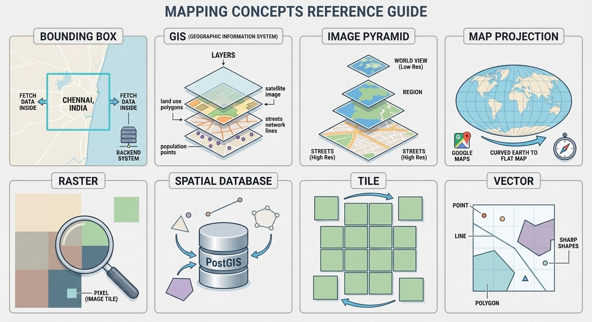
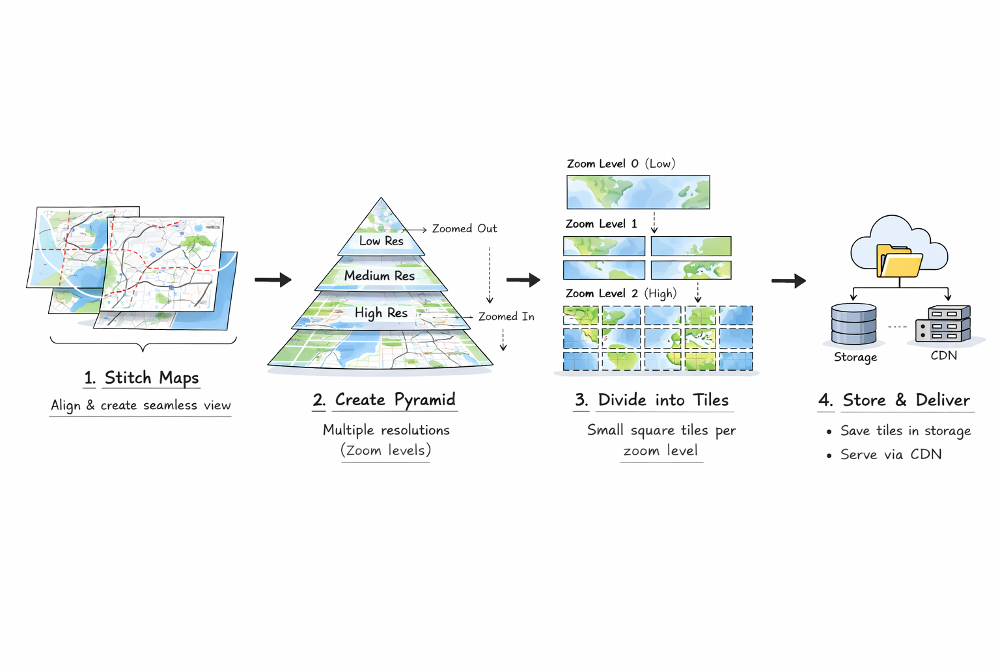
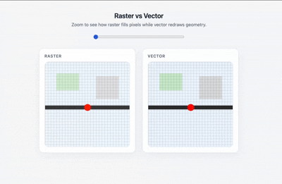

# Google Maps

<!-- toc -->

- [Introduction](#introduction)
  * [What is a Maps Service](#what-is-a-maps-service)
  * [How Maps Work](#how-maps-work)
- [Requirements](#requirements)
  * [Functional Requirements](#functional-requirements)
  * [Non-Functional Requirements](#non-functional-requirements)
- [API Design](#api-design)
  * [Search](#search)
  * [Rendering](#rendering)
  * [Routing](#routing)
- [High Level Design](#high-level-design)
  * [Search](#search-1)
  * [Rendering](#rendering-1)
  * [Routing](#routing-1)
- [Deep Dive Insights](#deep-dive-insights)
  * [Database Selection](#database-selection)
  * [Database Modelling](#database-modelling)
  * [Hidden Markov Model (HMM)](#hidden-markov-model-hmm)
  * [Douglas-Peucker Line Simplification](#douglas-peucker-line-simplification)

<!-- tocstop -->

## Introduction

### What is a Maps Service

Imagine you are traveling to a new place. You ask someone for directions for nearby restaurants, check traffic, and decide the best route to reach your destination. A maps service does the same thing digitally. It helps you understand where things are and how to reach them.

Instead of paper maps or asking people, you open a map application to search for places, explore nearby locations, and navigate. The app shows roads, buildings, landmarks, and real-time information like traffic or business hours. Behind the scenes, the system continuously collects geographic data, processes it, and presents it visually so you can understand your surroundings quickly.


### How Maps Work

When you open a map application, the system first determines your location and displays the surrounding area. As you move the map, the backend fetches only the required geographic data and renders it on the screen. If you search for a place (e.g., “restaurants near me”), the search system finds relevant places and shows them on the map.

If you choose a destination, the routing system calculates possible paths, estimates travel time, and suggests the best route based on distance and traffic conditions. During navigation, the system continuously updates your position and adjusts directions in real time.


---

## Requirements

### Functional Requirements

In an ideal scenario, a user goes through a sequence of flows such as searching for a place, viewing place on a map, and navigating to the destination when using a map application. The functional requirements are derived from this user journey.


**Search**

* **Place Search** – Users can search for places by name or keywords and get ranked results. 
* **Nearby Search** - Users can search nearby places like "restaurants near me" or "malls within 5 kms"

**Rendering**
* **Map Rendering** – Display map tiles based on the user’s current viewport.

**Routing**
* **Route Calculation** – Compute a path between source and destination.
* **Real-time Navigation** – Continuously track user location and re-route if needed.

### Non-Functional Requirements

* **Low Latency** – Search, tile loading, and routing responses must be within 100 ms.
* **High Availability** – Core features should remain 99.99% during peak usage.
* **Scalability** – System must handle millions of concurrent users.
* **Geospatial Accuracy** – Location tracking and routing must be precise with an acceptable error of + or - 40 meters.

---

## API Design
### Search

Search for places based on a text query and optional user location.


**HTTP Method & Endpoint**

We use `GET` method as we are retrieving place data from the backend system. The endpoint would be `/v1/places/search`

**HTTP Query Parameters**

* query - Search text (e.g., "cafe coffee day", "coffee shop near me")
* lat - User latitude
* lon - User longitude
* limit - Maximum results to return

**HTTP Response**

```json
{
  "results": [
    {
      "place_id": "plc_1021",
      "name": "Star Coffee",
      "lat": 13.0512,
      "lon": 80.2811,
      "rating": 4.5,
      "distance_meters": 320
    },
    {
      "place_id": "plc_984",
      "name": "Bean House",
      "lat": 13.0488,
      "lon": 80.2795,
      "rating": 4.2,
      "distance_meters": 540
    }
  ]
}
```

### Rendering

Rendering displays the map data into the user's device for visualization.


**HTTP Method & Endpoint**

We use `GET` since we are retrieving the map data. The endpoint would be: `GET /v1/tiles/vector/{z}/{x}/{y}`. Here `x` and `y` represents the coordinates and `z` is the zoom level.

**HTTP Request**
- x - X coordinate of the tile
- y - Y coordinate of the tile
- z - Zoom level

**HTTP Response**

Unlike traditional REST APIs that return JSON, the response here is sent as binary data using Protocolbuffer Binary Format (PBF).

Think of it as a compressed package of map data containing layers like roads, buildings, water, and places. This format is much smaller and faster to transfer than JSON, which helps maps load quickly when users pan or zoom.

Since the data is binary, it cannot be read directly. After decoding, it becomes a structured format (like the JSON shown below) describing map features such as roads, their type, name, and coordinates so the map can render them.

```json
{
  "type": "FeatureCollection",
  "features": [
    {
      "type": "Feature",
      "properties": {
        "class": "primary",
        "name": "Main Road"
      },
      "geometry": {
        "type": "LineString",
        "coordinates": [...]
      }
    }
  ]
}
```

### Routing

Routing finds the fastest route from a source to a destination and provides turn-by-turn directions to reach it. This is the core “Point A to Point B” service. The system calculates the best path using the road network and returns the route as a polyline. **Think of a polyline as a path drawn by connecting multiple points on a map.**


**HTTP Method & Endpoint**
We use the endpoint `/v1/routes` to calculate a route between a source and a destination. The `POST` method is preferred because the request contains structured and potentially sensitive data, such as latitude and longitude, which reveal the user’s location.

If `GET` were used, these values would appear in the URL query string, making them more likely to be logged by servers, proxies, browser history, and intermediary systems. `POST` places the data in the request body, reducing unintended exposure and avoiding URL length limitations when sending complex routing parameters such as waypoints or preferences.

**HTTP Request**
```
{
  "routeId": 123, // Optional Id. Needed for re-routing
  "source": {
    "lat": 12.9941,
    "lon": 80.1709
  },
  "destination": {
    "lat": 13.0418,
    "lon": 80.2337
  },
  "mode": "car"
}
```

**HTTP Response**

Think of the response as a list of possible routes from source to destination, ordered from the fastest to the slowest based on ETA.

Each route includes the total distance, estimated travel time, the path of the route (polyline), and step-by-step driving instructions such as when to turn and which road to take.

```
[
  {
  "routeId": 123,
  "distanceMeters": 15200,
  "durationSeconds": 2400,
  "geometry": "encoded_polyline_string",
    "steps": [
      {
        "maneuver": "depart",
        "roadName": "GST Road",
        "distanceMeters": 1200,
        "durationSeconds": 180
      },
      {
        "maneuver": "turn-right",
        "roadName": "Anna Salai",
        "distanceMeters": 8000,
        "durationSeconds": 900
      },
      {
        "maneuver": "arrive",
        "roadName": "Destination",
        "distanceMeters": 0,
        "durationSeconds": 0
      }
    ]
  }
]
```

## High Level Design

Below are some of the terms we frequently come across in the upcoming sections of the document.



- **Bounding Box** — A bounding box is a rectangle used to represent an area on the map so the backend system can fetch only what lies inside it (e.g., the part of Chennai visible on your screen).

- **GIS (Geographic Information System)** — GIS is a software used to store, analyze, and visualize location data (e.g., city planners using GIS to study traffic patterns or land usage).

- **Image Pyramid** — An image pyramid is multiple versions of the same map image at different resolutions so that maps can load quickly at any zoom level (e.g., blurry world view when zoomed out and detailed streets when zoomed in).

- **Map Projection** — Map projection is the mathematical method used to convert the curved Earth into a flat map you can scroll on your screen (e.g., Web Mercator used by Google Maps).

- **Raster** — Raster maps are pre-rendered images made of pixels that show the map as a picture (e.g., satellite imagery tiles).

- **Spatial Database** — A spatial database stores geographic objects like places, roads, and regions so they can be queried by location (e.g., PostGIS storing all buildings in a city).

- **Tile** — A tile is a small square piece of the map that loads individually so only the visible area is fetched (e.g., the few squares you see when zooming into a neighborhood).

- **Vector** — Vector maps represent the world as shapes like points, lines, and polygons instead of images, allowing dynamic styling (e.g., roads drawn as lines that stay sharp when zooming).

***

### Search
Search in a map system means turning what a user types into useful locations on the map. For example, a user might type:

- **"Marina Beach"** (Place Search)
- **"Restaurants near me"** (Nearby Search)

To understand how map search works, we can break it down into three key questions:

1. How does the system translate text into geographic coordinates?
2. How does the system quickly find nearby places?
3. How are the best results chosen and ranked?

Each of these steps must happen very quickly, typically within **~100 milliseconds**, so the map feels instant to the user.

#### 1. How does the system translate text into geographic coordinates
When a user searches for a specific location (for example **"Marina Beach"**), the system needs to convert that text into geographic coordinates. This process is called **Forward Geocoding**. Forward geocoding simply means converting human-readable text into **latitude and longitude**. For example, *"Marina Beach"* is translated into "13.0500° N, 80.2824° E"

> Similar to Forward Geocoding, there exists **Reverse Geocoing** where user taps a location on a map and get the place details.

But, user inputs are rarely clean. People often type abbreviations, incomplete names, or misspellings. For example, *"marina bech"*, *"marina bch"*, or *"marina beach chennai"*.  Before searching the database, the system performs **parsing and normalization**. This step cleans the input by correcting common spelling mistakes and expanding abbreviations. For example, *"St"* to *"Street"*, *"Rd"* to *"Road"*

After normalization, the system searches its place database, which contains information such as:
- addresses
- building locations
- points of interest (POIs) like restaurants, parks, and shops

A common challenge is that many places share the same name. For example, *"Springfield"* exists in many different cities. To resolve this ambiguity, the system assigns a **confidence score** to each candidate result. The score may consider:

- the user’s current location
- how popular the place is
- how frequently people search for it

For example, if a user in **Chennai** searches for *"Marina"*, the Chennai beach is far more likely to be returned. Whereas a user in **Bengaluru** searches for *"Marina"*, the Marina restaurant is returned.


#### 2. How does the system quickly find nearby places?
Nearby search answers queries like: *"restaurants near me"*, *"pharmacy within 2 km"*. The system cannot scan every place in the world each time a user searches. That would be too slow. So, mapping systems organize geographic data using **spatial indexing**, which groups locations based on where they are on the map.

Two commonly used techniques are **Quadtrees** and **Geohashing**.

**Quadtrees**

A **Quadtree** divides the map into four regions. If a region contains too many places, it is divided again into four smaller regions. This process continues until each region contains a manageable number of places.

Dense areas like cities get split into many smaller regions, while sparse areas remain large. When a user searches for **restaurants within 2 km**, the system first identifies the regions that overlap with the search area and retrieves places stored in those regions. This quickly filters out most of the world.


**Geohashing**

A geohash converts latitude and longitude into a short string. Locations that are physically close tend to share the same prefix. 

For example, the entire world can be split into 4 quadrants: 
* A (Top Left - North West), 
* B (Top Right - North East), 
* C (Bottom Right - South East),
* D (Bottom Left - South West). 

Now each of those quadrants can be sub-divided into 4 quadrants. For example, A can be split into:
* AA (North West)
* AB (North East)
* AC (South East)
* AD (South West)

This pattern is recursively applied for all quadrants until we reach a finite cell.


If you observe the image, you can see that cells with common prefix are close to each other. For example, AAA is closer to AAD

#### 3. How are the best results chosen and ranked?
Once the system finds all nearby candidates, it still needs to decide **which results should appear first**. This is handled by a **ranking algorithm** that sorts places based on multiple signals. Three important factors are typically considered:

- **Relevance** - Relevance measures how well a place matches the user’s query. When searching for *"pizza"*, A **pizza restaurant** is more relevant than a general restaurant that only serves pizza as one item.
- **Proximity** - Proximity measures how close the place is to the user. When searching for *"Indian Restaurant"*, "Indian Restaurant A" which is 200 meters away is preferred than "Indian Restaurant B" which is 2 kms away.
- **Prominence** - Prominence represents how well known or trusted a place is. Signals used to estimate prominence may include: **number of reviews**, **average rating**. For example, a **highly rated restaurant with thousands of reviews** may rank above a nearby restaurant that has very few reviews.

#### End-to-End Search Flow


1. User enters a query (e.g., "coffee shops") and the client sends a `GET /v1/places/search` request with query text, and user's GPS location
2. The API Gateway receives the request and routes it to the **Search Service**.  
3. The **Search Service** parses the query, normalizes text, and extracts search intent or category. (Steps 3a, 3b, and 3c)
4. The service checks cache layers for recent results matching the same query and geographic area.  
5. On a cache miss, the Search Service queries the Spatial Database for candidate places.  
6. The database uses a spatial index (Geohash, or Quadtree) to quickly identify nearby geographic cells.
7. The system combines spatial filtering with text or category matching to retrieve candidate POIs (Point of Interest).  
8. The Ranking Engine scores and sorts the candidate places based on relevance, proximity, and prominence.  
9. The final ranked results are stored in cache to speed up similar future queries.  
10. The Search Service returns the response through the API Gateway to the client.  
11. The client renders the returned places as markers on the map interface.

### Rendering

Rendering is the process of turning geographic data into something user can see and understand. When thinking about rendering a map, a few questions naturally come to mind:

1. How is geographic data captured and stored in the system? Is it stored as images or in a special representation?
2. How is the stored geographic data displayed to users quickly?
3. The world is a sphere — how is a spherical shape rendered on a flat 2D screen?

By answering these questions, we can understand how maps are rendered.

At a high level, rendering works by dividing the world into small sections called **tiles**, deciding how geographic information is represented inside those tiles, and loading only what the user currently sees. A digital map is not a single large image stored somewhere. Instead, it is assembled piece by piece as you pan and zoom.


#### 1. How Geographic Data Is Captured and Stored

Map data comes from many sources such as satellites, aerial imagery, mapping vehicles, and user contributions. The world is not captured as a single image but as many raw images collected over time.

An ingestion pipeline processes this raw imagery to make it suitable for fast retrieval.

During ingestion:

1. Raw images are aligned and stitched together to create a seamless global view. This step corrects color differences perspective, and overlaps.  
2. Multiple versions of the imagery are generated at different resolutions. High-resolution data is used for close zoom levels, while lower-resolution versions are used when zoomed out. This set of resolutions is known as an **image pyramid**.  
3. Each resolution is divided into small square tiles. At the lowest zoom level the entire world may be a single tile, and with each zoom level the number of tiles grows rapidly.  
4. These tiles are stored as static image files in distributed storage for fast delivery.

Because this work happens ahead of time, opening the map does not require image processing. The client simply requests the tiles needed for the current viewport.



These pre-rendered image tiles are called **raster tiles**. Raster tiles reduce computation on the user’s device because they are just images, but they are bandwidth-heavy and have a fixed appearance. Changing the style — for example switching to dark mode — requires regenerating the tiles.

**Vector Model**

To overcome the limitations of raster tiles, modern mapping systems represent geographic data using **vectors**.

Vectors are not images. They are geometric descriptions of the world. A place is stored as a **point**, a road as a **line string**, and areas such as buildings or parks as **polygons**. Instead of sending pixels, the system sends instructions describing what exists in a region.


Vector geometry is usually stored in databases like PostgreSQL with the PostGIS extension. PostgreSQL is a database used to store and query tabular data. To handle geographic data like locations, roads, and boundaries, it uses a special extension called PostGIS that adds spatial capabilities. During preprocessing, this geometry is organized into vector tiles, where each tile contains only the features that intersect that region and zoom level.

As vectors are mathematical representations rather than fixed images, the map remains crisp at any zoom level and can be styled dynamically by the client. 



#### 2. How the Geographic Data Displayed to Users

For raster maps, tiles are generated during ingestion and stored as images. When a user opens the map, the client calculates which tiles are visible and requests them from the server. The request endpoint typically looks like: `https://tile.maps.com/.../z/x/y.png`. Here, `x` and `y` represent tile coordinates and `z` represents the zoom level. The server simply retrieves the pre-generated image and returns it.

For vector maps, the retrieval pattern is similar but the payload differs. Instead of returning an image, the server returns structured geographic data describing the features within the tile. The endpoint usually looks like: `https://tile.maps.com/.../z/x/y.pbf`. The `.pbf` file is a compact binary format that contains points, lines, polygons, and their attributes.

When the client receives a vector tile, it decodes the geometry, applies styling rules, and renders the map locally. This shifts rendering from the server to the client. Raster tiles deliver the final picture, while vector tiles deliver the instructions needed to draw that picture, enabling dynamic styling, filtering, and smoother interactions.

**Hybrid Rendering**

Hybrid rendering combines raster and vector data in the same map view to balance performance and clarity. Raster tiles are used for complex, static imagery like satellite or terrain backgrounds, while vector data is used for interactive elements such as roads, labels, and markers.


This approach keeps photographic backgrounds efficient to load while allowing text and map features to stay sharp, dynamic, and interactive.

**Dynamic / Real-time Layers**

Dynamic layers are map overlays that show frequently changing information like live traffic, transit delays, or weather. Unlike roads and buildings, which rarely change, these layers are fetched separately and rendered on top of the base map in real time.


By separating fast-changing data from the static map, the system avoids constantly regenerating base tiles whenever traffic or other live conditions update.

> Traffic data is not only used for real-time layers but also for historical prediction. For example, based on historical traffic patterns on GST Road, the map system may predict that traffic is usually heavy around 10 AM.

#### 3. How is a Spherical Shape Rendered on a Flat 2D Screen

The Earth is spherical, but screens are flat. To display geographic data on a 2D surface, mapping systems use a mathematical transformation called a **map projection**.

A map projection converts latitude and longitude — coordinates on a sphere — into x and y positions on a flat plane. This transformation allows the curved surface of the Earth to be represented as a scrollable rectangle that can be divided into tiles. Most modern web maps use the **Web Mercator projection**. Conceptually, you can imagine wrapping a cylinder around the Earth, projecting the surface onto that cylinder, and then unrolling it into a flat map. This creates a continuous coordinate space where every location can be positioned on a grid. Web mercator answers `where does this appear on the screen?`


Web Mercator preserves local shapes and angles, which makes roads, buildings, and navigation directions appear natural when zoomed in. However, this comes with distortion: areas near the poles appear larger than they are in reality. Digital maps accept this trade-off because usability and smooth interaction are more important than perfectly accurate global area representation.

Projection also enables the tiling system described earlier. Once geographic coordinates are converted into planar coordinates, the world can be split into a consistent grid, allowing tiles to align across zoom levels and making caching and retrieval efficient. In practice, rendering follows a sequence: geographic coordinates are projected into a flat coordinate space, the viewport determines which tiles intersect that space, and those tiles are fetched and drawn on the screen. Projection therefore acts as the mathematical bridge between the real world and the visual map.

#### End-to-End Rendering Flow

Below end to end rendering flow is based on vector based map retrieval and rendering


1. User interacts with the map and the client calculates viewport bounds, applies **Web Mercator projection**, and determines required tile coordinates `(z, x, y)`. Client fetches the tile if it is already available in the **Local HTTP/IndexedDB cache**.
2. If the tile is not in client cache, it requests tiles from the **CDN**, which serves cached tiles from the edge whenever possible.
3. On a CDN miss, the request is routed to the **API Gateway** of the Map Service.
4. The API Gateway performs **authentication and rate limiting** before routing the request to the **Tile Service**.
5. The **Tile Service** parses the tile coordinates and computes the bounding box (latitude and longitude) for that tile. Then it checks a **Distributed Cache (Tile Cache)** for a precomputed tile.
6. On cache miss, the precomputed tile is fetched from **Tile Storage**.
7. If the tile does not exist, the **Tile Service** queries the **Spatial Database** using **Quadtree or R-Tree indexing**. It retrieves raw geometry, clips it to tile bounds, and performs **line simplification** (e.g., via Douglas-Peucker algorithm).
    * **Quad Tree** - A spatial data structures used to quickly find geographic features (like buildings or roads) within a specific map tile without searching the entire global database. A Quad-Tree recursively divides a 2D area into four squares to pinpoint locations, while an R-Tree groups nearby objects into "minimum bounding rectangles" for efficient range queries.
    * **Douglas-Peucker Line Simplification** - This algorithm reduces the number of points in a complex curve (like a jagged coastline or a winding road) to create a simpler, "smoother" version that uses less data. It identifies and keeps only the most essential points that define the shape's overall structure, discarding minor details that wouldn't be visible at lower zoom levels.
8. The generated tile is stored in **Tile Storage** and cached in the **Tile Cache**.
9. The **Tile Service** returns the tile data via the API Gateway.
10. The tile data is cached in the CDN and sent to the client. Client decodes vector tiles, applies **Style JSON**, and renders via **WebGL/GPU**.
11. The client makes a parallel, lightweight request to a **Dynamic Data API Gateway** to fetch real-time layers like traffic or incidents.
12. The API Gateway routes the request to the **Traffic Service**.
13. The traffic data (segment speeds) is fetched from the **Traffic Cache**.
14. On cache miss, the traffic data is fetched from the **Traffic Database**.
15. The **Traffic Service** returns the traffic data to the client via the API Gateway. The API Gateway returns the traffic data to the client device, which performs **client-side composition** to render the overlay on top of the base map. (Step 15a and 15b)

> Traffic data is mainly collected from millions of smartphones and connected vehicles that continuously send GPS location and speed information. This data is matched to specific road segments, filtered to remove noise (like parked cars), and used to calculate real-time traffic speed. The processed results are stored in fast in-memory systems for live updates and in historical databases to help predict future traffic patterns.

### Routing
Routing is the process of finding a path between a source and a destination. The map system tries to provide the best possible path so that users can travel from source to destination faster. 

When thinking about routing, a few questions naturally arise:

1. How are roads represented inside the system?
2. How is the shortest or fastest path calculated?
3. How does navigation adjust in real time?

By answering these, we can understand how routing systems work.

#### 1. How are roads represented inside the system
In a map system, the world is modeled as a Directed Weighted Graph.

- **Nodes**: Intersections or dead ends.
- **Edges**: Road segments connecting nodes.
- **Weights (Costs)**: A numerical value representing the "cost" to traverse an edge. It isn't just distance. It’s a function of speed limits, road type, turn restrictions, and live traffic.


At a global scale, a single road graph is too large to fit in memory. So, the global graph is divided into smaller, manageable "shards" or partitions based on geography (e.g., by city or state).

The road data is stored in a Spatial Database (like PostgreSQL with PostGIS). For routing, the data is extracted from the spatial database and converted into a **Directed Weighted Graph** aka **Road Graph**. An offline job reads the spatial data, identifies intersections (Nodes) and roads (Edges), and builds the Road Graph. This graph is "sharded" (e.g., a "South India" shard, a "Karnataka" shard) so the Routing/navigation Service can load only what it needs.

#### 2. How is the shortest or fastest path calculated?

We know that roads are modeled as a graph, where intersections are nodes and road segments are edges. To navigate from a source to a destination, we need to compute the shortest or fastest path between them. A straightforward way to do this is **Dijkstra’s Algorithm**.

Dijkstra starts from the source and repeatedly expands the node with the smallest accumulated distance. It continues this process until the destination is reached, guaranteeing the shortest path.


The limitation is that Dijkstra has no awareness of the destination’s direction (**uninformed search**). It expands outward uniformly, exploring many unnecessary nodes. In large road networks with millions of nodes, this leads to excessive computation and higher latency.

Since modern map systems must compute routes in milliseconds and often recompute during navigation, running full Dijkstra each time is inefficient. Therefore, production systems use more optimized techniques such as **A\* (A-Star)** and **Contraction Hierarchies** that reduce the search space while still guaranteeing optimal results.

**A\*  (A-Star)**

Assume you are driving from Chennai Airport to Marina Beach. The road network includes small residential streets, arterial roads, and highways. If we ran Dijsktra, it would expand in all directions even though Marina Beach lies northeast of the airport.

A* is a superior modified version of Dijsktra's algorithm. It uses straight-line distance to Marina Beach as a **heuristic**. That is, at each intersection (node), it evaluates:
* How far have I driven so far?
* How far does this road appear from Marina Beach?

If one road heads generally toward the coast and another heads inland, A* prioritizes the coastal direction. It does not blindly expand all neighborhoods.


**Contraction Hierarchies**

Assume another scenario, where you are driving from Chennai to Bengaluru. The road netwrok includes thousands of local streets, city arterial roads, and national highways. In reality, long-distance travel looks like: `local road → city arterial → National highway → city arterial → local road`. So, you do not evaluate every residential street between the two cities.

So, if we use A*, it still explores many nodes in large-scale routing (e.g., Chennai → Bengaluru). It improves direction but does not shrink the graph.

Contraction hierarchies instead of improving the search strategy, it changes the graph itself. Contraction hierachies work by preprocessing the road network graph and add shortcut edges by bypassing unnecessary edges such as small residential intersections.

So, instead of exploring hundreds of local streets, arterials, hundreds more streets, and highway, the graph contains `Chennai Arterial → National Highway Entry → National Highway Exit → Bengaluru Arterial`. At query time, Contraction Hierarchies run a **bidirectional Dijsktra** search — one from the source and one from the destination — and only move through higher-level roads in the hierarchy. By avoiding lower-level streets and meeting in the middle, the algorithm explores far fewer nodes than a full graph search.


> Contraction Hierarchies (CH) work well when edge weights are mostly static because shortcut weights are precomputed and fixed. When traffic frequently changes travel times, classic CH becomes unsuitable since updating weights would require rebuilding the hierarchy.
> **Customizable Contraction Hierarchies (CCH)** solve this by separating structure from weights. The hierarchy (node order and shortcuts) is built once, while shortcut weights are recomputed quickly whenever traffic updates occur. This enables fast routing with dynamic traffic without rebuilding the entire graph. CCH separates structure from weights — the hierarchy is built once, and only shortcut weights are efficiently recomputed when traffic changes, avoiding a full rebuild.

#### 3. How does navigation adjust in real time

Consider a scenario where you are driving from Chennai Airport to T Nagar during evening traffic. The initial route is `Airport → GST Road → Kathipara → Anna Salai → T Nagar` and the estimated time is **40 mins**. While you drive, your phone sends location updates every few seconds via GPS (Global Positioning System). Each update contains atitude, longitude, speed, and direction. 

Raw GPS data is noisy. You may appear slightly off the road. So the system performs **map matching**. It snaps your GPS coordinate to the most likely road segment using proximity, and direction. Now the system knows “You are on GST Road, heading north”. Typically we use **Hidden Markov Model (HMM)** for map matching. A Hidden Markov Model is a probabilistic model used to infer a sequence of hidden states from noisy observations, assuming each state depends only on the previous one. Refer deep dive section [Hidden Markov Model](#hidden-markov-model-hmm) for more details.


Suppose there is a right turn and you missed it, the original route expected is "Turn right at Kathipara". But you continued straight. The routing system checks: Is the user still on planned route? and Is current position within allowed deviation threshold?. If not, it triggers re-routing. Re-routing considers the current GPS location as source and computes the new best possible route to reach the destination. 

**ETA Update in Real-time**

ETA (Estimated Arrival Time) tells the remaining travel time to reach the destination from the user's current position. It is initially calculated during route computation from the source to the destination. However, as time passes and traffic conditions change along the route, the ETA is expected to change as well.

Every few seconds, the device sends updated GPS coordinates. The map matching logic snaps the raw GPS coordinates to the nearest road segment. At this point, the system has both the planned route (a list of edges) and the user’s current position on that route. Using the latest traffic weights, the system recomputes the ETA based on the remaining segments of the route.


#### End to End Flow


1. Client calls `POST /v1/routes` endpoint with source, destination, and travel mode (Eg: Bike, Car, etc)
2. The API Gateway of the Navigation Service handles the request and route it to the Navigation Service.
3. The **Navigation Service** uses HMM algorithm to snap the raw latitude and longitude to the nearest road segments using spatial index (Eg: R-tree). It then converts the coordinates into graph node IDs
4. The **Navigation Service** checks the **Route Cache** for cached route for the combination of source node, destination node, and travel mode. If a route exists, it returns immediately.
5. If route doesn't exist in cache, the **Navigation Service** loads the graph from **Road Graph Cache**. This contains the pre-computed CCH heirarchy structure
6. The **Navigation Service** fetches the traffic weights of the edges from in-memory **Traffic Cache**. We use the cache instead of invoking **Traffic Service** to provide ultra low-latency response for route calculation.
    * a) **Traffic Stream Processor Service** listens to the **Traffic Stream** for traffic events published by the **Traffic Service**
    * b) The traffic events from the **Traffic Stream** are processed and stored in the **Traffic Cache** with a shorter TTL (Eg: 3 mins) as traffic rapidly change.
7. The **Navigation Service** use the real-time traffic weights and runs the customization phase of CCH where the shortcut weights are recomputed based on the traffic weights.
8. The **Navigation Service** runs bi-directional Dijsktra's on the CCH hierarchy to find the best route. Finally it expands the shortcut edges back into original road segments to produce full geometry.
9. For turn by turn direction, the path segments are converted to human-readable maneuvers using road metadata (e.g., turn angle, road name, restrictions).
10. Finally, the response is returned to the client via the API Gateway. (Step 10a and 10b)

> Usually, a map system shows multiple possible routes from the source to the destination and recommends the best route based on ETA. To achieve this, the system runs **K-shortest path algorithms** on the road graph to generate multiple routes. For example, when **K = 3**, the top three shortest routes are generated between the source and destination.

## Deep Dive Insights
### Database Selection

Unlike most application systems that primarily store structured records such as users or orders, a maps platform must manage **geographic data representing real-world locations**. This requires specialized storage and querying system to efficiently handle spatial operations. Therefore, database selection in a maps system must consider **spatial database technologies** designed specifically for geographic data.


| Guideline                                                      | Recommendation                   |
| -------------------------------------------------------------- | -------------------------------- |
| When storing geographic objects and performing spatial queries | Use Spatial Database             |
| When serving static tiles at massive scale                     | Use Object Storage + CDN         |
| When ingesting high-volume location streams                    | Use Time-Series / Wide Column DB |

Based on the above guidelines, we made the database choices for our map service.

<table>
    <tr>
        <th>Database</th>
        <th>Deciding Factors</th>
        <th>Decision</th>
    </tr>
    <tr>
        <td>Places DB</td>
        <td>
            <ul>
                <li><b>Geospatial Queries</b> – Find places within a bounding box or radius.</li>
                <li><b>Text + Spatial Search</b> – Combine name search with geographic filtering.</li>
                <li><b>Indexing Support</b> – Needs spatial indexes such as R-Tree.</li>
            </ul>
        </td>
        <td>Spatial DB (PostgreSQL + PostGIS)</td>
    </tr>
    <tr>
        <td>Traffic DB</td>
        <td>
            <ul>
                <li><b>Continuous Updates</b> – Millions of devices sending speed updates.</li>
                <li><b>Time-Based Data</b> – Historical traffic patterns are analyzed.</li>
                <li><b>High Write Throughput</b> – Append-heavy workload.</li>
            </ul>
        </td>
        <td>Time-Series DB (Cassandra / ClickHouse)</td>
    </tr>
    <tr>
        <td>Tile Storage</td>
        <td>
            <ul>
                <li><b>Massive Read Volume</b> – Billions of tile requests daily.</li>
                <li><b>Immutable Data</b> – Tiles are pre-generated and rarely updated.</li>
                <li><b>Global Distribution</b> – Must be served from edge locations.</li>
            </ul>
        </td>
        <td>Object Storage + CDN</td>
    </tr>
</table>

### Database Modelling
#### Place Schema

* Database Type - Spatial Database (PostgreSQL + PostGIS)
* Common Queries
  * Fetch place details by place_id
  * Search places within a radius
* Indexing
  * GIST(location)

> GIST (Generalized Search Tree) acts like a map divided into "nested boxes" that group nearby locations together. When you search, the database instantly skips any boxes that don't overlap your area, only "doing the math" for the few points left inside.


#### Traffic Schema
* Database Type - Database Type: Time-Series / Wide Column
* Common Queries
  * Fetch latest speed for road segment
  * Fetch historical traffic trends
* Indexing
  * segment_id (road segment)
  * timestamp


### Hidden Markov Model (HMM)

When the map application receives GPS coordinates from the phone, the coordinates are not perfectly accurate. GPS has an error of 5–10 meters, meaning the location point given by GPS may appear slightly off the actual road. In dense areas where roads run close to each other (for example, a main road and a service road), simply snapping the GPS point to the nearest road can produce incorrect results.

To handle this, navigation systems use a Hidden Markov Model (HMM) for map matching—the process of aligning noisy GPS points with the correct road segment.

#### Key Idea
The key idea behind HMM is that the true road a vehicle is on is hidden, while the GPS coordinates we observe are noisy signals of that hidden state. Instead of deciding the road using a single GPS point, the system evaluates a sequence of points over time and determines which road sequence best explains the movement.

#### Working of HMM
Consider a situation where two parallel roads are only 15 meters apart. A vehicle sends three GPS points while driving. Because of GPS noise, the first two points may appear close to both roads. If the system only looked at distance, it might incorrectly snap the points to the service road.

HMM avoids this by considering two signals:

* **Emission probability** - It reflects how well a GPS point fits a candidate road. If the point lies very close to a road segment, the probability that the vehicle is on that road increases.
* **Transition probability** - It evaluates whether movement between two points is realistic on the road network. If moving from one candidate road to another would require an impossible turn, a disconnected segment, or a large detour, the probability becomes very low.

Instead of making independent decisions for each point, HMM evaluates entire sequences of possible road assignments. For example:

* Road A → Road A → Road A
* Road B → Road B → Road A
* Road A → Road B → Road A
* (other sequences stripped)


Each sequence is scored using both emission and transition probabilities. Even if the first point is closer to Road B, the sequence staying consistently on Road A may receive a higher overall probability because the movement is smooth and follows the road network.

### Douglas-Peucker Line Simplification

Maps are noisy. A single road can be stored as hundreds or thousands of GPS points because survey data captures every tiny bend, jitter, and measurement error. Rendering all those points at every zoom level would be wasteful and slow. The **Douglas–Peucker Line Simplification** algorithm exists to solve exactly that problem: `keep the points that define the shape, discard the ones that don’t meaningfully change it`.

Imagine a winding road represented by many points:

> A ---- p1 ---- p2 ---- p3 ---- ... ---- B

If you draw a straight line from A → B, most intermediate points will lie close to that line. Some points, however, will deviate significantly because the road bends there. Those are the points worth keeping.

#### Working of Douglas-Peucker Line Simplification
The algorithm works recursively:

1. Take the first and last point of the line segment.
2. Draw a straight line between them.
3. For every intermediate point, compute its perpendicular distance from this line.
4. Find the point with the maximum distance. Two cases occur:
    * If the maximum distance is below a threshold (ε). All intermediate points are discarded. The line can be safely approximated as a straight segment.
    * If the distance exceeds ε. That point represents a meaningful bend and must be preserved. The algorithm splits the line at that point and repeats the process on both segments.


The curve is progressively broken into segments until every segment approximates the original shape within the allowed tolerance.

#### Why Mapping Systems Depend on It
Douglas–Peucker is heavily used in geospatial pipelines because it attacks several performance bottlenecks simultaneously:

* Reduces storage size
* Improves rendering speed. Fewer vertices mean faster GPU drawing.
* Speeds up spatial operations