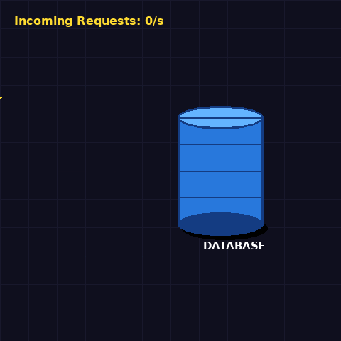
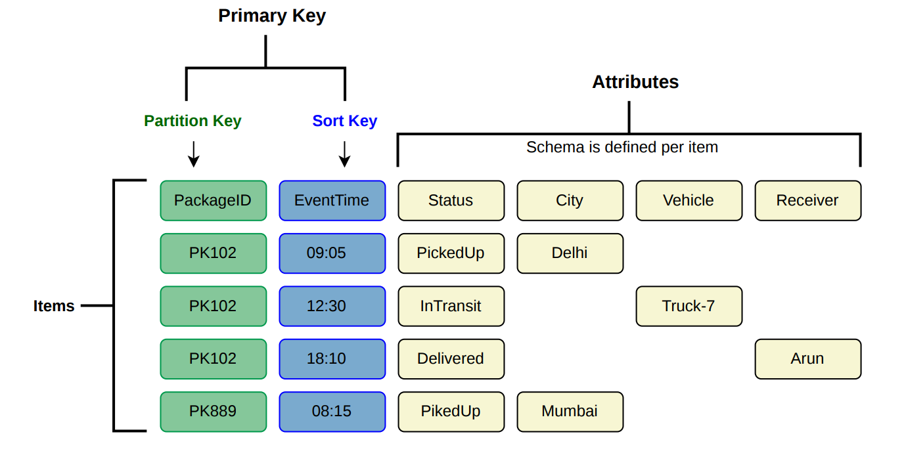
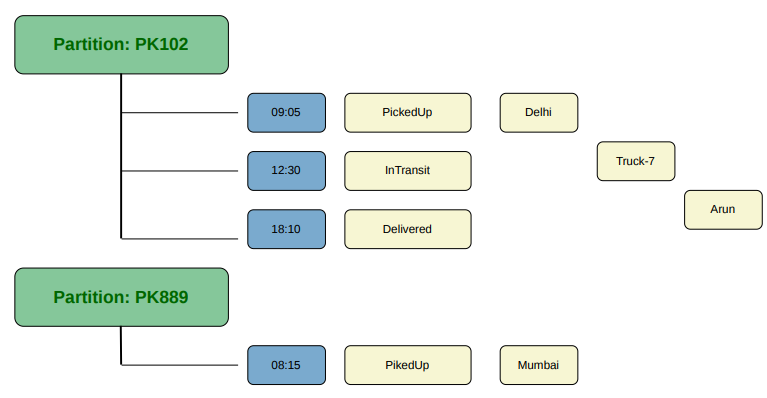
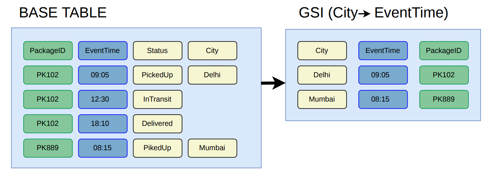
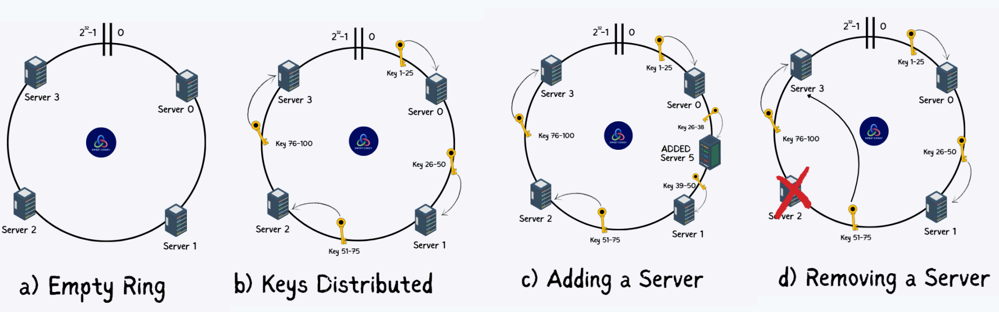
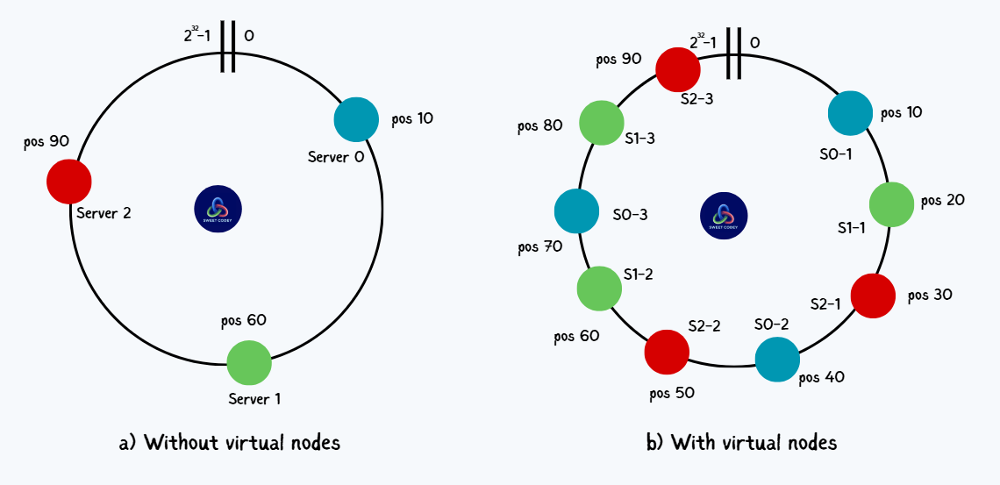
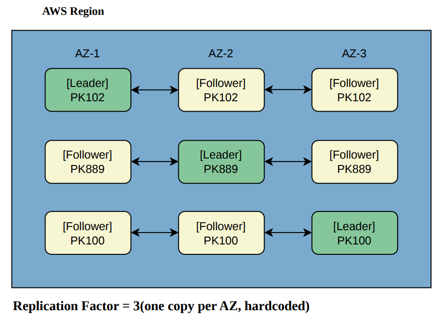
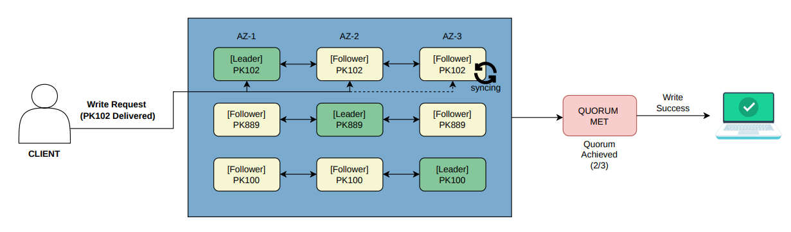
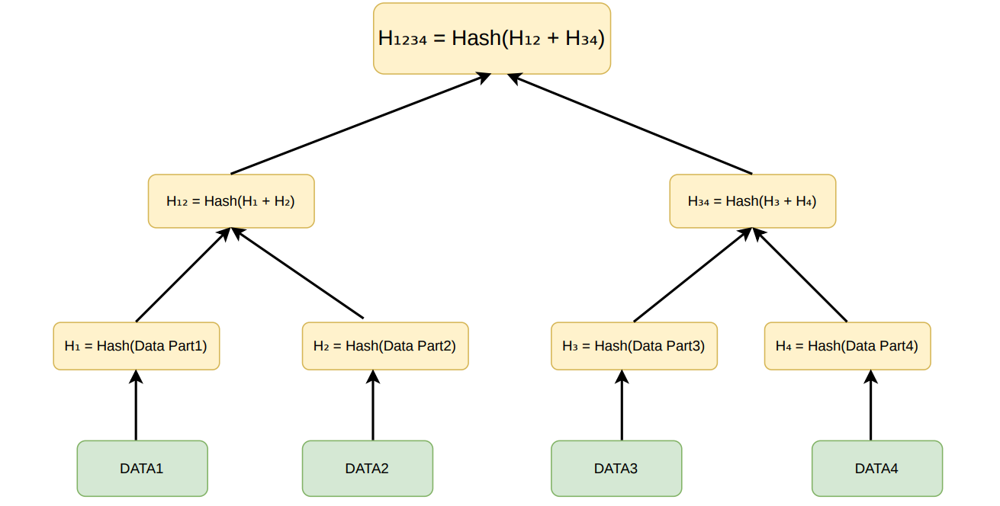

# Amazon DynamoDB: How It Handles Millions of Requests Without Slowing Down

## TL;DR

Amazon DynamoDB is a **distributed key-value database designed for extreme scale**.

It maintains **single-digit millisecond latency** even under massive workloads by:

- **Distributing data across many machines**
- **Replicating data for high availability**
- **Using simple key-value access instead of complex joins**
- **Scaling horizontally by adding more nodes**

This architecture allows DynamoDB to process **millions of requests per second** without slowing down.

# **The Real Problem**

During large shopping events like **Amazon Prime Day**, traffic reaches an extreme scale. Millions of users simultaneously **browse products, add items to carts, update carts, and place orders**.

Each of these actions generates **database reads and writes that must be processed instantly**.

At this scale, traditional databases often struggle — leading to **slow responses, overloaded systems, or even outages**.

Amazon, however, is built to handle this.

During the **66-hour Prime Day sale in 2021**, DynamoDB processed **trillions of requests**, with peak traffic reaching around **89.2 million requests per second**, all while maintaining **low latency and stable performance**.



This highlights a critical requirement:

> **Customer actions must never be lost.**
> 

A failed cart update directly impacts both **user experience and revenue**.

So the system must:

- handle **millions of writes per second**
- respond in **single-digit milliseconds**
- remain **available even during failures**

Traditional databases were not designed to satisfy all three simultaneously.

This challenge led Amazon engineers to build **Dynamo**, which later evolved into **DynamoDB**.

## The Engineering Approach to Handle Massive Throughput

One way to scale systems is **vertical scaling** — upgrading a single machine with more **CPU, RAM, or faster storage**.

This works initially, but has clear limits:

- hardware becomes **expensive**
- machines hit **physical limits**
- creates a **single point of failure**

If that machine fails, the entire system goes down.

---

Another approach is **horizontal scaling** — distributing data across **multiple machines** and scaling by adding more nodes.

However, traditional relational databases struggle here because they require:

- **coordination across nodes**
- **joins across distributed data**
- **strict consistency guarantees**

This coordination introduces **latency and bottlenecks**, making it difficult to handle massive throughput efficiently.


### **So the real issue here is not storing massive amounts of data. The issue is handling millions of read and write requests every second without slowing down.**

This is where **DynamoDB** comes in.


## Goal of DynamoDB Design

DynamoDB was designed with **one primary goal**:

> **provide consistent, low single-digit millisecond latency at any scale.**

To achieve this, DynamoDB focuses on several design principles:

- **Elastic scalability** – tables can grow to billions or trillions of items
- **High availability** – the system continues operating despite failures
- **Predictable performance** – latency remains stable under heavy load
- **Flexible data model** – schema-less key-value storage

---
# ARCHITECTURE

## DynamoDB Data Model

A DynamoDB table stores data as **items**, where each item contains a set of **attributes (key-value pairs)**.

Each item is uniquely identified using a **primary key**, defined when the table is created. The primary key consists of:

- **Partition Key (required)**
- **Sort Key (optional)**

The partition key determines *which node* stores the item. The sort key organizes related items *within* that partition.

---

## Example

Consider a table storing package tracking events:



`PackageID` is the partition key — all three events for PK102 live on the **same node**.

`EventTime` is the sort key — those three events are stored in **chronological order** within that node.

Together, `PackageID + EventTime` is globally unique. PK102 at 09:05 is one item. PK102 at 12:30 is a different item. They can never collide.

Internally, DynamoDB organizes it like this:




---

## Primary Index

The table's primary index is built using the primary key:

```
PackageID → EventTime
```

So when a query comes in:

> **"Give me the full journey of package PK102."**
> 

DynamoDB:

1. hashes `PK102`
2. directly locates the partition
3. returns all items sorted by `EventTime`

No scanning required

---

But now someone asks:

> **"Give me all packages that were picked up from Delhi."**
> 

`City` is not the partition key. DynamoDB has no idea which partitions contain Delhi data. It would have to open PK102, check city. Open PK889, check city. Open **every package in the table — one by one**. With millions of packages, this is a disaster.

This is exactly what **Secondary Indexes** solve.

---

## Secondary Index

You create a **GSI** with `City` as the new partition key:




Notice: only rows that **have a City value** appear in the GSI. The InTransit and Delivered rows for PK102 have no city, so they are not indexed.

The Delhi query now becomes:

```
Step 1: GSI lookup  →  City = "Delhi"  →  PK102 (09:05)
Step 2: Base table  →  fetch PK102     →  full item returned
```

Without GSI:  O(n)  — scan every item in the table
With GSI:     O(1)  — direct lookup by City, same as any primary key query

## **Local Secondary Index (LSI)**

An **LSI** keeps the same partition key but changes the sort key.

Lets you query the same partition in a different order.

> "Give me all events for PK102, sorted by **Status** instead of EventTime."
> 

You can't do that with the base table — EventTime is the only sort key. An LSI on `PackageID → Status` solves it instantly, and since the partition key is the same, the data is already co-located on the same node.

One constraint: **LSI must be created at table creation time.** You can't add it later. GSI can be added anytime.

---

# PARTITIONING

## How DynamoDB Distributes Data Across Nodes

Now that we understand the data model, the real question is:

**How does DynamoDB decide which machine stores which item?**

With billions of items across thousands of servers, DynamoDB needs a method that:

- distributes data **evenly** across all nodes
- causes **minimal disruption** when a node is added or removed
- routes any request to the **correct node quickly**

## The Naive Approach — Modulo Hashing

The simplest idea is modulo hashing:

`node = hash(partitionKey) % numberOfNodes`

Assign each node a fixed slot. Hash the key, take the remainder, done.

| Key | hash(key) % 4 | Goes to |
| --- | --- | --- |
| PK102 | 2 | N-2 |
| PK889 | 0 | N-0 |
| PK415 | 3 | N-3 |
| PK100 | 1 | N-1 |

This works perfectly — until you add a node.

| Key | Before (% 4) | After (% 5) |
| --- | --- | --- |
| PK102 | N-2 | N-1 ← moved |
| PK889 | N-0 | N-4 ← moved |
| PK415 | N-3 | N-0 ← moved |
| PK100 | N-1 | N-0 ← moved |

Almost **every key remaps to a different node**. At Amazon's scale — billions of items — this means moving a catastrophic amount of data every time capacity changes.

---

## Consistent Hashing

DynamoDB solves this with **consistent hashing**.

The idea is elegant: imagine the entire hash output space (say, 0 to 2³² − 1) arranged as a **ring** (circle). Each node is placed at a position on this ring by hashing its identifier.



When a **write or read** comes in for a key:

1. Hash the partition key → get a position on the ring
2. Walk **clockwise** until you hit the first node
3. That node is responsible for storing and serving that key

**What happens when a new node is added?**

Only the keys that fall between the new node and its predecessor need to move. **All other keys stay exactly where they are.** This is the core insight that makes consistent hashing powerful.

---

## Virtual Nodes (Vnodes)

Basic consistent hashing has one remaining problem.

With only **3 servers on the ring**, each server owns one large chunk — roughly ⅓ of the ring each. That sounds fair, but in practice nodes are placed by hashing their ID, so placement is random. 

In the below image a)Without Virtual Nodes, all of Key 11–60 dumps onto Server 2 (if sever 1 fails)

### How Vnodes Fix This

Instead of one position per server, each physical server is hashed **multiple times** — giving it multiple positions on the ring.

Each position is a **virtual node**. It points back to the same physical server, but it appears at a different spot on the ring.



The colors now **alternate evenly** around the entire ring — no server dominates any side. Each physical server owns **3 small scattered ranges** instead of 1 large chunk, and the total adds up to the same ⅓ each.

This matters because:

- **Node failure** — if Server 2 goes down, its 3 small ranges scatter to 3 different neighbors instead of dumping everything onto one node
- **New node added** — it steals small slices from many servers instead of one big slice from one server
- **Heterogeneous machines** — a stronger server simply gets more vnodes assigned, naturally receiving more traffic

**Effect:**

| Property | Basic Hashing | With Vnodes |
| --- | --- | --- |
| Load balance | Uneven | Even across all nodes |
| Node added/removed | Many keys move | Only neighboring ranges affected |
| Node failure impact | One large range lost | Many small ranges redistributed |
| Heterogeneous nodes | Can't weight by capacity | Assign more vnodes to stronger machines |

With enough vnodes, load naturally distributes evenly across all physical machines.

---

# REPLICATION

## Why Replicate?

A single node storing your data is a **single point of failure**. If that server crashes, your data becomes unavailable.

DynamoDB replicates every partition **three times** — across three separate **Availability Zones (AZs)** within a region. AZs are physically isolated data centers with independent power, networking, and cooling.

**Replication Factor (RF)** is the number of copies DynamoDB maintains for each partition. DynamoDB hardcodes RF = 3 — one copy per Availability Zone




One replica is the **leader** (sometimes called primary). The other two are **followers** (replicas).

- **Writes** always go to the leader first
- **Reads** can go to any replica (with tradeoffs — more on this below)

If the leader fails, **consensus** (using a protocol similar to Multi-Paxos) is used among the replicas to elect a new leader automatically. No human intervention required.

---

## How a Read Actually Happens

## Read Consistency

DynamoDB supports both strongly consistent and eventually consistent reads — where **eventual is the default**.

The **leader replica** does two things:

1. Serves all writes
2. Serves strongly consistent reads — because it handles all writes, it always has the latest data

That's the entire reason strong consistency works.

**Strong → read goes to the leader replica**

**Eventual → read goes to any replica**

|  | Strong | Eventual |
| --- | --- | --- |
| Routes to | Leader only | Any replica |
| Stale data? | Never | Possibly |
| Cost | 1× RCU / 4KB | 0.5× RCU / 4KB |
| Use case | Cart total, inventory, payments | Feed, dashboard, analytics |

## How a Write Actually Happens

Let's trace a write request step by step.

**Scenario:** Package PK102 just got delivered. The system writes the delivery event.



This is called a **quorum write** (W = 2 out of 3).

**Why quorum and not wait for all 3?**

Waiting for all three would mean the **slowest replica** determines your write latency. If one node is slightly degraded, every write gets slower.

With W=2, writes succeed as long as any **two** replicas are healthy, which provides:

- **Durability**: data is on multiple machines before acknowledging success
- **Performance**: not bottlenecked by the slowest node
- **Availability**: one replica can be down without affecting write

Two important things happening here:

**WAL write is synchronous** — quorum must confirm before client gets success. Data is safe even if every node crashes immediately after.

**B-Tree update is asynchronous** — the actual table update happens in the background. Client doesn't wait for it. That's why writes are fast.

---

# HANDLING FAILURES

## What Happens When a Node Goes Down?

DynamoDB is built to handle failures gracefully. Two key mechanisms make this work.

**What if the Dynamo cluster cannot reach quorum? Should the write be rejected?**

In traditional quorum systems, the answer is yes — writes are rejected to preserve durability.
But DynamoDB takes a different approach using **Sloppy Quorum:**

Even if the required quorum nodes are unavailable,
the system accepts the write anyway
and temporarily stores it on any available healthy nodes

This prioritizes availability over strict durability, ensuring the system continues to accept writes even during failures.

---

### Hinted Handoff

Imagine a write comes in for a key, but the target replica (say, Node B) is temporarily down.

Instead of rejecting the write, DynamoDB:

- sends it to another healthy node
- stores it with a **“hint”**
- later forwards it to the correct node when it recovers

```
Normal:  Write → Node A (Leader) → Node B, Node C

Node B is down:
         Write → Node A (Leader) → Node C ✅
                                 → Node D 🔁 (hint: "this belongs to Node B")

Node B recovers:
         Node D → transfers the hinted writes back → Node B ✅
```

This is actually a direct consequence of **Sloppy Quorum in action** — writes are routed to any available nodes, not strictly the original replica set.

This strategy ensures **writes are never rejected due to a single node failure.** The system remains highly available.

**Limitation:** If Node D also crashes before handing off, those writes could be lost. Hinted handoff only works for **short, transient failures.**

---

### Anti-Entropy (Merkle Trees)

For longer failures, DynamoDB uses a background sync process.

Instead of comparing entire datasets (which is expensive), it uses **Merkle trees** — a structure that lets systems quickly detect differences.

To compare two replicas efficiently without sending all the data, DynamoDB uses **Merkle trees** — a data structure where:

- leaf nodes represent hashes of individual data items
- parent nodes represent hashes of their children
- the **root hash** represents the entire dataset



If two replicas have the same root hash, they are **identical** — no sync needed.

If the root hashes differ, the tree can be traversed to find exactly **which keys differ** — without comparing all data. Only the divergent keys are synchronized.

This makes replica synchronization efficient even at massive scale.

---

# THE HOT PARTITION PROBLEM

## The Most Common DynamoDB Mistake

Understanding consistent hashing and replication is great. But there is one problem that trips up many engineers when using DynamoDB in production.

Consider an e-commerce application during an iPhone launch. Every user hitting the product page generates a read or write:

| Partition Key | Sort Key | Views |
| --- | --- | --- |
| product#iphone-15 | 2024-01-01 | 4,200,000 |
| product#iphone-15 | 2024-01-02 | 3,800,000 |
| product#iphone-15 | 2024-01-03 | 5,100,000 |
| product#samsung-s24 | 2024-01-01 | 800,000 |
| product#pixel-8 | 2024-01-01 | 620,000 |

DynamoDB hashes each partition key and distributes it across nodes:

```
hash("product#iphone-15")   → Node A
hash("product#samsung-s24") → Node B
hash("product#pixel-8")     → Node C
```

Perfectly spread — each product lives on a different node. This is exactly how DynamoDB is supposed to work.

---

But now it's iPhone launch day. Samsung and Pixel pages still get normal traffic. The iPhone page gets **millions of simultaneous hits**:

```
DynamoDB Cluster

Node A ██████████████████ ← 90% of traffic (iPhone!)
Node B ██                ← Samsung (normal)
Node C ███               ← Pixel (normal)
Node D █                 ← everything else
```

Node A is overloaded. Requests slow down or get throttled. **This is a hot partition.**

The problem is not that data is distributed wrong — it is. The problem is that **one key receives disproportionate traffic** compared to everything else.

---

## Why This Happens

> **Data is evenly distributed — traffic is not.**
> 

DynamoDB distributes data based on the partition key hash. If your partition key has **low cardinality** (few unique values) or **skewed access patterns** (one item is far more popular), all traffic lands on one node — regardless of how many machines you have.

Adding more capacity won't help if only one partition receives all the traffic.

---

## Why DynamoDB Can't Just Split the Hot Partition

DynamoDB can split Node A's partition into two:

```
Node A splits into A1 + A2

A1                          A2
└ product#iphone-15         ├ product#samsung-s24
                            └ product#pixel-8
```

But `product#iphone-15` still lives in A1. Every iPhone request still goes there. Samsung and Pixel just moved to A2 — which already had light traffic anyway.

You now have two partitions and the exact same hot key. Nothing changed.

**Splitting redistributes keys. It cannot redistribute traffic for a single key.**

That's why the fix has to come from your data model, not from DynamoDB's infrastructure.

---

## How to Fix It

### Strategy 1: Write Sharding (Random Suffix)

Instead of one key `product#iphone-15`, spread it across 10 shards:

```
product#iphone-15#0
product#iphone-15#1
product#iphone-15#2
  ...
product#iphone-15#9
```

Each shard hashes to a different node. Writes are distributed randomly across all 10. Reads must query all 10 shards and aggregate the result.

**Good for:** High-write scenarios where one key is the bottleneck.

---

### Strategy 2: Time-Based Partition Keys

Include a time component in the partition key:

```
Before: product#iphone-15
After:  product#iphone-15#2024-01-03
```

Each day's traffic lands on a different partition. Yesterday's data naturally cools off and stops receiving writes.

**Good for:** Time-series data like views, events, or logs.

---

### Strategy 3: Caching with DAX

For read-heavy hot keys, put DAX (DynamoDB Accelerator) in front of DynamoDB:

```
Client → DAX (in-memory cache) → DynamoDB (only on cache miss)
```

Most requests for `product#iphone-15` are reads — the same product page served millions of times. DAX returns cached results in **microseconds**. DynamoDB barely sees the traffic.

**Good for:** Read-heavy hot keys where the data doesn't change constantly.

---

## Summary

| Strategy | Best For | Tradeoff |
| --- | --- | --- |
| Write sharding | Hot write keys | Read aggregation complexity |
| Time-based keys | Time-series data | Natural access pattern shift |
| DAX caching | Hot read keys | Cache invalidation, extra cost |

**The best fix is always upfront design.** Choosing the right partition key is the most impactful decision you make when using DynamoDB. Get it wrong and no amount of infrastructure can save you.

---


# WHEN TO USE DYNAMODB

## DynamoDB is Excellent For

- **High-throughput, low-latency workloads** — gaming leaderboards, real-time bidding, session management
- **Unpredictable or bursty traffic** — you need elastic scaling without pre-provisioning
- **Key-value and simple query patterns** — you know your access patterns upfront
- **Serverless architectures** — pairs naturally with AWS Lambda, no connection pooling needed
- **Globally distributed applications** — Global Tables let you replicate across regions with local read/write

---


## The Cardinal Rule of DynamoDB

> **Design your access patterns before you design your table.**
> 

In a relational database, you define a schema, and queries are figured out later. In DynamoDB, it's the **opposite**. You need to know exactly how the data will be read, then design partition keys, sort keys, and indexes around those specific patterns.

Getting this right upfront means single-digit millisecond performance at any scale. Getting it wrong means redesigning your table — which is painful because DynamoDB does not support schema migrations in the traditional sense.

---

*Further reading: [Dynamo: Amazon's Highly Available Key-value Store (2007 SOSP Paper)](https://www.allthingsdistributed.com/files/amazon-dynamo-sosp2007.pdf) — the original research paper that started it all.*